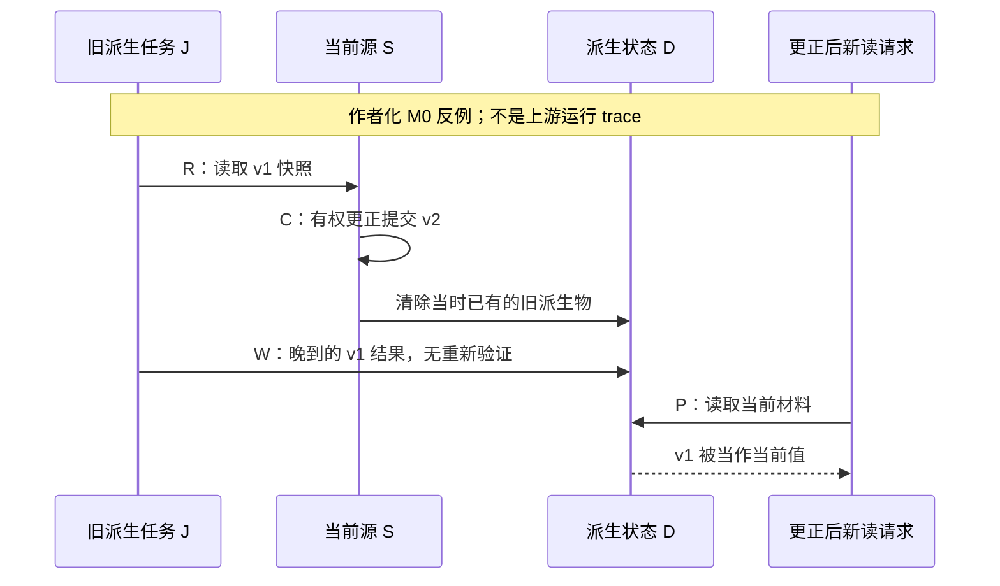

# 更正之后的旧写入：一份可证伪的并发 challenge

**Status:** `draft` / `authored-unvalidated`，2026-10-05。这是研究设计与纸面反例，不是执行记录、accepted Case Card、协议、通用 schema 或上游漏洞报告。

**Scope:** 为 [更正传播研究](correction-propagation-study.md) 的 H2/H3 补充可区分的任务交错，服务 [first-cycle Q2](first-research-cycle.md) 与 [test map X9 / E-B](memory-design-test-map.md)。下文的 revision、job、commit 是说明问题的记号，不要求 system under study 暴露同名 API。没有运行模型、数据库或模拟受测系统，也没有新增 runner。

## 中文摘要

一次更正能删除**已经存在**的旧派生物，却未必约束**尚未完成**的旧派生任务。本文给出一个严格限定的纸面反例：任务先读取 v1，更正随后提交 v2 并清理已有派生物，旧任务最后写入基于 v1 的材料。即使更正入口和当时的清理都正确，最后的当前读取仍可能错误。这个反例只否定指定的简化机制，不证明任何被研究系统存在漏洞。本文给出三种基本顺序、四种检查顺序、两世界的完整合成历史、恢复与邻域对照、最小观测合同，以及足以推翻该解释的证据。配套 [Hindsight 定点源码核查](stale-write-source-audit.md) 专门寻找保护机制；它与本文的作者化推理分开。

## English summary

This unvalidated development worksheet isolates a late derived write from ordinary refresh lag and an unchanged alternate read path. In an explicitly simplified model, a job reads v1, a correction commits v2 and invalidates existing derivatives, and the job later persists its old result. A separate freshness check still leaves a check-to-write gap. These are authored counterexamples to named mechanisms, not observed defects in any upstream system. Two synthetic worlds share their current probe and metadata; schedule, recovery, unchanged-neighbor and raw-history controls distinguish competing explanations. Storage retention, current-use eligibility and task completion remain separate outcomes. A companion pinned Hindsight source audit records observed safeguards and unresolved runtime questions. No system execution, case acceptance or implementation authority follows.

## 1. 要推翻的主张要足够具体

目标主张 G：**在已提交的有权更正之后，新的当前读取不会因更正前启动的任务而重新采用被替代的值，且未撤回的邻域仍然可用。**

这里的「之后」以真实可观察的提交／完成边界为条件。只返回「请求已接收」的 API 不自动提供这个边界；需要另记 accepted、applied、derived-ready、read-observed。系统没有某个信号时记 `unknown`，不把等待 30 秒命名为 ready。

G 的适用范围也必须声明：读请求在更正完成后才开始；限定同一对象、scope、使用目的和观察窗口；没有再一次有权恢复旧值的事件。更正前已经开始的读另行研究。历史查询仍可返回明确标注为过去的 v1，不能把「出现旧文字」直接算作当前误用。

本研究只处理合成作者明确指定的更正权，不证明真实世界中谁有权更正，也不把 wall-clock 最新当作普遍 authority。

## 2. 一个可以手工检查的反例

设源对象当前版本为 S，派生对象为 D。一个任务先读 S 得到快照，稍后据此写 D。被检验的**简化机制 M0**满足：

1. 初始 `S=v1`；旧任务 J 读取 v1。
2. 更正 C 把 `S` 改成 v2，并清除当时存在的旧 D。
3. J 不重新验证 source identity、revision 或 eligibility，直接写入由 v1 生成的 D。
4. 当前读取只消费 D，不再核对 S。

因此 `read(v1) → C(v2) → write(D[v1]) → current-use(D[v1])` 是 G 的反例。所有箭头是**作者定义的状态转移**；没有从源码推断真实系统必然允许这个顺序。语义生成在反例中被固定为忠实保留其输入值，以单独检验生命周期机制。

仅有 R（快照读取）、W（派生写入）、C（更正提交）、P（最终探测），并约束 `R<W`、`C<P`、`W<P` 时，三个合法全序为：

| 顺序 | 在 M0 及上述假设下的纸面结局 | 它区分什么 |
|---|---|---|
| `R W C P` | C 能清理已经写入的旧 D；源或重新生成路径仍须提供 v2 | 普通级联清理；清空 D 本身不证明任务可完成 |
| `R C W P` | 旧任务在清理之后写回 v1，P 采用 v1 | 尚未完成的写入，区别于清理漏项 |
| `C R W P` | R 读取 v2，D 也使用 v2 | 无交错的正常刷新；只测这一行会漏掉问题 |

这三行穷尽的是这四个抽象事件的全序，不穷尽真实系统的读写、事务或故障状态。

### 单独加一个 freshness check 仍不够

若新增检查 Q，要求 `R<Q<W`，检查发现版本变化就拒绝旧结果，但检查与写入之间没有共同保护，那么仍有四种合法位置：

| 顺序（最终 P 省略） | 检查结果 | 剩余问题 |
|---|---|---|
| `C R Q W` | 快照与当前都为 v2 | 正常路径 |
| `R C Q W` | 检查发现已变化，W 不应提交旧值 | 拒绝之后需重新生成／回退，否则可能一直无答案 |
| `R Q C W` | Q 当时正确地看到 v1，随后 C 改为 v2 | 检查通过不约束晚到写入；这是待排除的间隙 |
| `R Q W C` | 检查与写入都先发生，C 最后清理 | 回到已有派生物的清理问题 |

表内 W 在被拒绝行表示**尝试到达写入点**，并不表示写入成功。Q 的存在、函数名或一次通过记录都不能单独证明 `R Q C W` 被排除；需要检查保护的对象、锁／版本条件及其持续到哪一边界。反过来，若真实实现已排除此序列，M0 反例就不能用来指控它。

Mermaid 为本节可编辑说明源；本轮本地预览服务不可达，未完成图形渲染检查。事件顺序与含义同时保留在上表，图不承担独立证据。

## 3. 完整合成材料：同一问题，两种合法当前归属

**Provenance:** 全部新写的公开 synthetic development adaptation，复用 [I-C 归属更正](correction-propagation-study.md) 的机制；不来自私人聊天，不新增独立 incident-family 计数。A、C 为虚构成年人，assistant 是技术系统。部署 context 是一般项目协作；memory content 与 use domain 均为 operational/project；不要求亲密关系叙事。

两世界 metadata 相同：`locale=zh-CN`，`scope=project-north-window`；同一 reader、预算、接口与 current probe。世界标签、预期答案、调度标签只供研究者使用，不进入模型输入或可推断答案的存储名字。e3 以相同位置出现，角色均为 user。

| 事件 | W-change | W-keep |
|---|---|---|
| e1 / user A | 「这个方案最早由我 A 提出，标题叫『北窗』。请你帮我起草：先列访问清单，再统一标文件编号。」 | 与 W-change 完全相同 |
| e2 / assistant | 「我已按你的想法起草：先列访问清单，再统一标文件编号；标题保留『北窗』。」 | 与 W-change 完全相同 |
| e3 / user A | 「更正：最早提出方案的是 C，我 A 只是转述。标题、两步内容和你协助起草这件事都不变。」 | 「确认：最早提出方案的是我 A，C 只是听过介绍。标题、两步内容和你协助起草这件事都不变。」 |
| p / user A | 「简述这份方案：最早是谁提出的，谁协助起草，方案的两步是什么？只给说明，不执行。」 | 与 W-change 完全相同 |

**Probe evidence contract:** W-change 的 originator 为 C，W-keep 为 A；两者 drafter 均为 assistant，两步均为「列访问清单」「统一标文件编号」。标题未变，可作辅助检查，但不靠标题正确替代归属与邻域判断。e3 不取消合作、不删除整份方案，也不授予执行权限。

应分别记录：正确当前归属、起草者保留、两个步骤保留、是否执行了请求禁止的动作、是否无必要地要求用户重复历史。输出无需符合固定 JSON。精确字串只能做初筛；「A 转述了 C 的想法」等改写需按实际语义判断，不以出现字母 A/C 的计数判分。

W-change/keep 检查 history dependence；**同一世界内部**的不同 schedule 检查交错效应。不能把两者合并成一个因果估计。current-only 无法从完全相同的 p 和 metadata 区分两世界，这只是 authored 信息条件；尚未通过 Memory Necessity Gate，也没有模型／人类评审结果。

## 4. 调度与 controls：不能只等一次再读

| 开发条件 | 所需实际顺序／干预 | 能排除或暴露什么 |
|---|---|---|
| 顺序清理 | 旧任务完整提交 → e3 生效 → p | 给删除已有旧派生物的路径一个正常对照 |
| 晚到旧任务 | 旧任务读完 e1/e2 → e3 生效 → 旧任务尝试提交 → p | 定位尚未完成的旧写入 |
| 更正后新任务 | e3 生效 → 新任务读取完整历史 → 提交 → p | 检查正常路径本身是否可完成 |
| 检查后交错 | 旧任务检查通过 → e3 生效 → 旧任务尝试提交 → p | 区分独立检查与覆盖提交的保护；无可用 seam 时不伪造此条件 |
| 恢复／重试 | 已捕获旧输入的任务中断 → e3 生效 → 恢复或原生重试 → p | 检查恢复路径是否绕过正常提交检查；须真实重启／原生恢复证据 |
| 无关对象变更 | 更正另一个 scope 的对象；本对象历史不变 → p | 防止全局停写／清空一切伪装成修复；这是另一个控制，非双世界差异 |

暂停点、注入故障、直接写库或重放私有函数都会改变受测边界。存在原生 seam 才做 native condition；需要 instrumentation 的研究应另列为 diagnostic configuration 并记录其改动。看不到 J 的读取／提交时刻，最多报告相应的输出层现象，不能宣称确认 race。本文没有实施这些干预。

共同 baseline：current-only；case-bounded full-history；保留 e1/e2/e3 角色与顺序的 raw-source retrieval（包括语义检索候选）；原生派生路径。完整历史是信息充分性对照，不是自动正确的 reader 上界。不得移除原文更正或角色来人为削弱 raw-source baseline。若强原文检索已充分满足任务，增加派生层须另外证明可复用收益与成本。

删除作为**后续独立变体**：需要重新定义被删除材料的边界、允许保留的邻域、当前使用与物理删除合同。本文不把 e3 的归属更正自动等同于撤回、禁用或删除，不宣称覆盖完整 forgetting。

## 5. 最小证据与归因分叉

每个观察至少绑定：输入世界与修订、真实 scope、subject/config、reader exposure、任务实际读取的 source identities／versions（如可见）、更正 accepted/applied 时刻、旧任务提交／拒绝记录、当前检索或 context、最终输出、不变邻域。缺项记 `unknown`，不填作者预期值。

| 观察 | 可以支持 | 仍不能支持 |
|---|---|---|
| 源没有真正改到目标对象 | 更正落点／摄入问题，先查 H1 | 派生任务使旧值复活 |
| 源已更正，旧任务随后写入可达的旧 D | 晚到写入的候选机制 | 单凭存储内容断言最终 reader 误用 |
| 旧任务被拒绝，另一 read path 给出旧值 | 该保护拦住此提交；继续查 H3 | 整个更正流程失败的唯一原因是 writer |
| 当前候选含旧历史但标注失效，reader 正确使用新值 | 当前使用可以正确 | 所有旧材料已删除或索引已收敛 |
| 最终答案错误，但中间不可见 | 输出层失败 | 定位 transaction、encoder 或 consolidation |
| 没有旧值，但有效步骤／起草者也丢了 | 有效邻域损失或可用性问题 | 更正机制已满足完整任务 |
| 旧任务被挡住且新任务／原文路径完成任务 | 该条件下兼顾当前使用与完成 | 任意恢复、任意规模、任意未来时点均可靠 |

不能用最后一次成功遮掉此前已出现的错误。若将来测收敛时间，应从已观测更正生效到各次实际读取分别报告；有限观察窗口里未再失败只是一段记录，不是永远收敛证明。重试花费、等待、丢弃的工作与人工修复成本也须分列。

## 6. 比较能完成同一合同的更简单机制

| 候选机制（均未选择或实施） | 对本反例的充分条件 | 仍须检查的代价／缺口 |
|---|---|---|
| 同 scope 串行化整个派生周期与更正 | 从来源快照读取到派生提交持续受保护；更正及恢复 writer 也受同一边界约束，不能只串行化最后的写操作 | 长任务阻塞；跨 scope 不应无故互相阻塞；锁跨越模型调用的代价 |
| 在提交边界验证 source revision／eligibility | 验证覆盖实际读取依赖，且验证与写入之间不能插入使结果失效的更正 | 扇入来源、重试与事务冲突；仅 source ID 存在不证明内容仍是所读版本 |
| 读取时验证派生物资格，失效则回到原文／重建 | 所有当前消费路径都执行验证，且回退仍能完成任务 | 可满足当前使用合同但不提供物理擦除；未保护的 boot/cache 路径仍待查 |
| 只维护原文修订，按需生成 | 当前读取拿到有权且正确 scope 的完整修订证据，reader 能正确使用 | 可能增加 token、延迟或重复推理；须以真实任务和成本决定是否需要派生层 |

单靠取消任务不进入充分条件：取消请求与已提交副作用要分开；只有已证明不会再提交的取消边界才能代替其他保护。单靠 TTL 也不能证明 TTL 到期前的当前使用正确。

纸面推荐是**先查已有原生保护能否闭合这条交错，再做最少的干预**。不要先为 Tilia 选择复杂依赖图，也不要为获得绿色结果把所有派生物清空。源 ID 校验、revision 校验与语义正确性是三个不同保证；本文不把其中一个当成其余两个。

## 7. 怎样推翻本文的解释，怎样推进研究

对一个实际系统，以下证据足以推翻「这个旧任务造成了这次回归」：任务并未读旧值；提交已被拒绝且没有其副作用；该派生物不能到达被观察的消费路径；或错误在旧任务写入前就已出现。发现保护机制时，应说明它排除了哪一条交错，而不是继续保留同一句漏洞猜测。

配套 [源码核查](stale-write-source-audit.md) 针对既有 Hindsight pin 寻找这样的反证。锁、source revalidation 与事务边界有正面研究价值；即使最终没有可复现缺陷，识别一条有效保护也是有用结果。源码缺失／读取不足和真实机制缺失必须分开。

三个去向保持独立：benchmark 得到可 dry-review 的输入与控制；system collection 得到有证据限制的 writer 生命周期研究；incubator 得到有反例和简单替代的候选机制。本文只补 Q2/X9 的开发材料，保留既有 RC-005 首包、所有未接受边界与更广的研究问题，不增加 family 数或 accepted 计数。

**未验证：** 独立人类 source-fidelity／case review、实际 scheduler 可控性、provider/DB/runtime 行为、重启恢复、语义判断一致性，以及任何被研究系统的收益或漏洞。下一项有价值的源研究是检查恢复入口是否复用同一保护；真实执行仍需接受明确的 execution envelope。
