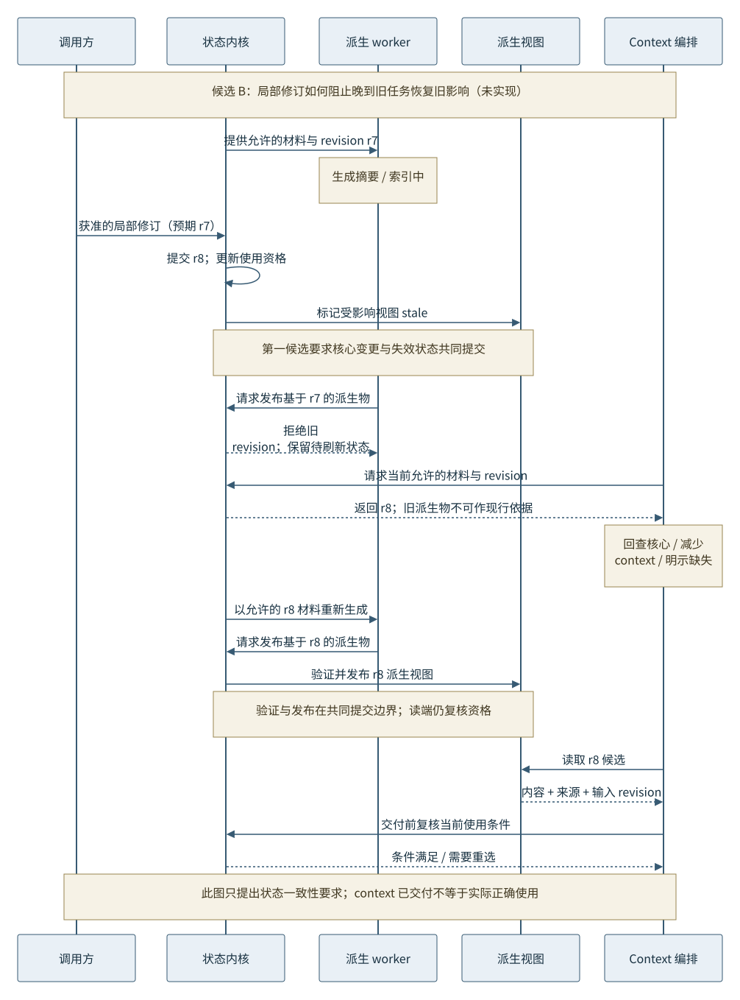

# 自有记忆架构：从连续性要求到可运行候选

**Status:** proposed design study；研究目标来自 maintainer 2026-09-26 的方向补充。[ADR-0007](../decisions/ADR-0007-local-memory-apparatus.md) 已授权第一套明确输入的本地实现；其验收状态见[工程记录](../experiments/local-memory-apparatus.md)。本文的广义架构、实验与效用主张仍是候选。
**Scope:** 为未来从空 Git repository 编写自有 memory 核心与运行装置积累设计和验证依据；不是跨系统协议或普适 memory ontology。

## 中文摘要

Relata 的研究也服务于一项建设目标：自己理解、设计并写出能长期运行的记忆系统。十项目研究给出可借鉴的机制与条件，Case Lab 给出需要保住的具体行为；二者通过[设计与测试映射](memory-design-test-map.md)连接。本研究建议优先比较「可追溯的持久材料与修订 + 可重建的理解/检索视图 + 面向当前任务的 context 编排」和更简单的完整历史／文件搜索方案。建议的中心是当前使用、修复和正向帮助，不是尽可能存下更多 facts。本文的组件和广义实验仍为候选；具体本地实现另行记录，不据此声称模型或连续性效果。

## English summary

Relata's research also prepares an independently authored memory architecture and runnable apparatus starting from an empty repository. This design study connects existing source studies and candidate cases to falsifiable engineering choices. It proposes comparing a durable, revisable evidence core with rebuildable memory views and task-specific context assembly against simpler full-history and file-search approaches. The proposal concerns useful continuity, scoped revision and inspectable use; it defines neither a universal memory ontology nor a cross-system API. ADR-0007 separately authorizes the first local explicit-input apparatus; its engineering record distinguishes implementation evidence from the broader proposed experiments and performance claims.

## 1. 我们想自己承担什么

「从零」指我们拥有核心行为的设计、源码和维护责任，不以 fork 某个 memory engine 再换名字作为这项目标的完成。数据库、模型、标准库和成熟工具可以作为基础设施；是否采用它们由实际责任和证据决定，不以重写一切证明原创性。研究已公开的机制不等于复制其代码，也不支持“首次提出”的声明。

希望最终装置能完成一条真实闭环：经历或工作结果留下可用材料，后来的任务在适当条件下得到帮助，使用者能检查影响的来历，纠正能改变后续影响，必要的历史与未受影响内容继续保留。它应支持普通生活、项目与共同创作、亲密关系、实例和模型迁移中的不同需求；并非每条信息都要承载关系象征，也并非每次互动都需要召回。

研究室和自有系统承担不同责任。Relata 继续容纳不同架构与独立文章；未来自有实现只是一个 system under study。其内部 schema 不能变成他人参测的标准答案。当前按 [STATUS](../STATUS.md) 与 ADR-0007 推进一套独立本地实现；研究 repo 不因此获得 provider、服务或公开新 repo 的权限。

## 2. 从已有研究转移什么

来源范围是 2026-09-22 固定 revisions 的[十份 source-study drafts](../systems/source-studies/README.md)与现有候选 cases。本轮将它们用于设计综合，没有更新 upstream HEAD、运行这些系统或把 source-observed 提升为效果结论。每项目的帮助条件、代价和案例落点见[机制转移与测试映射](memory-design-test-map.md)。

五项候选要求决定第一版设计的形状：

1. **保存差异，也保住使用时的差异。** 作者、来源、提案／接受／完成、适用时间与 scope 不能只停在 DB 字段里；最终 context 和调用结果必须保留当前判断所需的区别。依据：RC-003/005，Graphiti 的投影边界、Letta 的 context compilation。
2. **普通有用的过去能回来。** 项目依据、物品位置、普通共同经历、可复用经验与未完成线索都可能帮助当前任务。不要让抽取 prompt 默默只保存某类情感显著事件；也不要把有价值的叙事全部切成孤立 facts。依据：RC-002/003/005 与 Aelios、Tideline 的不同选择。
3. **更新影响的范围可解释。** 纠正一个断言、撤回一项许可、删除一段材料是不同操作；当前使用变化与历史回看也不同。依据：RC-001/004、lmc-5/Tideline/Graphiti 的分层边界。
4. **理解允许变化，变化有来源。** 摘要、解释、关联、用户或 companion 的理解不能自称原始事实；能重建、能指出依赖的材料和 revision。依据：Hindsight、A-MEM、OpenViking。
5. **有帮助与有代价一起记录。** 正确恢复工作、减少重复解释、找回需要的依据，以及延迟、token、维护和修复负担都要保留。可检查性有代价；如果简单文件搜索同样有效且更易维护，应缩减候选架构。

这些要求是本系统的设计目标。它们对其他研究对象是否适用，仍需声明具体使用情境。

## 3. 三个真正不同的选择

| 候选 | 它解决什么 | 具体代价 / 可推翻条件 | 本研究的位置 |
|---|---|---|---|
| A：完整历史 + 可搜索文件 + 显式 context 选择 | 最少加工，保留叙事和原文，便于检查、编辑与迁移 | 长历史的预算、条件修订、scope 和新旧版本选择要有人或调用方负责；不能假定全文自然会正确使用 | 必须保留的强基线；若满足目标，可以成为实际方案 |
| B：可修订证据核心 + 派生视图 + context 编排 | 明确修订/来源/适用条件，并让检索和当前使用读同一状态；解释和摘要可再生成 | schema、写入判断、维护和状态传播更复杂；元数据不会自动让推断可靠 | **优先验证的候选**；先证明相对 A 的必要性，再逐步加入加工 |
| C：以自主组织／学习为主的记忆 | 经验可改变链接、摘要、提示或更深层的策略，可能获得更好的跨任务迁移 | 变化的归因、回滚、遗忘和代价更难检查；学习对象和实际收益需另有证据 | 有价值的后续研究方向；不作为第一装置的隐含前提 |

B 不是把十个项目的模块全部装在一起。文件、图、向量和规则各自解决具体问题；没有收益证据时不同时引入。对 C 的暂缓不是判定它较差，参数学习也不被排除在 memory 研究之外。

## 4. 候选 B 的责任与状态

以下名称是自有设计中的工作词，全部为 **proposed**。先定义责任，不锁定编程语言、数据库 schema 或公共接口。

| ID / 组件 | 唯一主要责任 | 状态与写入者 | 当前不应推断的能力 |
|---|---|---|---|
| I / 输入与 scope 绑定 | 接收当前输入、明确身份/项目/角色/允许使用范围 | 身份和权限由受信调用方给出；材料正文是待处理内容 | 自然语言标签、namespace 或 LLM 自报角色不等于认证 |
| P / 写入提案 | 从原文或明确操作提出保留、更新、关联或待办 | 模型/人/工具可提出；保留提案来源、依据和不确定性 | 模型提出“已同意”不等于人实际同意 |
| K / 状态内核 | 检查写入权限、预期 revision 和局部条件，提交持久变更 | 核心记录、关系与 revision 的唯一写入口 | 字段完整不证明语义真实；接受进入存储不表示断言被共同认可 |
| D / 派生与维护 | 生成或刷新摘要、关联、索引等可重建视图 | 只写派生视图，记录输入 revision 与依赖；不改原始证据 | 后台启动或 job 完成不证明每个视图可用 |
| R / 候选检索 | 在当前允许范围内寻找可能有用的材料 | 读取核心与当前可用视图；不自主修改权限 | relevance 不等于可以进入 context |
| C / Context 编排 | 选择、预算、排序并保留当前所需的来源/时间/限制 | 输出本次 context packet 与最少解释记录 | 被放入 context 不等于模型正确使用 |
| U / Agent 与实际使用 | 使用 context 回答、继续工作或提出行动 | 执行权限仍归宿主；输出/结果可成为下一轮材料 | memory 本身不获得发送、部署、承诺或定时执行权限 |

在这个候选里，核心保留材料与修订关系；全文、摘要、关联和向量是不同的视图。某条理解可以引用多段材料；材料也可以保持完整片段，不强制抽成原子 fact。解释和经验适用条件可以成为记录，但不能悄悄覆盖说话者原文或获准范围。

ADR-0007 的第一装置选择 Python 标准库与单个本地 SQLite 事务存储，配合普通文件导出，以减少持久状态 owner；这是一项实现选择，不是已证的最优架构。只有在实际检索不足时再引入 embedding；只有并发或维护成本证据要求时再拆后台服务。移动端、多租户云服务和多节点同步不在第一装置的拟议责任中。

内核不承诺自行理解什么是真的。它可以核对受信调用方提供的权限上下文、明确引用、scope 和 revision，却不能验证一句模型解释是否忠于真实经历；第一装置也不提供账号认证。存储接受、来源身份、断言可信度和共同认可应保持不同状态；第一工程实验使用明确输入操作测试这些区别，后续自动抽取必须在相同原始材料上另测。自动维护也不意味着每条材料都要人工审批：已获准范围内可按策略自动保存带来源的提案，但扩大权限或声称共同接受不能由模型自行完成。

### 当前使用链

图的语义规格是上表的 I/P/K/D/R/C/U 和以下动作：I→P 提交材料，P→K 提案，K→D 使派生视图过期／可刷新，I→R 请求，K/D→R 提供候选，R→C 带来源的候选，C→U 本次 context，U→I 可记录的实际结果。箭头都描述候选行为，不是已经运行的系统。外部模型、宿主执行与 case evaluator 在内核之外。

[编辑 Mermaid 源图](figures/own-memory-overview.mmd)。图中实线表示本次材料/请求路径，虚线表示资格复核或结果回流；所有组件均为 proposed。

## 5. 修订闭环：必须经过的具体例子

假设共同作品先有一个由 agent 提出的名字，随后使用者接受，后来又明确更名。再出现一份迟到旧稿。我们希望当前工作使用新名，回顾来历时保留提出者和接受过程；旧稿的到达时间不能自动推翻后来的决定。这沿用了 RC-005 的问题结构，但不是新建或已通过的 Case Card。

拟议的数据最小区别为：材料/断言的稳定身份、来源及原片段引用、发生或适用时间与记录时间、适用范围、提案/接受证据、所修订对象、派生所用的 revision。不要求每条记录填写所有维度；未知与不适用应当可表达。身份和 revision 用来定位同一对象的变化，不用文本相似度代替。

1. 写入提案携带旧材料的真实来源和时间，不能仅以“最新收到”提交为 current truth。
2. 内核只在获准 scope 内提交变更；并存、局部替代、撤回、争议都保留为可区分的关系。明确的人类操作不必再次经模型裁定，模型推断也不自动晋升为共同接受。
3. 与变更有关的派生视图记录为 stale；读路径同时检查当前 revision。若不能证明一份旧派生物适用于当前状态，就回查允许的核心材料或少给信息，不能继续把它当现行依据。
4. 维护从允许的当前材料刷新派生视图。生成是可重试工作；提交前再次核对输入 revision，避免“撤回已经生效，晚到的旧 job 又把它写回来”。
5. Context 编排保留当前名字与工作所需来历。没有当前需要时，不强行展示完整历史；需要回溯时也不能把历史状态说成当前状态。
6. 观察输出与实际后续行为。记录“候选被检索”“context 已交付”“实际正确使用”三个不同事实；不能用前两者替代第三者。

这里没有“全库 latest wins”，也没有以 confidence 分数解决权利、事实或关系意义的冲突。无法根据明确证据消解的分歧保留为分歧，由使用场景决定是否询问、并陈或暂不使用。

上述一致性还有一个精确的时间边界：核心变更与失效标记共同提交；派生物的 revision／权限核对与发布也必须在同一个受保护的提交边界内，不能“检查通过后再无条件写入”。新的 context packet 绑定其读取的 revision，并在交付前复核资格。已交付或正在生成回答的旧 packet 无法自动收回；是否取消在途生成、以及外部行动前怎样重验，属于未来宿主集成的明确合同。不能把一次交付前检查声称为撤回后的全局即时一致。

[编辑 Mermaid 源图](figures/own-memory-revision.mmd)。提交、失效和派生发布需要明确一致性边界；此图不构成已经具备崩溃恢复或并发正确性的证据。

## 6. 控制权、遗忘与运行代价

**Scope 是使用条件，也是权限问题。** 检索前限定可见范围，context 编排和最终派生提交再核对其当前条件。跨 scope 需要明确授权的桥接，不能让相似度自动扩大可见范围。这里拟议的是一个本地可信调用方；尚未设计多租户认证。

**修正、撤回未来使用、清除内容分开。** 修正可保留历史理由；撤回先改变未来的 eligibility；清除要覆盖原始内容和受影响派生副本。不能把“append-only 可审计”理解为永远不能删除。未来实现需逐项说明文件导出、缓存、索引与备份的覆盖；当前不承诺未设计存储层的物理擦除。发送到外部模型或已经交付的 context 不能靠本地删除收回。

**派生追踪是有边界的。** `depends_on` 能记录生成时实际输入的材料，不能证明模型的完整因果来源或语义依赖。来源不全的视图须扩大失效范围或重新生成；与其声称细粒度传播完备，不如保留可解释的粗粒度重建方式。第一版不做分布式依赖图服务。

**后台工作必须值得其维护成本。** 第一候选可以同步刷新或按需重建。若采用后台，写入核心与登记待做维护必须有共同的提交边界，失败可见，读取检查 freshness。崩溃后能继续处理与最终使用正确仍是两个独立测试问题。

**正向收益不能被审计吞掉。** 记录足以定位失败的 revision、选中材料、过滤理由和实际结果；默认不复制整段 context 到永久日志，不收集私人关系内容来证明工具有用。设计是否减少重复解释、恢复工作和修复的负担，需要真实使用证据；token 数不能直接冒充情感劳动。

## 7. 让设计接受反例

完整维度、Case Card 状态与机制转移见[设计与测试映射](memory-design-test-map.md)。下列四组设计实验均 **尚未执行**，目标是排除错误解释，不产生总分。

| 实验问题 | 需要的对照 | 应保留什么 | 哪个结果会改变设计 |
|---|---|---|---|
| 结构化修订是否比原文更有用？ | A 的完整历史/文件搜索与 B；相同输入、当前请求和 reader，分别报告 native 与预算匹配条件 | 正确使用、缺失来源、局部修复与历史保留、token/延迟 | A 已稳定完成而 B 只增加负担：减少结构化加工；B 的优势只来自额外上下文：撤回架构优势解释 |
| 不同入口是否读到同一当前状态？ | 主动搜索、会话预注入、显式回看；旧 revision 派生物作为干扰 | 核心提交、可检索/可投影时间、各入口消费的 revision | 搜索已修正但预注入仍旧：当前状态保障失败，不能只修展示文本 |
| 写入理解是否损害原始区别？ | 保留原文、无自动抽取、候选抽取；RC-003/005 的来源/接受区别 | 丢失发生在哪个转换、未来纠正能否恢复 | 设计只能靠 evaluator annotations 保住区别：不得宣称原生能力，先修输入/提案路径 |
| 更新或删除会不会让旧影响回来？ | 正常、提交后重启、维护中断、晚到旧任务；同时保留未受影响邻居 | 数据/视图/输出层证据、重建状态和失败记录 | 已撤回材料再次进入新 context，或修复误删邻域：内核/派生协议不满足目标 |

current-only 诊断历史是否必要；full-history/full-search 保留简单而强的对照；作者选出的 reference excerpt 只是选择诊断，不是真实 retrieval 上界。材料量不同就报告暴露差异，不能靠统一截断让强基线失去关键证据。所有历史条件保留原有时间顺序，probe 答案、未来事件和 evaluator key 不进入后续输入。

比较 A 与 B 时，B 不能直接收到作者整理的正确状态，而 A 只得到原始对话。应从相同可见材料开始，记录各自的抽取、选择和人工干预；使用人工写入操作的内核实验与自动记忆的端到端实验分别报告。具体收益也应成对观察：当前工作是否恢复、来历是否正确、未来使用是否更少重复解释，以及这些结果所花的上下文、调用和维护代价。

既有五个 cases 是已知开发表例，不能再被称为隐藏验证集。后续需要先锁定设计主张，再做未用于开发的变体和竞争反例，记录争议；尚未有人类 review 的案例仍不据此升级为 accepted。对 companion identity、长时段效用、学习迁移、撤回意图等覆盖缺口保持明确，尤其不将 D-006 的未来意图 authority 缺口补成已完成案例。

## 8. 第一次 git init 的实现范围

本设计最初交付研究、反例和装置合同候选。随后的继续实现按 ADR-0007 在独立 `relata-memory` repo 中承担下列闭合本地路径；实际完成项和命令以工程记录及该 repo 的 README 为准：

- 输入与来源/scope 绑定 → 持久写入 → 检索/编排 → 实际消费 → 局部纠正 → 重启后继续使用；
- 能检查、导出和恢复该实验装置自己的材料；能区分原始材料、派生视图与已交付 context；
- 同一条路径有当前请求、完整历史和简单搜索对照，避免内核测试被误报成模型或长期关系能力。

可先用明确操作和 scripted consumer 验证持久性、revision、scope 与失效规则。这会是存储/状态机制的工程证据；只有接入具体 reader 并观察语义使用，才开始回答连续性效果。不要把人工标注好的结构当作自动抽取的成绩。

独立 repo 的工作名为 `relata-memory`，第一技术栈为 Python 标准库 + SQLite；新 repo 中保留自有源代码和基础设施来源，不继承上游 maintainer 设置，也不默认增加公共许可或远端。Relata 研究记录仍留在这里，未来独立实现按其真实权限、数据和运行条件进入研究。第一装置不以正式跨系统 benchmark 的完整 promotion gate 作为开发前提；具体获准范围由 ADR-0007 给出；本设计不将其扩大成自动抽取或模型效果试验。

## 9. 本轮认识的边界

优先候选 B 的理由是我们已有的问题反复跨越保存、更新和使用三层；它仍可能输给 A。现有资料足以提出这个假设，不足以证明 B 更好、原创机制或普遍适用。后续文章可以批评现有机制，自有系统也必须接受同样的批评。

与 [AMS 的连接](agent-memory-inquiry.md#与-ams-的连接)继续保留其 source / experiment / proposed-transfer 状态。本文没有改动 AMS，也不以“有模型反思”代替经验改变能力的证据。

图示的 editable source 为 `figures/own-memory-*.mmd`，SVG 是 Mermaid 11.17.2 的派生导出。修改源图后应重新导出并检查实际布局；不在 SVG 中另行维护拓扑。图示是候选设计的表达，不是第三十一、三十二张 upstream 源码观察图。
