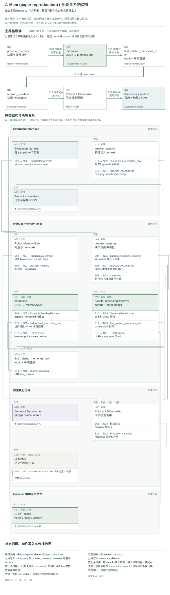

# A-Mem：笔记演化机制与论文复现边界

**Status:** source-study draft; independent human review pending. No complete-system performance result.

状态：bounded public-source study，静态源码研究；不是 accepted System Card、运行测试、性能验证或 maintainer endorsement。研究日期：2026-09-22。

源对象：[WujiangXu/A-mem](https://github.com/WujiangXu/A-mem)，固定 commit `0c8039f28fdcc08189a23c07a3437d9d2482f9c2`。架构模型：[architecture model](../architecture-atlas/models/a-mem.json)，包含 `overview`、`flow`、`revision` 三个视图。模型中的 observed 仅指检查过静态源码。

## 中文摘要

这个仓库明确服务于论文结果复现，README 另将应用构建指向 A-mem-sys；不能把两者的 API、存储或生命周期混成一个系统。本次固定版本同时有 original JSON-schema 路径和 README 推荐的 robust plain-text 路径，架构图以 robust 为主，报告对照 original。其独特机制是：把每个输入保存为带 context、keywords、tags 的 note；用新 note 的原文检索 5 个近邻；让 LLM 决定为新 note 增加链接，以及是否重写旧近邻的 context/tags；回答问题时先抽 query keywords，再 embedding 检索并单跳展开 links。实际 state 分成 UUID→note 字典、按列表位置引用的 links、向量/corpus 索引，以及 evaluation harness 管理的三文件缓存。旧笔记 metadata 演化与索引刷新并不同步；默认每 100 次被标记为演化的添加才全量重建索引。没有专用 correction、delete、TTL 或演化审计接口。[S1], [S2], [S3], [S4], [S5], [S6]

## English summary

This pinned repository is the paper-reproduction code, not the separately linked A-mem-sys application implementation. The atlas models the recommended robust path and its shared embedding retriever, with the original JSON-schema path documented separately. Inputs become notes with generated keywords, context and tags. A new note retrieves five neighbors; conditional model calls can attach positional links to the new note and rewrite existing neighbors' context/tags. QA uses model-generated query keywords, cosine top-k retrieval and one-hop link expansion. The canonical UUID-keyed note dictionary, positional references, derived embedding corpus and harness-owned cache files have distinct update boundaries. Neighbor metadata changes do not immediately refresh existing embeddings; consolidation rebuilds the index after a count threshold, without merging or deleting notes. No upstream code, model, dataset evaluation or synthetic probe was executed.

## 身份、版本与证据级别

[论文 arXiv v11 页面](https://arxiv.org/abs/2502.12110v11) 将 A-MEM 标为 NeurIPS 2025，摘要描述 Zettelkasten 式动态索引、连接与已有记忆的表征演化，并报告六种模型实验。本次只读了该页面的摘要、元数据和版本信息，没有读完整论文或复验实验表。论文所称效果是作者报告，不是本研究的发现；当前仓库 commit 也不被假定为发表实验时的精确环境。

README 的第一条边界比名字更重要：这里是复现仓库；A-mem-sys 是另一个代码对象，本次没有读取、克隆或纳入。未检索或导入任何同名商业项目。`test_advanced*.py` 是会调用模型与写缓存的 evaluation harness，不是已经运行过的离线 unit tests。[S1], [S2]

| 路径 | 已读实现 | 本研究如何表示 |
| --- | --- | --- |
| original | `MemoryNote`、`AgenticMemorySystem`、`test_advanced.py` | JSON-schema metadata/evolution；报告对照，不叠到 robust 图中 |
| robust | `RobustMemoryNote`、`RobustAgenticMemorySystem`、`test_advanced_robust.py`、`llm_text_parsers.py` | 主图；plain-text section parsing，JSON fallback，模型调用 retry |
| shared retriever | `SimpleEmbeddingRetriever`，由两路实例化 | active embedding-only corpus/向量索引；`HybridRetriever` 定义存在但不是这里的 active 检索路径 |

两条主路都构造 `SimpleEmbeddingRetriever`。源码注释中的 “hybrid retrieval” 不能当成 BM25 已参与当前调用的证据。[S4], [S7], [S19], [S20]

## 输入、笔记与 state ownership

Harness 每个 sample 建一个 agent。冷缓存时按 dataset session/turn 的迭代顺序输入 `Speaker … says : …` 文本，并传 session 时间；它没有逐用户权限系统。Dataset loader 保有 `dia_id`，但 `add_memory` 只交 content/time，没有把该原始 ID 填入笔记的结构化 provenance。图片只经已有 caption 文本化。这里是对话 QA 部署域；note 的内容域不限于感情、人物或关系。[S11], [S22]

`RobustMemoryNote` 保留 content，并由模型生成 keywords、context、tags；note.id 默认 UUID。timestamp 接受调用方值，缺省当前时间；另有 links、importance_score、retrieval_count、last_accessed、evolution_history、category 等字段。但 active 检索/演化没有推进 access/history 字段，也未用 importance 做保留或排序。category 默认 `Uncategorized`；它不是自动得出的系统 ontology。[S3], [S4], [S5], [S6]

metadata 分析使用 plain-text prompt 和 section parser，同时接受 JSON。空字段可启发式补齐；模型/解析异常则回退 heuristic。该 keyword heuristic 用英文字符 regex 和英文 stop words；它不能据此被宣称为可靠中文后备方案。content 仍保留原文，不应把生成 context 当作原始话语或已判定事实。[S3], [S16], [S18]

| state | owner / writer | identity 与传播 |
| --- | --- | --- |
| `memories` | memory system；`add_note` / `process_memory`；harness restore | UUID-keyed dictionary；canonical note object |
| `links` | `STRENGTHEN` 修改新 note | 模型输出整数，读取时直接 `list(memories.values())[neighbor]`；不是 UUID 边；不自动加反向边 |
| `corpus` / `embeddings` | `SimpleEmbeddingRetriever` | 一行对应字典 insertion order；`document_ids` 则为全文→行号，不用于 UUID retrieval |
| disk cache | evaluation harness + retriever | notes pickle、index pickle、embedding npy 独立保存；没有原子 snapshot |
| output / metrics | evaluation harness | prompt/context 日志、预测/参考结果 JSON；不是记忆系统的审计 log |

[S3], [S4], [S5], [S7], [S8], [S11], [S12]

## 写入与演化

`add_note` 的真实顺序是构造 note → `process_memory` → 存 UUID 对象 → 给索引追加新 note 拼接文本 → 若演化标记为 True，增加 evo_cnt 并检查 threshold。整个过程同步执行；没有记忆任务队列、后台 worker 或定时整理器。[S4], [S6]

Robust evolution 用新 note.content 检索 k=5；没有旧 note 时跳过。先请求 `NO_EVOLUTION`、`STRENGTHEN`、`UPDATE_NEIGHBOR` 或组合决策，再条件性发第二/第三个模型调用。STRENGTHEN 追加新 note.links 并替换非空 tags；UPDATE_NEIGHBOR 直接覆盖被选旧对象的非空 context/tags。旧 content 与 keywords 不随之重写。未实现关系类型、双向链接或 LLM reason 的结构化审计保存。[S5], [S6], [S16], [S17]

LLM 后端来自 factory：OpenAI、Ollama、SGLang 或 vLLM。调用包装最多尝试三次，间隔是同步 sleep；默认不执行 connectivity check。模型输出能提出动作，实际变更权限在 `process_memory` 代码中，未经过人类批准或独立真实性检查。外部服务本身的存储、模型内部推理和 retention 都未检查。[S13], [S14], [S15]

Robust 捕获演化异常并返回 False，让添加继续，但不存在 transaction rollback。若 strengthen 已改了新 note，随后 update 调用失败，新 note 的已改 links/tags 仍可被保存；如果更新循环中后段失败，先前对象修改也没有撤销。这里可以支持“保留处理进度”的解释，不能写成“原子存储无演化”。该故障路径是静态推导，尚未运行验证。[S4], [S6]

## 选择、context 与回答

`SimpleEmbeddingRetriever.search` 对 query 编码，和全部 embeddings 求 cosine similarity，排序取 top-k 行号。读 note 时按同序字典 values 取对象。`find_related_memories_raw` 先输出 seed note 的 timestamp/content/context/keywords/tags，再单跳展开其 links；不递归遍历图，不做最终去重或 token-budget 裁切。代码在 append 后判断 `j >= k`，因此单个 seed 可追加最多 k+1 条 link，而不是 k；最终 context 数量不能当成 retrieve_k。[S5], [S7]

Harness 先让模型把问题变成关键词，再调用 raw retrieval。存在 `retrieve_memory_llm` helper，但 active `answer_question` 直接使用 raw_context，未调用该 helper 做第二轮筛选。最终 prompt 由 QA category 决定。category 5 把传入的 final_answer 与 “Not mentioned…” 作为二选一候选，不能把该 category 描述成无候选自由回忆。参考答案、评分和结果文件由 harness 拥有，非 memory layer。[S9], [S10], [S12], [S22]

LLM 回答不是检索命中的证明；当前研究也没有比较 keywords query 与原始 query、embedding-only 与 link expansion，或 full-history/full-search controls。

## 演化与索引为何会分离

新 note 添加时立即编码，但 `UPDATE_NEIGHBOR` 修改旧 note 的 context/tags 后不更新其旧 corpus 行或 embedding。默认 evo_threshold=100；只统计被返回为 True 的演化，因此不是每 100 笔输入，也不是每 100 次字段改动。阈值到达时 `consolidate_memories` 从当前 notes 全量重新建立 retriever；没有合并、压缩、去重或删除 note。[S4], [S6], [S7]

这意味着同一查询的选中集合可能仍由旧 metadata 的向量决定，然而返回给 QA 或下一次演化的 metadata 已是新值。此结论来自写路径分离；实际排名改变和效果尚未测量。索引初次 append 的拼接模板与重建模板也不同，不能假定重建只是逐字一致的 refresh。[S4], [S5], [S7], [S8]

“canonical state” 在这里指内存字典，而非事务型 durable authority。harness 在摄入全部 turns 后依次保存三文件；加载先恢复 notes，再加载索引，有 index cache 缺失时才从 notes 重建。文件名按 sample index，cache 目录按 backend/model；该逻辑没有 dataset identity、源码版本或完整性验证。保存旧向量时 metadata/index 差异可以跨运行保留。evo_cnt 不在 notes 或 retriever cache 里，新实例恢复后从 0 开始。这里只陈述已读路径，不推出实际已有 cache 一定损坏。[S4], [S8], [S11]

## 更正、删除、保留与 relational use

所读两套 memory system 没有专用更正、delete、撤回或 TTL API；新输入可触发生成 metadata 更新，但没有“旧命题被撤销”“哪位说话者有权纠正”的确定性合约。原 content 保留，context 可改写，不追加 revision history。外部直接删 dict 项会使 positional links/rows 的维护成为调用方问题；本仓库没有为这种行为定义传播算法，因此不把外部手动修改算成已支持删除。[S3], [S4], [S5], [S6], [S20]

对于一般记忆，条件优势是新事件可使旧材料出现更有用的检索描述，并通过 links 扩大上下文；前提是模型判断和近邻定位可靠。对于长期 relational use，同样机制能把日常活动、共同项目与关系事件联系起来；并不需要每条事件具备浪漫标签。但这里没有关系主体、承诺、隐私边界、撤回权限或多主体观点的原生模型。输入 speaker 字符串与每 sample 隔离只是评估包装，不等同于多用户权限或亲密关系治理。不能从 LoCoMo QA 架构推导实际长期亲密关系维持能力。[S3], [S5], [S6], [S11], [S22]

## Original 路径的额外静态发现

Original 将演化合在一次 JSON-schema 调用中，并同样采用 positional links 和 threshold rebuild。它的 `analyze_content` 使用 `re.sub`，但该模块 import 列表没有 re；内部 bare except 的日志又引用尚未绑定的 e。外层 except 有兜底返回，但这条未修正路径会妨碍预期 metadata 解析（从源码推导，未执行）。如果 completion 在 response 赋值前失败，异常日志再引用 response 也可能出错。此发现只属于固定 commit 的 original，不应归因于 robust 或论文发表时实现。[S19], [S20], [S21], [S24]

图采用 robust 并不表示它已经证明正确。尤其 link 整数没有范围校验；更新 prompt 的邻居 ordinal 与展示的 corpus index 分属不同坐标，调用链依赖模型按预期格式回应。需要分别测试这些 contract，不能以函数名或 robust 标签作运行保证。[S5], [S6], [S16], [S17]

## 两个 proposed synthetic probes（均未运行）

1. **更正→旧 metadata→派生索引一致性。** 只用 synthetic 成年角色与项目材料：先写“林与周周四晚在北馆做共同翻译”，再写“更正：共同翻译改在南馆；周四仍有效”，混入工作记录和普通生活事件。固定可观察的模型响应，使新 note 触发旧 note context/tags 更新；分别检查原 content、当前 context、对应 corpus/embedding 输入、evo_cnt，以及 query 的 seed/expanded context。比较阈值前、显式 consolidate 后、保存/恢复后；另以完整历史/完整搜索提供可用证据上界。目标是区分“模型没改 metadata”“已改但索引未更新”“检索到了但 QA 没用更正”，不把三类失误混成一个记忆失败。会需要另行授权的执行环境；本报告没有任何 probe 结果。

2. **位置链接与混合域 provenance。** synthetic 成人 A/B 的个人事件、共同项目与同名第三人事实交错输入，使被选邻居的 corpus indices 与局部 ordinal 不一致。检查模型返回 links 是哪套坐标、单跳扩展是否包含正确对象、重复和最终 context 数量。增加一个明确撤回请求，记录系统是否只是新增 note/改 metadata，还是确有专用删除传播（当前源码预期未提供）；任何手动模拟移除只作为另列的适配实验，不冒充 native 能力。以保留的 UUID、原始 turn ID 对照表和真实传入 prompt 区分归属错误、链接格式错误、缺少 deletion contract。不得让“关系用例”把所有材料强制改成情感符号。

## 覆盖、未读与验证

已静态读取：README 全文；`memory_layer.py` 的 imports/controller factory、MemoryNote、HybridRetriever/共享 SimpleEmbeddingRetriever、AgenticMemorySystem 写入/演化/查询和示例；`memory_layer_robust.py` 主体（构造、所有 factory 后端、同步 retry、note、完整 active system）；`llm_text_parsers.py` 全文；`test_advanced_robust.py` 核心 agent、cache/摄入/QA、输出和 CLI；`test_advanced.py` active answer、cache 与部分包装；`load_dataset.py` 1–175；`run_k_sweep.sh` 1–100。初次大块输出有截断，重要 active 段落随后分段重读；未把截断部分算成全量覆盖。

未读/未验证：raw `data/locomo10.json`、完整论文、图片、`utils.py` 的指标实现、原始 harness 的全部配置/聚合细节、dataset loader 后半部分、shell 全部实验编排、依赖实际版本/兼容性、外部 A-mem-sys、任何 hosted product 或运行状态。没有对原始数据做真实性、consent 或版权判断。

完成的检查仅包括：clone 官方公开 repo 并获取完整 commit；静态源码锚点行界验证；architecture.json JSON 解析、三视图数量、node/edge 引用、evidence ID、observed 证据非空验证。节点/边数为 overview 12/18、flow 14/21、revision 12/16。没有安装依赖、导入/运行 upstream、下载权重、发起 provider 请求、运行数据集/测试或生成性能结果。上游系统的运行行为仍未验证。

## 固定源码引用

[S1]: https://github.com/WujiangXu/A-mem/blob/0c8039f28fdcc08189a23c07a3437d9d2482f9c2/README.md#L1-L7 "论文复现仓库与另一个 A-mem-sys 的明确边界"

[S2]: https://github.com/WujiangXu/A-mem/blob/0c8039f28fdcc08189a23c07a3437d9d2482f9c2/README.md#L82-L122 "original 与 robust 两条 evaluation 入口；缓存和 k-sweep 宣称"

[S3]: https://github.com/WujiangXu/A-mem/blob/0c8039f28fdcc08189a23c07a3437d9d2482f9c2/memory_layer_robust.py#L273-L345 "笔记 UUID、字段、metadata 提取、解析及启发式降级"

[S4]: https://github.com/WujiangXu/A-mem/blob/0c8039f28fdcc08189a23c07a3437d9d2482f9c2/memory_layer_robust.py#L352-L409 "canonical memories、写入顺序、evolution counter 与全量重建"

[S5]: https://github.com/WujiangXu/A-mem/blob/0c8039f28fdcc08189a23c07a3437d9d2482f9c2/memory_layer_robust.py#L411-L459 "embedding 索引位置映射与单跳 links 扩展"

[S6]: https://github.com/WujiangXu/A-mem/blob/0c8039f28fdcc08189a23c07a3437d9d2482f9c2/memory_layer_robust.py#L463-L540 "至多三次演化调用及直接写邻居 metadata"

[S7]: https://github.com/WujiangXu/A-mem/blob/0c8039f28fdcc08189a23c07a3437d9d2482f9c2/memory_layer.py#L554-L610 "实际使用的 SimpleEmbeddingRetriever；拼接 corpus 与 cosine top-k"

[S8]: https://github.com/WujiangXu/A-mem/blob/0c8039f28fdcc08189a23c07a3437d9d2482f9c2/memory_layer.py#L612-L664 "索引双文件 persistence 与从 notes 重建"

[S9]: https://github.com/WujiangXu/A-mem/blob/0c8039f28fdcc08189a23c07a3437d9d2482f9c2/test_advanced_robust.py#L53-L114 "harness 包装、question→keywords→raw_context；筛选 helper 未接入"

[S10]: https://github.com/WujiangXu/A-mem/blob/0c8039f28fdcc08189a23c07a3437d9d2482f9c2/test_advanced_robust.py#L115-L153 "按 QA category 造 prompt；category 5 有给定选项；模型返回"

[S11]: https://github.com/WujiangXu/A-mem/blob/0c8039f28fdcc08189a23c07a3437d9d2482f9c2/test_advanced_robust.py#L204-L250 "每 sample 实例、三文件 cache 与逐 turn 摄入"

[S12]: https://github.com/WujiangXu/A-mem/blob/0c8039f28fdcc08189a23c07a3437d9d2482f9c2/test_advanced_robust.py#L254-L313 "reference metrics、日志、结果 JSON"

[S13]: https://github.com/WujiangXu/A-mem/blob/0c8039f28fdcc08189a23c07a3437d9d2482f9c2/memory_layer_robust.py#L44-L66 "同步重试，至多三次尝试与指数 sleep"

[S14]: https://github.com/WujiangXu/A-mem/blob/0c8039f28fdcc08189a23c07a3437d9d2482f9c2/memory_layer_robust.py#L98-L206 "OpenAI/Ollama/SGLang/vLLM 调用边界"

[S15]: https://github.com/WujiangXu/A-mem/blob/0c8039f28fdcc08189a23c07a3437d9d2482f9c2/memory_layer_robust.py#L243-L266 "factory 与默认关闭的 connectivity check"

[S16]: https://github.com/WujiangXu/A-mem/blob/0c8039f28fdcc08189a23c07a3437d9d2482f9c2/llm_text_parsers.py#L128-L206 "分析、演化、连接和邻居更新的 prompt 合约"

[S17]: https://github.com/WujiangXu/A-mem/blob/0c8039f28fdcc08189a23c07a3437d9d2482f9c2/llm_text_parsers.py#L292-L377 "连接整数解析及邻居 ordinal block 解析"

[S18]: https://github.com/WujiangXu/A-mem/blob/0c8039f28fdcc08189a23c07a3437d9d2482f9c2/llm_text_parsers.py#L430-L511 "metadata repair 与偏英文 heuristic"

[S19]: https://github.com/WujiangXu/A-mem/blob/0c8039f28fdcc08189a23c07a3437d9d2482f9c2/memory_layer.py#L666-L757 "original 同样选择 embedding-only；写入和重建"

[S20]: https://github.com/WujiangXu/A-mem/blob/0c8039f28fdcc08189a23c07a3437d9d2482f9c2/memory_layer.py#L807-L898 "original 演化 JSON 和 positional links 读取"

[S21]: https://github.com/WujiangXu/A-mem/blob/0c8039f28fdcc08189a23c07a3437d9d2482f9c2/memory_layer.py#L278-L401 "original metadata 分析与未绑定 re/e 异常路径"

[S22]: https://github.com/WujiangXu/A-mem/blob/0c8039f28fdcc08189a23c07a3437d9d2482f9c2/load_dataset.py#L8-L96 "QA、Turn IDs、session 时间和 caption 文本化"

[S23]: https://github.com/WujiangXu/A-mem/blob/0c8039f28fdcc08189a23c07a3437d9d2482f9c2/run_k_sweep.sh#L63-L100 "k-sweep 是外部实验进程并行；不是后台记忆任务"

[S24]: https://github.com/WujiangXu/A-mem/blob/0c8039f28fdcc08189a23c07a3437d9d2482f9c2/memory_layer.py#L1-L29 "original imports 中没有 re"

## 架构三视图

[打开交互图集](../architecture-atlas/index.html#a-mem/overview) · [总览 SVG](../architecture-atlas/diagrams/a-mem/overview.svg) · [写入到使用 SVG](../architecture-atlas/diagrams/a-mem/flow.svg) · [修订与控制 SVG](../architecture-atlas/diagrams/a-mem/revision.svg) · [可编辑模型与源码证据](../architecture-atlas/models/a-mem.json)

图中“已读”表示固定版本的静态源码观察；“推断”和“未知”分别保留条件与未检查边界。三幅图覆盖不同问题，不等于全仓审计。[图例与阅读方法](../architecture-atlas/README.md)。
