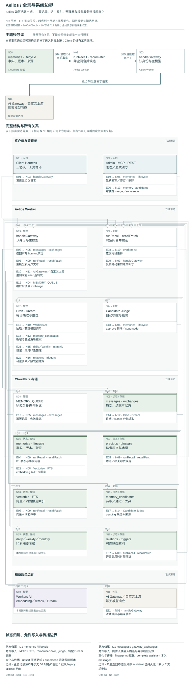

# Aelios：跨客户端记忆网关的即时、夜间与修订边界

**Status:** source-study draft; independent human review pending. No complete-system performance result.

状态：**公共源码研究草稿**。研究日期：2026-09-22。`observed` 仅表示静态实现已读，不表示线上行为、性能或案例验证。未运行上游脚本、安装依赖、调用模型或 embedding provider、部署、使用私人对话或改动上游。

## 中文摘要

Aelios 当前公共主线是部署于 Cloudflare 的记忆网关：客户端持有工具循环，Worker 按钥匙、助手与主模型白名单决定是否记忆；D1 保存原话和主要长期记录，Vectorize 与 FTS 提供候选索引。主模型的人类新输入在召回前同步写入，规则识别的“请记住”可立即成为长期条目；完整助手输出在响应结束后经 Queue 异步记录。夜间 Dream 按日期和 cursor 分批消费原话，生成候选与日记，默认自动 judge 可以批准、丢弃或留待人工。召回把多个空间、多种来源的候选汇合，按原文片段批量重排、去重和严格数量预算，将少量内容临时追加到当前用户消息尾部。[S1][S4][S6][S14][S17]

它提供可检查的候选、版本、署名、珍贵原文与印象阶梯，但不能据此称为通用混合域抽取或全局遗忘系统：默认抽取 prompt 排除工程主体，删除路径也未统一清理日记、感知快照、全部触发器及上游状态。[S20][S21][S27][S28]

## English summary

At the pinned public main commit, Aelios is a Cloudflare-hosted memory gateway, with the client retaining the agent/tool loop. Human input is persisted before recall; explicit remember instructions can create verbatim memories immediately. Completed assistant output is recorded asynchronously. Nightly Dream proposes memories and writes impressions, while a default-enabled model judge can accept, discard, or leave candidates pending. Multi-namespace retrieval combines several sources and reranks exact text windows before appending a small temporary patch to the current user turn. Source code supports inspectable curation and revision mechanisms, but does not establish production reliability, domain-neutral extraction, or end-to-end erasure. In particular, the default extraction prompt filters out engineering-centered conversations, and deletion semantics vary between REST, MCP, and legacy paths.

## 精确对象与版本选择

- 主研究对象：[wusaki0723/Aelios](https://github.com/wusaki0723/Aelios)，`main`，commit [`9e65c802ec1c13a68d22a68c5c9d7cdce385e041`](https://github.com/wusaki0723/Aelios/commit/9e65c802ec1c13a68d22a68c5c9d7cdce385e041)，Git commit 日期 2026-09-15。当前 README 的产品入口是记忆网关；实现配置版本字段为 `version: 3`，记忆库仍使用默认启用的 v2 lifecycle。两者不能当作同一“版本号”。[S2]
- 同作者 [aelios-v3](https://github.com/wusaki0723/aelios-v3) 的公共 `main` 固定于 [`65dd845618a5841183ac48f170bf6b9f05bc63f6`](https://github.com/wusaki0723/aelios-v3/commit/65dd845618a5841183ac48f170bf6b9f05bc63f6)，2026-09-06 的单次 `source repo import`。其 [README 开头](https://github.com/wusaki0723/aelios-v3/blob/65dd845618a5841183ac48f170bf6b9f05bc63f6/README.md#L1-L31) 仍带开发分支说明并把主线和 clone 链接指向 Aelios。没有找到支持“aelios-v3 已替代 Aelios”的明确迁移声明。
- GitHub 公共 metadata 在研究日显示两仓库均 `archived:false`、默认分支 `main`，Aelios 的 pushed_at 更新。因此将 Aelios main 作为当前公共研究入口是**有上述证据支持的编辑判断**，不是替作者宣布版本政策。图不混入 aelios-v3 的旧逻辑或历史 `v1-final`、`tg-bot`。

## 实际组件，而非把“六层”当现状

| 当前对象 | 作用与边界 |
| --- | --- |
| `messages` / `gateway_exchanges` | 原话与请求结果；user 在召回前 await 写入，assistant 在结束后异步投递。exchange 状态可存在，但 failed/truncated/incomplete assistant 不进入普通 Dream 原话集合。[S1][S4] |
| `memories` + `memory_lifecycle` | 长期事实及版本、来源、last_seen / last_injected 元数据。普通写入固定八类 `fact/event/preference/relationship/boundary/habit/decision/note`。[S18][S29] |
| `precious` / `glossary` | 独立珍贵原文与术语表。显式 boot 可以读取；网关只把相关内容纳入统一选择，不让珍贵无条件占位。[S6][S26][S37] |
| `memory_candidates` | 抽取和修订建议的状态队列，支持自动 judge 和人工操作，不等价于“全人工审批”。[S16][S17][S38] |
| `daily_log` / `weekly_log` / `monthly_log` | 印象摘要阶梯，不走 memory embedding；日记提示明确不是核实事实档案。boot 返回印象；gateway 中相关周印象可进入候选，但不得作为事实问答答案。[S6][S8][S11][S26][S30] |
| `memory_relations` / triggers | 可选关系扩展与触发器候选入口，默认关闭；不是所有记忆必经的图架构。[S9][S31][S42] |
| `perception_cache` | 夜间选出的少量高重要度、近期未回忆条目的正文快照，经 secret-pattern 处理后用于显式 boot。[S27] |

旧 migration 仍有 L1 digest、longtail 等历史对象；当前 `runRecall` 仍保留 longtail 空结果兜底，但本轮没有发现当前 Dream 继续生成 longtail 的普通路径。故图不伪造稳定的六层必经流水线。历史改造记录已明确移除四小时抽取和 digest 写入，当前 `wrangler.toml` 只配置 `10 20 * * *`。[S9][S13][S40][S41]

## 写入、保留、选择、使用

1. **确定身份与空间。** `Identity` 有一个写空间、显式 `readNamespaces`，省略则读写空间，`[]` 则不召回；允许最多八个唯一读空间。配置由 D1 优先于环境配置。主模型白名单是自动记忆开关，工具续轮、auxiliary 与非主模型各有不同绕过行为。[S1][S2][S3]
2. **即时保存。** 新人类文本先存 D1/FTS；“请记住”规则把内容按字面 hash 构成 `verbatim:` fact_key，直接 upsert。它只保证相同字面幂等，不能把改写内容自动当成同一主题。保存失败会记失败状态但不自动阻断聊天。[S1][S4][S5]
3. **召回与注入。** 普通条目走向量＋词面；glossary、相关 precious、证据问题的原话、条件性的周印象一起候选。各空间轮流合并，再选最多 16 候选、每条最多 4 个连续窗口。默认 Workers AI reranker 看实际拟引用原文；失败回退词面。普通联想至多一条，证据问题至多两条，低分可以全不选；日记印象不能回答事实，“最近一次/哪天”的事件排序类问题有拒绝自动注入的条件。[S6][S7][S8][S9]
4. **使用与记录。** 补丁只追加当前 user 尾部。Responses 主模型强制 `store:false`，拒绝隐式服务端历史引用；客户端仍管理工具循环。响应可见文本与模型工具调用经过收集后异步写回，原补丁不被当作用户原话保存。Queue 失败有直接 D1 回退，消费错误会 retry；这不等于响应返回前已收到 durable assistant 写入确认。[S1][S4][S43]
5. **夜间整理。** cron 对配置写入空间运行 Dream，cursor 分批和少量回补；模型输出错误时不推进 cursor。新提取与普通 add/update/delete 进入候选；默认 strategy 的既存 `world_fact` 更新存在直接 supersede 例外。judge 默认启用，查来源 messages 后判 grounded/durable，无原始消息直接不可信；批准可以创建、supersede 或 archive，未定项仍 pending。其后还有日记、留存、可选 archive pull、周月汇总与可选联想建期。[S14][S15][S16][S17][S35]
6. **可选联想。** relation 是从已有命中往外扩两跳；trigger 是夜间用模型生成 concept/bridge，写三个向量到 `trg:` namespace，再将命中 union 入池。其 D1 当前状态复核能挡已删除记忆，但不保证删除了派生触发器；增量 build 默认跳过已经有 trigger 的同 ID 条目。[S9][S31][S32][S33][S42]

## 修订、curation 与遗忘

`upsertMemoryByFactKey` 命中同键时原地改正文与元数据；`supersedeMemory` 才创建新 ID，标旧版本、写新旧关联、下架旧向量并尝试加 `supersedes` 边。`under_review` 仍可召回；显式 `includeHistory` 能读 superseded。带 `authored_by` 的条目对非手写来源的 upsert/supersede 有保护，但 MCP/REST 调用者也能构造手写来源，这不是人类身份认证，也不是所有删除和留存规则的豁免。[S18][S19][S37][S39]

人工候选界面支持 approve/discard/merge/supersede。自动 judge 的 delete 批准实际 archive，非立即硬删。REST 普通 DELETE 是 soft delete 后 best-effort 删 embedding；MCP v2 `memory_delete` 先删除向量再硬删 D1 本体/侧车与 FTS，向量失败返回 false。代码中“保留 tombstone”的注释不意味着该失败分支已经把现有 active 状态改为 tombstone。只有另一路 `deleteVectorMemory` 明确清 trigger；不能把它的能力归给所有删除入口。[S17][S20][S21][S34][S36][S38]

留存默认每空间 24 小时节流：原消息与 exchange 7 天；非 pinned、非 identity/persona 的 active 条目按 **updated_at** 180 天过期；deleted/superseded/expired 再过 30 天成为硬删对象，archived 不在该列表。硬删前尽量删除向量，失败保留有向量的 D1 行。D1 状态能挡非 active 旧向量，但默认 legacy 模式仍容许缺 D1 的向量作为降权兜底，不能宣称“绝不消费无主向量”。[S10][S22][S23]

周记生成默认保留 daily，人工 approve 才删对应日记；配置可改成自动删除。月记路径则同批写月记并删输入 weekly。单条 memory 的删除没有同步撤回原消息、日记、周月摘要、感知文本快照或已发给模型的补丁；`loadSpontaneousForBoot` 直接返回日缓存，未逐条查当前 memory。因此“正文已删除”“索引已删除”“派生叙事已撤回”“上游已忘记”是四种不同状态。[S20][S21][S24][S25][S26][S27]

## 两种研究语境下的条件优势与限制

**一般 agent memory。** 一写多读空间、原生协议网关、工具循环留给 Harness、显式 fact_key 与版本 API，为跨客户端和共享资料提供可组合基础。原文窗口与来源 ID 让检索结果更可检查。然而默认 Dream prompt 把工程主体整体排除，仅重大关系节点或亲密内容例外；项目工作若要求自动持久保留，不能直接假设这套默认抽取覆盖。显式 API 仍可以存通用事实，这与夜间提示策略是两个入口。每日原话保留窗口和候选源证据窗口也可能发生冲突。[S1][S2][S17][S22][S28]

**成人长期 human–AI 关系。** `relationship/boundary` 类型、珍贵原文、署名条目、术语、印象日记与非频繁重复的感知提供多种连续性材料。抽取 prompt 有保留关系原话、区分主体/否定/计划状态的约束；这是设计意图，未证明模型始终遵循。普通共享工作会因工程否决而失去连续性材料，不能要求所有共同经历携带明确关系节点才算有效。自动 judge、有限原文窗口、源消息过期与派生文本独立存在，意味着“有温度”“有出处”“当前仍获认可”不能互相替代。未使用真实关系资料或进行人类参与者研究。[S8][S27][S28][S29][S30]

## 两个拟议但未运行的 synthetic probes

- **P1：混合域留存与来源归属。** 创建两个纯合成 namespace，分别喂等量的工程协作决定、普通生活偏好、关系边界变更；另有 explicit remember 与 MCP upsert 对照。离线保存 exact messages、生成候选、批准来源与最终 recall trace，区分“prompt 指示不抽取”“模型漏抽取”“已入库但没入候选”“重排未选中”。另检查只读共享空间不会成为该助手写空间。不能只以最终回答是否记得判整条链路。
- **P2：修订与删除传播。** 用合成旧偏好创建 memory、触发器、daily/perception 快照；分别走同键 upsert、supersede、REST delete、MCP delete，并模拟 Vectorize 删除失败。逐层检查 D1 状态、FTS、memory/trigger vectors、boot、显式 recall 和自动注入；保留正常 provider-independent stub 控制。检验旧值是否通过 perception/印象/legacy 路径出现，以及 archived 与 expired 的保留差异。该设计尚未实现或执行，不报告结果。

## 已读覆盖、未读与文档漂移

已读公共 README/metadata 与版本关系；网关身份配置、主入口及记录；主要召回、片段 selector、embedding、状态复核；Dream orchestrator/lifecycle、抽取 prompt、candidate judge；upsert/supersede/archive/delete；留存 SQL；boot/perception；周月汇总的写删边界；MCP 和 REST 的关键变更入口；trigger build/store/recall 和 relation 默认开关。代码行引用已按固定 checkout 验证存在。

未全读：管理 UI 的完整交互、所有测试、迁移的全部历史、导盲犬、Hook 运行细节、可选 GitHub archive pull 的全部数据解析、全部 provider adapters。未阅读任何部署中的真实数据，不观察 Cloudflare 服务，不测模型遵循、性能、并发一致性或 provider 留存。对模型函数的调用位置与参数有静态证据，对模型内部行为没有。

需避免从公开说明直接继承的陈旧表述：

- 仓库 About 仍写六层、四小时抽取；当前 cron 已无该频率。[S13][S41]
- `docs/memory-gateway.md` 仍有开发分支和“main 不合并”历史文字；本研究固定的是已在 main 的源码。
- 该文档“响应后才记录”不覆盖新增的同步人类原话路径。[S1][S4]
- README/抽取 prompt 的“候选审核”不能理解为纯人工 gate，默认 judge 会自动批准。[S17]
- “记忆删掉时触发器也摘掉”仅在部分删除函数成立；不能泛化到 REST 普通删除、MCP v2 或 retention。[S20][S21][S23][S34][S36]
- “日记不自动注入”应细分：daily 不直接进入 gateway，相关 weekly impression 可以候选形式参与，但不充当事实答案。[S6][S8]

交付的 `architecture.json` 含 overview / flow / revision 三视图。配套图集保留可编辑拓扑与固定源码证据。

## 固定源码引用

[S1]: https://github.com/wusaki0723/Aelios/blob/9e65c802ec1c13a68d22a68c5c9d7cdce385e041/src/gateway/handler.ts#L204-L304 "网关鉴权、主模型门限、同步 human 写入、召回注入、响应后记录"

[S2]: https://github.com/wusaki0723/Aelios/blob/9e65c802ec1c13a68d22a68c5c9d7cdce385e041/src/gateway/config.ts#L15-L35 "身份、写入空间、召回空间与主模型配置"

[S3]: https://github.com/wusaki0723/Aelios/blob/9e65c802ec1c13a68d22a68c5c9d7cdce385e041/src/gateway/config.ts#L95-L125 "D1 配置优先级、key 授权与 readNamespaces"

[S4]: https://github.com/wusaki0723/Aelios/blob/9e65c802ec1c13a68d22a68c5c9d7cdce385e041/src/gateway/record.ts#L30-L144 "稳定指纹、原话与 exchange 持久化、Queue 回退、remember-now"

[S5]: https://github.com/wusaki0723/Aelios/blob/9e65c802ec1c13a68d22a68c5c9d7cdce385e041/src/memory/rememberNow.ts#L13-L82 "显式记住的规则捕获与 verbatim fact_key"

[S6]: https://github.com/wusaki0723/Aelios/blob/9e65c802ec1c13a68d22a68c5c9d7cdce385e041/src/gateway/handler.ts#L30-L143 "跨空间、多来源候选合并、最终选择与注入记账"

[S7]: https://github.com/wusaki0723/Aelios/blob/9e65c802ec1c13a68d22a68c5c9d7cdce385e041/src/memory/recallSelector.ts#L49-L97 "Workers AI 片段 reranker 与超时"

[S8]: https://github.com/wusaki0723/Aelios/blob/9e65c802ec1c13a68d22a68c5c9d7cdce385e041/src/memory/recallSelector.ts#L100-L249 "原文窗口、重复过滤、条数预算、词面回退与最新事件拒绝"

[S9]: https://github.com/wusaki0723/Aelios/blob/9e65c802ec1c13a68d22a68c5c9d7cdce385e041/src/memory/v2/recall.ts#L395-L573 "hybrid 候选、可选 trigger/relation、降权及 longtail 兜底"

[S10]: https://github.com/wusaki0723/Aelios/blob/9e65c802ec1c13a68d22a68c5c9d7cdce385e041/src/memory/search.ts#L300-L363 "D1 状态复核与默认保留的 legacy 向量兜底"

[S11]: https://github.com/wusaki0723/Aelios/blob/9e65c802ec1c13a68d22a68c5c9d7cdce385e041/src/memory/embedding.ts#L50-L125 "Workers AI/自定义 embedding 与 Vectorize 镜像"

[S12]: https://github.com/wusaki0723/Aelios/blob/9e65c802ec1c13a68d22a68c5c9d7cdce385e041/src/gateway/upstream.ts#L50-L115 "Cloudflare BYOK 或自定义地址的三协议路由"

[S13]: https://github.com/wusaki0723/Aelios/blob/9e65c802ec1c13a68d22a68c5c9d7cdce385e041/wrangler.toml#L23-L101 "单个夜间 cron、模型/留存默认值与 Cloudflare 绑定"

[S14]: https://github.com/wusaki0723/Aelios/blob/9e65c802ec1c13a68d22a68c5c9d7cdce385e041/src/index.ts#L244-L327 "夜间按写入空间执行 Dream、judge、diary、retention、rollup"

[S15]: https://github.com/wusaki0723/Aelios/blob/9e65c802ec1c13a68d22a68c5c9d7cdce385e041/src/memory/dream/orchestrator.ts#L96-L176 "Dream 以日期/cursor 分批消费 messages"

[S16]: https://github.com/wusaki0723/Aelios/blob/9e65c802ec1c13a68d22a68c5c9d7cdce385e041/src/memory/dream/lifecyclePhase.ts#L21-L169 "候选提案、world_fact 例外直接 supersede、daily_log"

[S17]: https://github.com/wusaki0723/Aelios/blob/9e65c802ec1c13a68d22a68c5c9d7cdce385e041/src/memory/candidateJudge.ts#L265-L425 "默认自动 judge：读取原始证据、approve/discard/keep、归档/版本更新"

[S18]: https://github.com/wusaki0723/Aelios/blob/9e65c802ec1c13a68d22a68c5c9d7cdce385e041/src/db/v2/memories.ts#L173-L287 "同 fact_key 原地 upsert、亲笔保护、D1 与镜像同步"

[S19]: https://github.com/wusaki0723/Aelios/blob/9e65c802ec1c13a68d22a68c5c9d7cdce385e041/src/db/v2/memories.ts#L385-L586 "supersede 创建新版本、旧向量下架、双向版本指针与关系边"

[S20]: https://github.com/wusaki0723/Aelios/blob/9e65c802ec1c13a68d22a68c5c9d7cdce385e041/src/db/v2/memories.ts#L628-L687 "archive 与 MCP v2 hard-delete 的确切清理范围"

[S21]: https://github.com/wusaki0723/Aelios/blob/9e65c802ec1c13a68d22a68c5c9d7cdce385e041/src/api/memories.ts#L992-L1052 "REST patch 原地编辑、soft-delete 与向量 best-effort"

[S22]: https://github.com/wusaki0723/Aelios/blob/9e65c802ec1c13a68d22a68c5c9d7cdce385e041/src/memory/retention.ts#L18-L170 "7/180/30 天窗口、24 小时节流与先删向量的硬清理"

[S23]: https://github.com/wusaki0723/Aelios/blob/9e65c802ec1c13a68d22a68c5c9d7cdce385e041/src/db/retention.ts#L101-L196 "过期豁免、终态列表、硬删 SQL 不级联派生状态"

[S24]: https://github.com/wusaki0723/Aelios/blob/9e65c802ec1c13a68d22a68c5c9d7cdce385e041/src/memory/weeklyRollup.ts#L339-L419 "周记落库默认保留 daily，人工 approve 才删 daily"

[S25]: https://github.com/wusaki0723/Aelios/blob/9e65c802ec1c13a68d22a68c5c9d7cdce385e041/src/memory/monthlyRollup.ts#L237-L299 "月记模型汇总后同 batch 写月记并删除输入周记"

[S26]: https://github.com/wusaki0723/Aelios/blob/9e65c802ec1c13a68d22a68c5c9d7cdce385e041/src/memory/v2/recall.ts#L202-L270 "显式 boot 包读 precious/glossary/印象/感知缓存"

[S27]: https://github.com/wusaki0723/Aelios/blob/9e65c802ec1c13a68d22a68c5c9d7cdce385e041/src/memory/perception.ts#L36-L111 "夜间感知文本快照；boot 读取未复查当前 memories"

[S28]: https://github.com/wusaki0723/Aelios/blob/9e65c802ec1c13a68d22a68c5c9d7cdce385e041/src/memory/dreamExtract.ts#L95-L161 "工程主体否决、关系/亲密例外、来源与事实状态提示"

[S29]: https://github.com/wusaki0723/Aelios/blob/9e65c802ec1c13a68d22a68c5c9d7cdce385e041/src/memory/canonicalTypes.ts#L1-L31 "8 种普通长期记忆写入类型"

[S30]: https://github.com/wusaki0723/Aelios/blob/9e65c802ec1c13a68d22a68c5c9d7cdce385e041/src/memory/diaryWriter.ts#L74-L115 "日记提示定位为印象并要求来源消息"

[S31]: https://github.com/wusaki0723/Aelios/blob/9e65c802ec1c13a68d22a68c5c9d7cdce385e041/src/memory/triggers/build.ts#L81-L145 "可选增量 trigger 建期，已有 trigger 默认跳过"

[S32]: https://github.com/wusaki0723/Aelios/blob/9e65c802ec1c13a68d22a68c5c9d7cdce385e041/src/memory/triggers/store.ts#L16-L82 "concept/bridge/joint 三向量与 trg: namespace"

[S33]: https://github.com/wusaki0723/Aelios/blob/9e65c802ec1c13a68d22a68c5c9d7cdce385e041/src/memory/triggers/recall.ts#L26-L101 "trigger 检索与 D1 active 背书"

[S34]: https://github.com/wusaki0723/Aelios/blob/9e65c802ec1c13a68d22a68c5c9d7cdce385e041/src/memory/vectorStore.ts#L410-L436 "legacy 删除路径清理 trigger，不能泛化到全部删除入口"

[S35]: https://github.com/wusaki0723/Aelios/blob/9e65c802ec1c13a68d22a68c5c9d7cdce385e041/src/memory/dream/orchestrator.ts#L303-L401 "relation/trigger/Z audit/perception 夜间支路"

[S36]: https://github.com/wusaki0723/Aelios/blob/9e65c802ec1c13a68d22a68c5c9d7cdce385e041/src/api/mcp.ts#L475-L497 "MCP 默认调用 deleteMemoryV2"

[S37]: https://github.com/wusaki0723/Aelios/blob/9e65c802ec1c13a68d22a68c5c9d7cdce385e041/src/api/mcp.ts#L565-L659 "MCP pin/glossary/upsert/supersede/archive 的写权限"

[S38]: https://github.com/wusaki0723/Aelios/blob/9e65c802ec1c13a68d22a68c5c9d7cdce385e041/src/api/memories.ts#L762-L974 "候选人工 approve/discard/merge/supersede"

[S39]: https://github.com/wusaki0723/Aelios/blob/9e65c802ec1c13a68d22a68c5c9d7cdce385e041/src/memory/search.ts#L37-L54 "active/current/under_review 与显式历史查询语义"

[S40]: https://github.com/wusaki0723/Aelios/blob/9e65c802ec1c13a68d22a68c5c9d7cdce385e041/migrations/0003_v2_memory_lifecycle.sql#L1-L111 "历史六层 schema；不能把残留表当当前管线"

[S41]: https://github.com/wusaki0723/Aelios/blob/9e65c802ec1c13a68d22a68c5c9d7cdce385e041/docs/specs/v3-slim.md#L1-L59 "历史改造记录：去掉 4h 抽取与 digest 写入"

[S42]: https://github.com/wusaki0723/Aelios/blob/9e65c802ec1c13a68d22a68c5c9d7cdce385e041/src/memory/relations.ts#L19-L77 "relation 扩展默认 off、种子后的两跳扩展"

[S43]: https://github.com/wusaki0723/Aelios/blob/9e65c802ec1c13a68d22a68c5c9d7cdce385e041/src/index.ts#L231-L241 "Queue 消费成功 ack、异常 retry"

## 架构三视图

[打开交互图集](../architecture-atlas/index.html#aelios/overview) · [总览 SVG](../architecture-atlas/diagrams/aelios/overview.svg) · [写入到使用 SVG](../architecture-atlas/diagrams/aelios/flow.svg) · [修订与控制 SVG](../architecture-atlas/diagrams/aelios/revision.svg) · [可编辑模型与源码证据](../architecture-atlas/models/aelios.json)

图中“已读”表示固定版本的静态源码观察；“推断”和“未知”分别保留条件与未检查边界。三幅图覆盖不同问题，不等于全仓审计。[图例与阅读方法](../architecture-atlas/README.md)。
