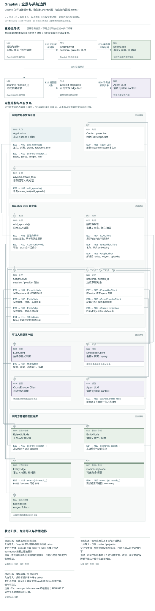

# Graphiti：时间化事实图的能力与调用者边界

**Status:** source-study draft; independent human review pending. These notes are not accepted System Cards or system performance results.

[比较入口](README.md) · [研究问题](../../research/agent-memory-inquiry.md)

## 中文摘要

Graphiti 将 episode、实体、事实边与时间有效性连接成可查询图；本文检查调用者的时间选择、上下文消费与撤回责任。

## English summary

A bounded source study of Graphiti temporal graphs, including provenance, conflict resolution, caller-selected time filters and isolated source-branch observations.

研究对象：官方 `getzep/graphiti` 开源实现；固定 commit [`16cdf7045378c8d53ae01f94e2fa60d238cb0f68`](https://github.com/getzep/graphiti/commit/16cdf7045378c8d53ae01f94e2fa60d238cb0f68)，commit 时间 2026-09-21 14:48:51 −05:00，获取日 2026-09-22。本报告是有界源代码研究，不是性能评测、完成的 Case Study 或 Zep 产品评测。

证据标签：**SOURCE-CLAIMED** 为维护者陈述；**SOURCE-OBSERVED** 为固定源码事实；**INFERRED** 为条件性推论；**UNVERIFIED** 为未运行、未覆盖或不能从源码成立的结论。

## 对象与阅读边界

**SOURCE-CLAIMED**：README 将 Graphiti 定义为 temporal knowledge graph framework，宣称 episode 来源、时间有效窗、增量更新及 hybrid retrieval；同一 README 明确区分 OSS 自建数据库/用户管理与 Zep managed context infrastructure，后者使用专有 Context Graph Engine。因此 Zep 的治理、规模或延迟主张不能移植为本次 OSS 结果。[对象划分](https://github.com/getzep/graphiti/blob/16cdf7045378c8d53ae01f94e2fa60d238cb0f68/README.md#L79-L112)

**SOURCE-OBSERVED**：阅读了 `graphiti.py` 的单 episode 写入、抽取封装、保存、搜索及删除入口；实体/边数据模型；node/edge maintenance 的提取、去重、摘要和失效分支；edge extraction/dedupe prompts；search recipes、filters 与通用 Cypher 查询；LangGraph agent 示例的消费/回写路径；两个相关测试片段。未完整读 bulk/dense ingestion、saga/community 更新、所有数据库 driver、MCP/server、安全与部署层、历史版本、论文或评测数据。无依赖安装、provider 调用或外部服务启动；未运行官方测试。部分初次工具输出截断，关键结论涉及的函数后续已按范围重读；覆盖不等于全库审计。图集补读包括 bulk 保存 helper、driver 初始化边界、可选 BFS/rerank/community 路径；没有覆盖完整 bulk ingestion。图中的示例 `create_task` 是应用接线，library 的 awaited 调用不因此成为持久后台队列。精确增补来源见[图模型](../architecture-atlas/models/graphiti.json)。

## 一条原生生命周期

**SOURCE-OBSERVED**：调用者传入正文、来源描述、类型、`reference_time` 与 `group_id`。写入入口取得同组先前 episodes 作上下文，将系统当前时间存作 `created_at`，事件参考时间存作 episode `valid_at`。随后提取实体、检索候选并去重、抽取事实边、解析重复/矛盾，再更新实体属性和摘要、保存图。自定义 Pydantic 类型和 extraction instructions 可改变抽取约束。[写入顺序](https://github.com/getzep/graphiti/blob/16cdf7045378c8d53ae01f94e2fa60d238cb0f68/graphiti_core/graphiti.py#L1133-L1242)；[实体解析](https://github.com/getzep/graphiti/blob/16cdf7045378c8d53ae01f94e2fa60d238cb0f68/graphiti_core/utils/maintenance/node_operations.py#L627-L708)

事实边保存两端 UUID、文本 `fact`、embedding、来源 episode UUID 列表及时间字段。`valid_at/invalid_at` 表示事实何时成立/不再成立；继承的 `created_at` 和边上 `expired_at` 记录图处理时间。源 episode 与实体的 MENTIONS 边、episode 的 entity_edges 列表构成可回查连接。[事实模型](https://github.com/getzep/graphiti/blob/16cdf7045378c8d53ae01f94e2fa60d238cb0f68/graphiti_core/edges.py#L49-L54)；[时间与来源](https://github.com/getzep/graphiti/blob/16cdf7045378c8d53ae01f94e2fa60d238cb0f68/graphiti_core/edges.py#L263-L283)；[保存](https://github.com/getzep/graphiti/blob/16cdf7045378c8d53ae01f94e2fa60d238cb0f68/graphiti_core/graphiti.py#L744-L759)

搜索将关键词和向量结果合并排序；基本入口返回 `EntityEdge`，高级入口可返回 nodes、episodes、communities 并选择 BFS、MMR、cross encoder 等方法。基本 recipe 是 BM25+cosine+RRF，并非每次都遍历图。调用者决定怎样把边转成上下文：官方 agent 示例只拼接 `edge.fact`，放进 system message，再把人和 agent 的对话作为新 episode 回写。存储层的时间和来源不会自动全部进入生成上下文。[默认 recipe](https://github.com/getzep/graphiti/blob/16cdf7045378c8d53ae01f94e2fa60d238cb0f68/graphiti_core/search/search_config_recipes.py#L110-L116)；[消费与回写](https://github.com/getzep/graphiti/blob/16cdf7045378c8d53ae01f94e2fa60d238cb0f68/examples/langgraph-agent/agent.ipynb#L328-L371)；[仅拼事实](https://github.com/getzep/graphiti/blob/16cdf7045378c8d53ae01f94e2fa60d238cb0f68/examples/langgraph-agent/agent.ipynb#L230-L234)

## 时间、冲突与来源兑现到哪一层

**SOURCE-OBSERVED**：语义判断集中在 LLM，而不只是日期运算。抽取 prompt 要求事实连两个实体、保留细节，以 episode 时间解释相对时间，允许时间为 null。实体解析混用确定性相似规则和 LLM；边解析先检索同端点重复候选及组内更广矛盾候选，再让 LLM 返回 duplicate/contradicted 索引。候选召回之外的事实不会凭时间规则自动被比较。[抽取约束](https://github.com/getzep/graphiti/blob/16cdf7045378c8d53ae01f94e2fa60d238cb0f68/graphiti_core/prompts/extract_edges.py#L138-L175)；[候选](https://github.com/getzep/graphiti/blob/16cdf7045378c8d53ae01f94e2fa60d238cb0f68/graphiti_core/utils/maintenance/edge_operations.py#L361-L428)；[LLM 裁决](https://github.com/getzep/graphiti/blob/16cdf7045378c8d53ae01f94e2fa60d238cb0f68/graphiti_core/utils/maintenance/edge_operations.py#L699-L778)

一旦被选为矛盾候选，代码跳过不重叠区间，将较早事实的 `invalid_at` 设为新事实开始时间，并写 `expired_at`；迟到旧事实也可被更晚候选截断。严格 `<`/`>` 与非空时间条件意味着同时间、缺时间并非同一套自动消解结果。[区间规则](https://github.com/getzep/graphiti/blob/16cdf7045378c8d53ae01f94e2fa60d238cb0f68/graphiti_core/utils/maintenance/edge_operations.py#L538-L572)；[迟到事实](https://github.com/getzep/graphiti/blob/16cdf7045378c8d53ae01f94e2fa60d238cb0f68/graphiti_core/utils/maintenance/edge_operations.py#L820-L845)

**INFERRED**：这是“语义候选与判断＋时间状态转移”的机制，不能把自动失效写成不依赖 LLM 的逻辑真值系统。双时间字段和历史边是真实设计优势，可支持“何时发生”和“何时系统获知”两类查询；但可变实体摘要、去重合并和硬删除说明它不是全状态不可变版本日志。观点、转述、承诺、事实纠正之间的区别仍依赖输入表达、类型和应用策略。

**SOURCE-OBSERVED**：默认 `search()` 构造空 `SearchFilters()`；四种时间过滤均默认为 None，通用全文/向量路径仅在提供条件时加过滤。因此源码 docstring 的“当前时间相关性”不能被理解成自动排除历史失效事实。历史/当前视图是可配置能力；调用者必须选择查询语义。[默认入口](https://github.com/getzep/graphiti/blob/16cdf7045378c8d53ae01f94e2fa60d238cb0f68/graphiti_core/graphiti.py#L1623-L1646)；[过滤模型](https://github.com/getzep/graphiti/blob/16cdf7045378c8d53ae01f94e2fa60d238cb0f68/graphiti_core/search/search_filters.py#L55-L67)；[查询条件](https://github.com/getzep/graphiti/blob/16cdf7045378c8d53ae01f94e2fa60d238cb0f68/graphiti_core/search/search_utils.py#L224-L234)

来源连接存在，但它不是对引用内容的真实性担保；`store_raw_episode_content=False` 会在本次保存前把正在处理的 `episode.content` 置空，保留 UUID 不等于完整可审计原文。[来源保存条件](https://github.com/getzep/graphiti/blob/16cdf7045378c8d53ae01f94e2fa60d238cb0f68/graphiti_core/graphiti.py#L744-L759) **INFERRED**：应用应明确区分作者、说话人、信息来源及其权威，尤其不能把 agent 自己回写的断言自然升级成人的认可。

## Scope、更新与撤回

**SOURCE-OBSERVED**：`group_id` 是图分区；写入可创建 request-scoped driver，避免不同组并发重定向共享 driver。检索 group 条件是可选的；空值规范化为无过滤。这里的分区设施不能单独证明人级权限、同意管理或跨关系隔离；调用者负责绑定认证主体与允许的 group、选择来源和串行写入安排。[scope](https://github.com/getzep/graphiti/blob/16cdf7045378c8d53ae01f94e2fa60d238cb0f68/graphiti_core/graphiti.py#L1013-L1041)；[空 group](https://github.com/getzep/graphiti/blob/16cdf7045378c8d53ae01f94e2fa60d238cb0f68/graphiti_core/search/search.py#L154-L155)；[写入顺序要求](https://github.com/getzep/graphiti/blob/16cdf7045378c8d53ae01f94e2fa60d238cb0f68/graphiti_core/graphiti.py#L1117-L1123)

实体摘要较短时直接追加新事实，累计字符长度超过阈值后走 LLM 摘要分支；这层摘要没有逐句有效期。[摘要路径](https://github.com/getzep/graphiti/blob/16cdf7045378c8d53ae01f94e2fa60d238cb0f68/graphiti_core/utils/maintenance/node_operations.py#L871-L893) `remove_episode()` 则按 `edge.episodes[0] == episode.uuid` 删除边，只删除仅被该 episode 提及的实体，再删 episode；该入口没有重算保留实体摘要、清理存活边的来源数组、重建社区或恢复此前失效边。[完整删除入口](https://github.com/getzep/graphiti/blob/16cdf7045378c8d53ae01f94e2fa60d238cb0f68/graphiti_core/graphiti.py#L1824-L1852)

已作额外**源码分支离线观察**：用标准库 AST 提取上述原函数，提供内存替身，不导入 Graphiti。结果见[保存的 JSON](observations/graphiti-observed.json)与[观察脚本](observations/graphiti-observe.py)。两个来源共同支持一边时，删除首来源仍请求删整边；删除次来源保留边且来源数组未变，共享实体摘要也未变。另一个观察把已失效边作为重复候选：同文、同端点新事实直接复用旧边，仅追加来源，保留旧有效期、不调用 LLM。[exact shortcut](https://github.com/getzep/graphiti/blob/16cdf7045378c8d53ae01f94e2fa60d238cb0f68/graphiti_core/utils/maintenance/edge_operations.py#L684-L695) **UNVERIFIED**：真实抽取措辞、候选召回、数据库实现是否使特定自然语言案例走到该分支；这些观察不是端到端效果。

## 竞争解释与 Relata 的问题

**INFERRED**：Graphiti 把记忆落实为可持续写入、重组、检索并影响下一轮生成的外部状态，适合研究增量记忆；成本在于抽取、解析、embedding 和多级派生状态共同构成维护链。它的可解释性强于仅有一段隐藏摘要，但来源可达不等于撤回传播闭合。

竞争解释应保留：保留失效边有利历史查询，默认不滤时间不是单独的缺陷；同文去重能避免重复事实和额外模型调用，但复现与重复可能混淆；首来源所有权删除可被理解为“撤销创建 episode”，不应直接许诺用户层面的“只撤回这一个来源”。上述代价要以调用契约检验，不能以没造完整关系产品判差。

同一机制可服务项目角色变更、地点偏好、共享约定和成人长期关系中的承诺修订；普通工作事件也可能构成关系连续性，无须附加浪漫标记。不同部署域可以包含同样的个人、共同活动或项目记忆内容。研究应问哪些差异被压缩、何种依据支持后续行动，而非先把关系记忆设成独立图本体。**UNVERIFIED**：中文细节保留、冲突准确率、长期关系质量、隐私删除完整性、规模延迟和任何“优于 RAG”效果。

## 两个原创 synthetic probe（提议，未执行）

1. **同句复现与有效区间**：成人 Lin 1 月“我在 Cedar 工作”，2 月离开，3 月重新入职并重复首句；平行换成“周五一起散步”的约定、暂停、恢复。问 1/2/3 月状态及系统在不同获知时点可答什么。控制项为明确带日期的改写、缺时间、同时间纠正；绑定 edge UUID、来源列表、四时间字段、默认/显式过滤及生成上下文。分别辨认抽取差异、召回失败、exact shortcut 与回答消费失误，不能把它们统称遗忘。

2. **双来源支持与撤回传播**：成人 Yun 两次独立确认“项目周报由我整理”；平行关系事件为两次确认共同周日安排。再加入共享实体的无关记忆及一次 agent 未获认可的转述。分别删首来源、次来源、撤回转述，检查仍有来源的事实、episode UUID、共享摘要、曾被失效的旧边和实际给调用者的上下文。以完整合成历史/全文搜索作为对照，检查保留与撤回能否同时满足。它测试派生状态的证据依赖，不要求 Graphiti 内建同意产品或特定关系架构。

复现命令见[离线观察说明](README.md#离线观察复现)。观察仅验证已指定原函数分支；没有运行官方测试和 provider/DB 集成。

## 架构三视图

[打开交互图集](../architecture-atlas/index.html#graphiti/overview) · [总览 SVG](../architecture-atlas/diagrams/graphiti/overview.svg) · [写入到使用 SVG](../architecture-atlas/diagrams/graphiti/flow.svg) · [修订与控制 SVG](../architecture-atlas/diagrams/graphiti/revision.svg) · [可编辑模型与源码证据](../architecture-atlas/models/graphiti.json)

图中“已读”表示固定版本的静态源码观察；“推断”和“未知”分别保留条件与未检查边界。三幅图覆盖不同问题，不等于全仓审计。[图例与阅读方法](../architecture-atlas/README.md)。
