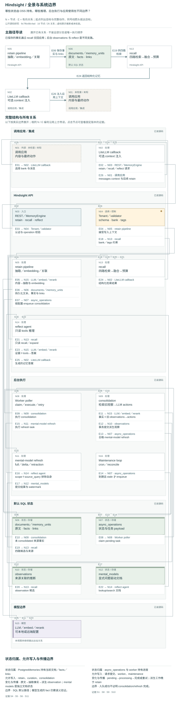

# Hindsight：从事实抽取到派生知识的分层记忆

**状态：bounded public-source study；未执行的静态源码研究，不是 accepted System Card、实测 case 或性能排名。**

来源：[vectorize-io/hindsight](https://github.com/vectorize-io/hindsight)，固定 commit **9c7f6c68c4ad26be5af5d5deef63b4873d1fbc55**；commit 时间 2026-09-22T10:13:48+02:00，研究日期 2026-09-22。克隆后工作树干净；没有安装依赖、执行上游程序、运行数据库或调用 provider。

## 中文摘要

Hindsight 的核心不是把聊天原文放进一个 vector store。默认 OSS 路径区分 documents/chunks 原文、抽取的 world/experience facts、后台归纳的 observations，以及显式问题驱动的 mental models。retain 负责抽取、embedding、实体和时间等检索关系；recall 融合多种检索信号；reflect 是带只读 tools 的推理循环。consolidation 与 mental-model refresh 才负责后台写入派生状态。应用通过 API 返回值自行使用材料，或选择 LiteLLM callback 在应用模型调用前注入 context、成功后写回对话。这里的学习是记忆库及派生文档的变化，不能等同于模型权重训练。[S4–S7, S11, S17–S20, S29–S30]

## English summary

This study pins one public OSS commit and examines its default PostgreSQL memory path. Hindsight separates source documents and chunks, extracted world/experience facts, consolidated observations, and explicitly configured mental-model documents. Retain extracts and indexes; recall combines retrieval arms; reflect performs read-only tool-based reasoning. Background consolidation and mental-model refresh own derivative writes. Source changes invalidate observations and can schedule refreshes for automatically maintained mental models, but asynchronous propagation does not establish complete erasure of history or external copies. Application use is a separate boundary, illustrated by one optional LiteLLM integration. No providers, benchmarks, databases, or upstream programs were run.

## 对象与版本边界

三幅图的语义模型位于 architecture.json：overview 回答边界与状态归属，flow 追踪写入到 context 使用，revision 追踪更正、删除及派生状态。observed 专指检查过的静态源码，不是 observed runtime behavior。

默认 PostgresMemories 将 memory rows、links 与 retrieval 放在 SQL；MEMORIES extension 可以替换它。因此本研究不把 Oracle、替代 store-owned 模式或 Hindsight Cloud 当成同一个已验证部署。初始 schema migration 含旧的 fact-type 名称；本报告采用当前 retain/recall/consolidation 中的 world、experience、observation 和独立 mental_models，不把 migration 起点当作当前概念。[S6, S14, S18]

[论文 arXiv:2512.12818v1](https://arxiv.org/abs/2512.12818v1) 的摘要以 world facts、agent experiences、entity summaries 与 beliefs 描述四种 logical networks，并提出 benchmark 优势。本研究只读了摘要及版本页，没有复核全文、实验设置或结果；这些仍是论文主张。README 的性能、企业采用、strict isolation 与 Cloud 宣传同样不是本研究结果。当前代码可以支持具体 bank/scope 条件，却不能直接证明所有部署已满足跨用户访问控制或 Cloud 服务保证。[S2, S22, S33–S34]

## 状态与写入权

| 状态 | 意义 | 写入者与边界 |
| --- | --- | --- |
| documents / chunks | 输入原文及切分，带 document ID | retain、document update/delete；不等于 fact 返回值 |
| world / experience facts | LLM 抽取的文本、embedding、时间、实体和来源 | retain 与显式 curation；并非逐字原文 |
| observations | 有 source_memory_ids 的跨事实归纳 | consolidation 的 LLM actions 与执行校验；不是天然真实事实 |
| mental_models | source_query 驱动文档、scope、trigger、水位和结构化内容 | 手动 CRUD 或 refresh；单独 reflect 不写入它 |
| async_operations | 任务 payload、进度和结果 | API enqueue、worker claim/execute/retry；receipt 不等于完成 |
| invalidated_memory_units | 失效事实及关系描述的 archive | invalidation；不等于 erasure |
| mental_model_history | 按配置保存旧文档与 grounding | model update；另有保留／清理问题 |

依据：[S1, S4–S6, S9–S11, S18–S20, S25, S28, S35–S37]。

## 写入、后台归纳、读取与使用

**Retain。** HTTP 支持同步等待与异步提交。异步 operation_id 仅说明任务已提交；worker 后续做抽取及写入。engine 确定 tenant schema、执行可选 operation validator，再进入 retain。抽取读 content/context，日期信息参与 embedding；调用者负责说话者和来源语境，当前路径不会把 bank 显示名自动当作 narrator。事务写入 facts 及 retrieval-critical entity postings、temporal/semantic/causal links。大文档流式／delta 路径按批次执行，因此不能把函数 docstring 的 ONE transaction 扩写成任意大输入全量原子提交。[S1, S3–S5, S28]

**Consolidation。** retain 后按配置提交后台任务；提交失败记录 warning，不撤销已持久 facts。每条事实先 recall 同 scope 的相关 observations；事实与旧观察候选交给 LLM，准备 create/update/delete，随后在 batch 事务内提交 actions 及 consolidated 标记。执行会校验事实、observation ID 和 scope，但这不证明模型归纳语义正确。combined 使用事实标签组合；per_tag、all_combinations、shared 或显式 scopes 改变派生观察归属。shared 生成 untagged observations，不能误读为跨标签归纳仍保留原始访问限制。[S7–S13]

**Recall。** 按 fact type 执行 semantic、text/BM25、graph、temporal arms，部分可按配置关闭。默认 RRF 融合；某些内部 dedup 查询用 interleave；cross encoder 可跳过，再经 combined scoring、可选 source-provenance dedup 和预算裁剪。这里以实际实现为准，不把 docstring 的 MMR 列表当成已运行 stage。temporal_window 影响 temporal arm 排序，并非全部候选的硬过滤。facts、chunks、source facts 有分开的 token 参数，max_tokens 不是完整响应的统一预算。[S14–S16]

**Reflect 与 mental models。** reflect_async 自身只读，使用 lookup/search mental models、search observations、recall、expand 等 tools 合成答案，不等于一次持久学习。refresh 另读 source_query、scope 和 full/delta 模式，排除自身，使用数据库 cutoff 与实际可见记忆水位；调用 reflect 后应用结构化修改，由写入路径提交内容／watermark。失败保留旧内容；自动刷新可来自 consolidation 完成，或到期且 stale 的 cron。[S17–S21]

**应用使用。** 核心 API 返回后，应用是否注入、相信或行动是独立问题。已检查的 LiteLLM callback 可在应用模型调用前把 recall 结果或 reflect 文本放入 system/user message，成功调用后配置允许才 retain 对话。这提供一个可见接入路径，但不证明所有 SDK 使用者都采用它，也不证明模型遵从了 context。反馈回路可将生成内容重新纳入记忆，需验证来源与事实／推断的区分。[S29–S30]

## Bank、scope 与模型边界

DefaultTenantExtension 直接返回配置 schema，不做认证。ApiKeyTenantExtension 可验证一个共享 key，仍返回配置 schema；多 tenant schema 映射需自定义实现。engine 提供 operation validator hooks，但没有审计某个真实部署的 validator。因此 bank isolation 的 SQL 条件不等于终端用户有权访问哪个 bank。[S2–S3]

Tags 的 any/all 包含 untagged，strict 排除，exact 匹配全标签集合，exact 加空集合仅选无标签。应用若以 tags 做 ACL，须明确 mode、observation_scopes 和 mental-model scope；不能仅凭用户 tag 过滤就宣称安全。[S12, S22]

LLM、embedding 与 reranker 是可配置模型边界，consolidation 有单独配置和 fallback。图不假定它们一定云端或本地。公开自托管代码不能证明数据不发向外部 provider；真实流向依赖部署。本研究没有审计账号环境。[S4, S16, S31]

## 更正、删除与派生状态

同 document 重留有 delta 路径：比较 chunks，仅抽取变化部分，事务更新 metadata/tags 并删除被替换 chunks 的事实及派生影响。fact edit 可更新 text/embedding 并使关联 observation 失效。document delete 删除当前 document 及关联 facts/links，并在级联前后检查 observation，以处理 consolidation 交错。[S23–S24, S28, S36–S37]

只要任一来源移除，相关 observation 行及 observation history 就删除；幸存事实的 consolidated_at 归空，后续重新归纳。这比仅减少 source list 更保守，但会留下派生观察重建前的缺口。[S24]

Mental models 不会同步全部重写。删除后 best-effort 检查 grounding，只为 consolidation-trigger 或 cron 管理的模型 enqueue refresh；手动模型留给 owner。pending consolidation 时可以延后；delta retraction 尝试结构化删改不再支持的内容，失败可能保留旧内容并记录。因此 delete 成功响应不代表派生文档已立即纠正，更不证明 history、logs、backups、exports 和已注入应用 context 都已擦除。[S19–S21, S26–S27]

Invalidation 把原事实及关系描述搬到 archive，再移出 live 表，是可审查的失效操作。已检查的 retention sweeps 针对 audit_log 和 llm_requests，不能据此声称所有记忆有自动 TTL 遗忘。[S25, S32]

## 条件性收益、限制与 Relata 问题

- 当抽取质量、来源 ID 和 scope 正确时，facts→observations→mental models 可支持证据回查与压缩理解；代价是模型调用、多层状态和异步新鲜度管理。
- 当任务兼具关键词、实体和时间线索时，多路 recall 提供不同命中入口；融合与预算仍会丢弃材料，架构不证明优于 full-history/full-search。
- 当需要长期知识页时，query-driven refresh、水位和失败记录使更新可检查；保留旧内容保护可用性，也可能延长错误或撤回内容的可见期。
- 它适用于 general agent memory。成年长期 human–AI relational continuity 可以是其中一个应用域，包括习惯变化、共同项目、承诺与更正；源码未赋予系统判断共同关系真相的特殊能力。Disposition 也不是双方同意、隐私授权或事实审定。
- 对 Relata 的问题包括：抽取是否保留说话者／来源；普通共享工作能否跨期保持意义；归纳是否把自我报告变成定论；撤回后各派生层多久收敛；scope 会否错误扩散混合领域内容。这些是待研究问题，不是已得结果。

## 两个提出但未运行的 synthetic probes

**P1：更正与派生延迟。** 使用完全合成的成年角色，在同一 bank 写入周末惯例和项目偏好，建立一个自动刷新与一个手动 mental model。初次 consolidation 后更正同 document，再删除支撑旧惯例的来源。分别检查 document/chunks、live facts、source_memory_ids、consolidated_at、operation 状态、model grounding/text/history。区分同步 observation 清除、异步再归纳、手动文档保持与 history 留存；加入 worker/provider 失败条件，不能仅以 HTTP 200 判成功。以 full-history/full-search 及不使用派生物的 recall 作对照。

**P2：混合领域与 scope 扩散。** 两个 bank，各有共同项目、个人习惯和共享关系事件，使用 user/project/session tags 和少量 untagged 对照。比较 combined/shared scopes 与 any/all/strict/exact recall。查询内容一致、标签范围变化，记录进入 recall、reflect 和 callback context 的来源。检验跨 bank 控制、untagged 默认可见性及 shared 的预期扩散，并检查应用 bank 授权错误是否被真实部署拦截。该 probe 不预设漏洞，也不把 tag 匹配当作已存在 ACL。

## 覆盖与未读范围

已逐段检查 HTTP retain、tenant、retain extraction/write/delta、默认 store、consolidation scope/batch/trigger、recall 融合与预算、reflect、mental-model refresh/curation/delete/retraction、worker claim/retry、cron、日志 retention，以及一个 LiteLLM callback。精确证据见下表，不是全仓覆盖。

未完整检查论文全文、benchmark harness/results、所有 provider transports、所有 graph 算法、schema migration 全链、Cloud、Oracle、替代 stores、所有 integrations、UI、webhooks delivery、bulk/bank deletion 与 import/restore 组合、backups/exports 擦除。无 runtime、隔离、并发或性能实测。三视图是这些静态源码判断的可视表达。

## 固定源码证据

- **[S1](https://github.com/vectorize-io/hindsight/blob/9c7f6c68c4ad26be5af5d5deef63b4873d1fbc55/hindsight-api-slim/hindsight_api/api/http.py#L9653-L9730)** — HTTP retain 的 async operation receipt 与同步 retain 路径不同。

- **[S2](https://github.com/vectorize-io/hindsight/blob/9c7f6c68c4ad26be5af5d5deef63b4873d1fbc55/hindsight-api-slim/hindsight_api/extensions/builtin/tenant.py#L8-L90)** — 默认无认证；可选共享 API key；schema 选择与自定义多租户边界。

- **[S3](https://github.com/vectorize-io/hindsight/blob/9c7f6c68c4ad26be5af5d5deef63b4873d1fbc55/hindsight-api-slim/hindsight_api/engine/memory_engine.py#L5757-L5800)** — retain authentication、可选 operation validator、bank 创建。

- **[S4](https://github.com/vectorize-io/hindsight/blob/9c7f6c68c4ad26be5af5d5deef63b4873d1fbc55/hindsight-api-slim/hindsight_api/engine/retain/orchestrator.py#L1129-L1185)** — 抽取事实、日期增强 embedding；context 由调用者提供，bank 显示名不当 narrator。

- **[S5](https://github.com/vectorize-io/hindsight/blob/9c7f6c68c4ad26be5af5d5deef63b4873d1fbc55/hindsight-api-slim/hindsight_api/engine/retain/orchestrator.py#L608-L700)** — 事实、entity postings 与 temporal/semantic/causal links 的事务写路径。

- **[S6](https://github.com/vectorize-io/hindsight/blob/9c7f6c68c4ad26be5af5d5deef63b4873d1fbc55/hindsight-api-slim/hindsight_api/engine/memories/__init__.py#L1-L54)** — 默认 PostgresMemories；MEMORIES extension 可替换，因此本图明确只画默认 SQL 路径。

- **[S7](https://github.com/vectorize-io/hindsight/blob/9c7f6c68c4ad26be5af5d5deef63b4873d1fbc55/hindsight-api-slim/hindsight_api/engine/memory_engine.py#L6073-L6111)** — retain 后按配置提交 consolidation 与 graph/index maintenance；后续提交失败不撤销已成功 retain。

- **[S8](https://github.com/vectorize-io/hindsight/blob/9c7f6c68c4ad26be5af5d5deef63b4873d1fbc55/hindsight-api-slim/hindsight_api/engine/memory_engine.py#L22184-L22249)** — consolidation 异步任务，按 bank 去重；scope 指定路径例外。

- **[S9](https://github.com/vectorize-io/hindsight/blob/9c7f6c68c4ad26be5af5d5deef63b4873d1fbc55/hindsight-api-slim/hindsight_api/worker/poller.py#L679-L716)** — worker claim_tasks 后读取 type、task payload、retry 次数。

- **[S10](https://github.com/vectorize-io/hindsight/blob/9c7f6c68c4ad26be5af5d5deef63b4873d1fbc55/hindsight-api-slim/hindsight_api/worker/poller.py#L1006-L1030)** — 失败任务按 next_retry_at 回到 pending；取消／删除任务不重排。

- **[S11](https://github.com/vectorize-io/hindsight/blob/9c7f6c68c4ad26be5af5d5deef63b4873d1fbc55/hindsight-api-slim/hindsight_api/engine/consolidation/consolidator.py#L2166-L2345)** — 每事实 recall 同 scope observations，LLM 生成 actions，预备后一次事务；ID/scope 校验。

- **[S12](https://github.com/vectorize-io/hindsight/blob/9c7f6c68c4ad26be5af5d5deef63b4873d1fbc55/hindsight-api-slim/hindsight_api/engine/consolidation/consolidator.py#L593-L660)** — observation_scopes combined/per_tag/shared 等含义；shared 产生 untagged 派生物。

- **[S13](https://github.com/vectorize-io/hindsight/blob/9c7f6c68c4ad26be5af5d5deef63b4873d1fbc55/hindsight-api-slim/hindsight_api/engine/consolidation/consolidator.py#L2062-L2163)** — consolidation 后仅为 scope 匹配且 stale 的 opt-in mental models 安排刷新。

- **[S14](https://github.com/vectorize-io/hindsight/blob/9c7f6c68c4ad26be5af5d5deef63b4873d1fbc55/hindsight-api-slim/hindsight_api/engine/memory_engine.py#L7893-L7988)** — recall 参数、时间窗口非全局硬过滤、可选 source facts/chunks 与独立 token budgets。

- **[S15](https://github.com/vectorize-io/hindsight/blob/9c7f6c68c4ad26be5af5d5deef63b4873d1fbc55/hindsight-api-slim/hindsight_api/engine/memory_engine.py#L8550-L8668)** — 按 fact type 执行 semantic/text/graph/temporal retrieval，收集候选。

- **[S16](https://github.com/vectorize-io/hindsight/blob/9c7f6c68c4ad26be5af5d5deef63b4873d1fbc55/hindsight-api-slim/hindsight_api/engine/memory_engine.py#L8849-L9210)** — 实际 RRF/interleave、cross encoder/passthrough、combined scoring、provenance dedup 与裁剪。

- **[S17](https://github.com/vectorize-io/hindsight/blob/9c7f6c68c4ad26be5af5d5deef63b4873d1fbc55/hindsight-api-slim/hindsight_api/engine/memory_engine.py#L15004-L15135)** — reflect 是只读 tool loop；查询 mental models、observations、raw facts、expand。

- **[S18](https://github.com/vectorize-io/hindsight/blob/9c7f6c68c4ad26be5af5d5deef63b4873d1fbc55/hindsight-api-slim/hindsight_api/engine/memory_engine.py#L17129-L17335)** — mental model refresh scope/full vs delta/snapshot watermark 与调用 reflect，排除自身。

- **[S19](https://github.com/vectorize-io/hindsight/blob/9c7f6c68c4ad26be5af5d5deef63b4873d1fbc55/hindsight-api-slim/hindsight_api/engine/memory_engine.py#L18010-L18208)** — refresh 失败保留内容；成功调用 update_mental_model 持久化内容／watermark。

- **[S20](https://github.com/vectorize-io/hindsight/blob/9c7f6c68c4ad26be5af5d5deef63b4873d1fbc55/hindsight-api-slim/hindsight_api/engine/memory_engine.py#L18300-L18480)** — mental model 手动更新、重新 embedding 与可配置 history snapshot。

- **[S21](https://github.com/vectorize-io/hindsight/blob/9c7f6c68c4ad26be5af5d5deef63b4873d1fbc55/hindsight-api-slim/hindsight_api/engine/maintenance.py#L469-L566)** — cron 到期且 stale 才 enqueue mental-model refresh，并限定 worker 可见 tenant schemas。

- **[S22](https://github.com/vectorize-io/hindsight/blob/9c7f6c68c4ad26be5af5d5deef63b4873d1fbc55/hindsight-api-slim/hindsight_api/engine/search/tags.py#L1-L88)** — any/all 包含 untagged；strict 排除；exact 空集合仅看 untagged。

- **[S23](https://github.com/vectorize-io/hindsight/blob/9c7f6c68c4ad26be5af5d5deef63b4873d1fbc55/hindsight-api-slim/hindsight_api/engine/memory_engine.py#L10151-L10365)** — document delete 的权限 hook、级联、stale observation 清除、graph maintenance 与刷新派生内容。

- **[S24](https://github.com/vectorize-io/hindsight/blob/9c7f6c68c4ad26be5af5d5deef63b4873d1fbc55/hindsight-api-slim/hindsight_api/engine/memories/pg/writes.py#L240-L338)** — 删除受影响 observations/history；幸存来源 consolidated_at 归空以重新 consolidation。

- **[S25](https://github.com/vectorize-io/hindsight/blob/9c7f6c68c4ad26be5af5d5deef63b4873d1fbc55/hindsight-api-slim/hindsight_api/engine/memories/pg/writes.py#L409-L445)** — invalidate 将原事实与关系描述归档到 invalidated_memory_units，再移除 live 行。

- **[S26](https://github.com/vectorize-io/hindsight/blob/9c7f6c68c4ad26be5af5d5deef63b4873d1fbc55/hindsight-api-slim/hindsight_api/engine/memory_engine.py#L19970-L20065)** — retracted grounding 只推动自动刷新 mental models；best effort；手动模型由 owner 决定。

- **[S27](https://github.com/vectorize-io/hindsight/blob/9c7f6c68c4ad26be5af5d5deef63b4873d1fbc55/hindsight-api-slim/hindsight_api/engine/memory_engine.py#L17595-L17685)** — delta retraction 的 structured edits、失败保留及延后条件；不是同步彻底擦除。

- **[S28](https://github.com/vectorize-io/hindsight/blob/9c7f6c68c4ad26be5af5d5deef63b4873d1fbc55/hindsight-api-slim/hindsight_api/engine/retain/orchestrator.py#L3887-L4107)** — 同 document 重留的 delta 路径：新增抽取、事务删除变化 chunks、更新 metadata/tags。

- **[S29](https://github.com/vectorize-io/hindsight/blob/9c7f6c68c4ad26be5af5d5deef63b4873d1fbc55/hindsight-integrations/litellm/hindsight_litellm/callbacks.py#L364-L403)** — 可选 integration 将 context 注入 system message 或用户消息。

- **[S30](https://github.com/vectorize-io/hindsight/blob/9c7f6c68c4ad26be5af5d5deef63b4873d1fbc55/hindsight-integrations/litellm/hindsight_litellm/callbacks.py#L820-L995)** — recall/reflect 在应用模型调用前进入 messages；成功调用后配置开启才 retain conversation。

- **[S31](https://github.com/vectorize-io/hindsight/blob/9c7f6c68c4ad26be5af5d5deef63b4873d1fbc55/hindsight-api-slim/hindsight_api/engine/memory_engine.py#L2612-L2654)** — 独立 consolidation LLM 配置／fallback，模型边界可配置。

- **[S32](https://github.com/vectorize-io/hindsight/blob/9c7f6c68c4ad26be5af5d5deef63b4873d1fbc55/hindsight-api-slim/hindsight_api/engine/maintenance.py#L237-L249)** — 已检查 retention sweeps 针对 audit_log/llm_requests，不应当成全体记忆自动遗忘。

- **[S33](https://github.com/vectorize-io/hindsight/blob/9c7f6c68c4ad26be5af5d5deef63b4873d1fbc55/README.md#L20-L48)** — 作者身份与 benchmark 声明，仅作来源主张，不是本研究运行证据。

- **[S34](https://github.com/vectorize-io/hindsight/blob/9c7f6c68c4ad26be5af5d5deef63b4873d1fbc55/README.md#L348-L387)** — 作者对 observations、mental models、banks 与一般用途的说明。

- **[S35](https://github.com/vectorize-io/hindsight/blob/9c7f6c68c4ad26be5af5d5deef63b4873d1fbc55/hindsight-api-slim/hindsight_api/engine/retain/chunk_storage.py#L1-L55)** — 原文 chunks 与 delta 对比所用持久结构。

- **[S36](https://github.com/vectorize-io/hindsight/blob/9c7f6c68c4ad26be5af5d5deef63b4873d1fbc55/hindsight-api-slim/hindsight_api/engine/memory_engine.py#L11697-L11780)** — memory unit 更新契约：text/date/entity re-embedding、context、invalidation/revert 与 observations invalidation。

- **[S37](https://github.com/vectorize-io/hindsight/blob/9c7f6c68c4ad26be5af5d5deef63b4873d1fbc55/hindsight-api-slim/hindsight_api/engine/memory_engine.py#L12065-L12225)** — memory edit invalidates dependent observations, updates live fact and schedules post-edit derivative work。

## 本次实际检查

JSON 成功解析；三视图分别为 16 nodes / 26 edges、16 / 27、15 / 22。检查了所有 node/edge 的 endpoint、region 与 evidence ID 引用；37 条固定源码 URL 的 commit、路径存在性及行号边界全部有效。克隆工作树保持干净。没有运行上游测试或程序。

## 架构三视图

[打开交互图集](../architecture-atlas/index.html#hindsight/overview) · [总览 SVG](../architecture-atlas/diagrams/hindsight/overview.svg) · [写入到使用 SVG](../architecture-atlas/diagrams/hindsight/flow.svg) · [修订与控制 SVG](../architecture-atlas/diagrams/hindsight/revision.svg) · [可编辑模型与源码证据](../architecture-atlas/models/hindsight.json)

图中“已读”表示固定版本的静态源码观察；“推断”和“未知”分别保留条件与未检查边界。三幅图覆盖不同问题，不等于全仓审计。[图例与阅读方法](../architecture-atlas/README.md)。
