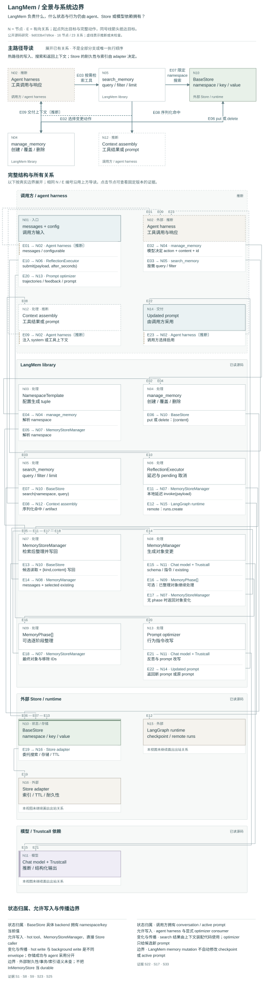

# LangMem：工具、后台对象整理与 procedural prompt 的边界

**状态：bounded public-source study / 静态研究草稿。** 这不是 accepted System Card、运行评测或部署审计。研究日期：2026-09-22。上游：[https://github.com/langchain-ai/langmem](https://github.com/langchain-ai/langmem)；精确 commit：[`9d033b47d9ce53e37e92c92241b0496c0278932e`](https://github.com/langchain-ai/langmem/tree/9d033b47d9ce53e37e92c92241b0496c0278932e)，commit 时间 2026-09-08T23:44:42-07:00；`pyproject.toml` 标注版本 `0.0.30`。依赖以范围声明，未安装，因此没有可声称的实际依赖解析版本。[S32](https://github.com/langchain-ai/langmem/blob/9d033b47d9ce53e37e92c92241b0496c0278932e/pyproject.toml#L1-L17)

## 中文摘要

LangMem 是一组可组合的记忆能力：agent 可在 hot path 通过工具直接管理和查询条目；`MemoryManager` 把 messages 与现有对象交给模型／Trustcall，返回结构化对象变化；`MemoryStoreManager` 在此之外加上候选检索、可选 consolidation phases 与 Store 写回；`ReflectionExecutor` 才处理延迟提交。procedural memory 是另一条 prompt 改写路径，通常返回新 prompt，是否保存、启用及如何验证由调用方决定。其研究价值在于这些边界可拆开比较，而非提供一套已经验证的自治长期记忆平台。[S1](https://github.com/langchain-ai/langmem/blob/9d033b47d9ce53e37e92c92241b0496c0278932e/src/langmem/knowledge/tools.py#L263-L355) [S4](https://github.com/langchain-ai/langmem/blob/9d033b47d9ce53e37e92c92241b0496c0278932e/src/langmem/knowledge/extraction.py#L217-L339) [S8](https://github.com/langchain-ai/langmem/blob/9d033b47d9ce53e37e92c92241b0496c0278932e/src/langmem/knowledge/extraction.py#L1006-L1084) [S9](https://github.com/langchain-ai/langmem/blob/9d033b47d9ce53e37e92c92241b0496c0278932e/src/langmem/knowledge/extraction.py#L1086-L1137) [S13](https://github.com/langchain-ai/langmem/blob/9d033b47d9ce53e37e92c92241b0496c0278932e/src/langmem/reflection.py#L254-L329) [S16](https://github.com/langchain-ai/langmem/blob/9d033b47d9ce53e37e92c92241b0496c0278932e/src/langmem/prompts/optimization.py#L260-L268)

## English summary

At the pinned commit, LangMem is a composable library rather than a complete memory service. Agent tools issue scoped Store operations; a functional `MemoryManager` returns structured memory changes; `MemoryStoreManager` retrieves a bounded candidate set, optionally consolidates it, and writes changes back. `ReflectionExecutor` adds local deferred execution or remote run submission. Prompt optimizers form a separate procedural adaptation path whose outputs require application adoption. Durability, authenticated scope, retrieval quality, deletion propagation and deployed behavior are not established by this static study.

## 运行与存储边界

- **Harness**：README 以 LangGraph ReAct agent 装配工具；hot-path guide 另示范 prompt callback 主动搜索、把结果放入 system message。工具不是 agent loop，命中也不是正确使用的证据。Store 与 conversation checkpointer 是两个状态所有者。[S22](https://github.com/langchain-ai/langmem/blob/9d033b47d9ce53e37e92c92241b0496c0278932e/docs/docs/hot_path_quickstart.md#L35-L119) [S23](https://github.com/langchain-ai/langmem/blob/9d033b47d9ce53e37e92c92241b0496c0278932e/README.md#L34-L64)
- **Store**：工具可显式注入 `BaseStore`，或从 graph runtime 取得。数据位置是 `namespace + key`。README 的 `InMemoryStore` 示例明确说明重启丢失；本研究未检查任何 Postgres 或 platform 的持久实现。`ttl`、`refresh_ttl`、index 参数在相关 wrappers 中转交 adapter，不是 LangMem 自建生命周期服务。[S2](https://github.com/langchain-ai/langmem/blob/9d033b47d9ce53e37e92c92241b0496c0278932e/src/langmem/knowledge/tools.py#L433-L497) [S23](https://github.com/langchain-ai/langmem/blob/9d033b47d9ce53e37e92c92241b0496c0278932e/README.md#L34-L64) [S25](https://github.com/langchain-ai/langmem/blob/9d033b47d9ce53e37e92c92241b0496c0278932e/src/langmem/knowledge/extraction.py#L1580-L1658) [S37](https://github.com/langchain-ai/langmem/blob/9d033b47d9ce53e37e92c92241b0496c0278932e/src/langmem/knowledge/extraction.py#L1504-L1566)
- **Scope**：`NamespaceTemplate` 将 `{user_id}` 等配置字段替换为 tuple 项，缺字段报错。它不核验“这个 user_id 属于谁”。固定 namespace 可以跨线程共享；按用户、agent、项目或关系划分是调用方设计。仓库另有部署 auth hooks，会认证请求、设置 thread owner，并为 store namespace 加 identity 前缀；这是特定部署边界，不是 core namespace 函数的能力。[S3](https://github.com/langchain-ai/langmem/blob/9d033b47d9ce53e37e92c92241b0496c0278932e/src/langmem/utils.py#L56-L95) [S26](https://github.com/langchain-ai/langmem/blob/9d033b47d9ce53e37e92c92241b0496c0278932e/src/langmem/graphs/auth.py#L20-L80)
- **模型与外部网络**：knowledge 路径通过 `BaseChatModel` / `init_chat_model`、Trustcall 调用结构化提取；prompt 路径也调用模型，部分实现使用 LangSmith trace。未读取 credentials、未调用 provider，不能判断某个实际部署的日志、数据保留或地域配置。[S4](https://github.com/langchain-ai/langmem/blob/9d033b47d9ce53e37e92c92241b0496c0278932e/src/langmem/knowledge/extraction.py#L217-L339) [S17](https://github.com/langchain-ai/langmem/blob/9d033b47d9ce53e37e92c92241b0496c0278932e/src/langmem/prompts/stateless.py#L149-L243) [S18](https://github.com/langchain-ai/langmem/blob/9d033b47d9ce53e37e92c92241b0496c0278932e/src/langmem/prompts/gradient.py#L318-L360) [S32](https://github.com/langchain-ai/langmem/blob/9d033b47d9ce53e37e92c92241b0496c0278932e/pyproject.toml#L1-L17)

## 对象、生命周期与使用

### 1. Hot path：工具直接修改当前值

`create_manage_memory_tool` 的调用参数包含 `action`、`content` 与可选 UUID `id`，`actions_permitted` 默认准许 create/update/delete。create 自动生成 ID；update/delete 必须给 ID。代码直接 `put(namespace,key,{"content":…})` 或 delete，随后返回一行确认文本。update 没有本层读旧值、compare-and-swap、provenance 或版本链。何时调用、什么算更正，主要由 agent 模型及工具指令决定。[S1](https://github.com/langchain-ai/langmem/blob/9d033b47d9ce53e37e92c92241b0496c0278932e/src/langmem/knowledge/tools.py#L263-L355) [S35](https://github.com/langchain-ai/langmem/blob/9d033b47d9ce53e37e92c92241b0496c0278932e/src/langmem/knowledge/tools.py#L25-L39)

`create_search_memory_tool` 将 query/filter/limit/offset 交给 Store，返回序列化 item；可选返回原始 artifact。它不自行实现 embedding/ranking。独立 `create_memory_searcher` 则另加模型生成多条 query、批量调用工具、对象去重与 score 排序。主动 prompt 注入与 agent 主动 tool search 是两种可选使用方式。[S2](https://github.com/langchain-ai/langmem/blob/9d033b47d9ce53e37e92c92241b0496c0278932e/src/langmem/knowledge/tools.py#L433-L497) [S22](https://github.com/langchain-ai/langmem/blob/9d033b47d9ce53e37e92c92241b0496c0278932e/docs/docs/hot_path_quickstart.md#L35-L119) [S29](https://github.com/langchain-ai/langmem/blob/9d033b47d9ce53e37e92c92241b0496c0278932e/src/langmem/knowledge/extraction.py#L775-L815)

### 2. Core extraction：事实、profile、episode 由 schema 决定

`MemoryManager` 接收 messages 与 existing 对象，建立 Trustcall extractor，受 insert/update/delete flags 限制。`max_steps` 默认 1，可进行多步处理并用 `Done` 提前结束；结果包含对象 ID 与内容，移除通过 `RemoveDoc` 表示。其实现不写 Store。默认 `Memory` 只有自由文本 `content`；profile/episode 的结构是调用方 schema，不是多个独立存储引擎。profile 可用 `default` seed 与禁止新增的配置管理，但“只有一个且永远正确”不能仅从 schema 名称推导。[S4](https://github.com/langchain-ai/langmem/blob/9d033b47d9ce53e37e92c92241b0496c0278932e/src/langmem/knowledge/extraction.py#L217-L339) [S5](https://github.com/langchain-ai/langmem/blob/9d033b47d9ce53e37e92c92241b0496c0278932e/src/langmem/knowledge/extraction.py#L457-L533) [S6](https://github.com/langchain-ai/langmem/blob/9d033b47d9ce53e37e92c92241b0496c0278932e/src/langmem/knowledge/extraction.py#L832-L913) [S8](https://github.com/langchain-ai/langmem/blob/9d033b47d9ce53e37e92c92241b0496c0278932e/src/langmem/knowledge/extraction.py#L1006-L1084) [S36](https://github.com/langchain-ai/langmem/blob/9d033b47d9ce53e37e92c92241b0496c0278932e/src/langmem/knowledge/extraction.py#L64-L92)

### 3. Store manager：retrieve → local consolidate → mutate

`MemoryStoreManager` 先在当前 namespace 搜索：显式 `query_model` 时由模型生成 queries；否则由最近消息的指数窗口生成。结果按 namespace/key 去重、按 score 排序，再全局截断到 `query_limit`（默认 5）。默认窗口数量是 `query_limit // 4`，因此默认只产生最近一条消息窗口；抽取本身仍得到传入的全部 messages。被搜索漏掉的旧事实不会进入这轮修订。[S6](https://github.com/langchain-ai/langmem/blob/9d033b47d9ce53e37e92c92241b0496c0278932e/src/langmem/knowledge/extraction.py#L832-L913) [S7](https://github.com/langchain-ai/langmem/blob/9d033b47d9ce53e37e92c92241b0496c0278932e/src/langmem/knowledge/extraction.py#L936-L1004) [S8](https://github.com/langchain-ai/langmem/blob/9d033b47d9ce53e37e92c92241b0496c0278932e/src/langmem/knowledge/extraction.py#L1006-L1084) [S28](https://github.com/langchain-ai/langmem/blob/9d033b47d9ce53e37e92c92241b0496c0278932e/src/langmem/utils.py#L103-L119)

选中对象成为 `existing`，模型输出分为 store-based 与 ephemeral 新对象。可选 `phases` 顺序整理两者，默认不再附 messages；它是这轮有限集合的整理，不是全库 sweep。最后仅对变化的旧对象按原 namespace/key put，新对象写新 key，映射到已有对象的 RemoveDoc 转为 delete。异步路径 `await asyncio.gather` 等待这些 Store 操作，但这里没有跨对象事务、CAS、version ledger 或 tombstone 传播。返回 `final_puts` 不包含删除清单。[S7](https://github.com/langchain-ai/langmem/blob/9d033b47d9ce53e37e92c92241b0496c0278932e/src/langmem/knowledge/extraction.py#L936-L1004) [S8](https://github.com/langchain-ai/langmem/blob/9d033b47d9ce53e37e92c92241b0496c0278932e/src/langmem/knowledge/extraction.py#L1006-L1084) [S9](https://github.com/langchain-ai/langmem/blob/9d033b47d9ce53e37e92c92241b0496c0278932e/src/langmem/knowledge/extraction.py#L1086-L1137)

**两个可组合入口并不等于数据格式自动相容**：hot tool 写 `{content}`，store manager 从候选读 `value["kind"]`、`value["content"]`，写 `{kind,content}`。若把两者指向同 namespace，必须明确 envelope 或做适配；不能只因同为 BaseStore 就假定它们可无缝互读。[S1](https://github.com/langchain-ai/langmem/blob/9d033b47d9ce53e37e92c92241b0496c0278932e/src/langmem/knowledge/tools.py#L263-L355) [S8](https://github.com/langchain-ai/langmem/blob/9d033b47d9ce53e37e92c92241b0496c0278932e/src/langmem/knowledge/extraction.py#L1006-L1084) [S9](https://github.com/langchain-ai/langmem/blob/9d033b47d9ce53e37e92c92241b0496c0278932e/src/langmem/knowledge/extraction.py#L1086-L1137)

### 4. 延迟与回执

直接 `await manager.ainvoke` 仍会等待处理；background quickstart 的基本例子正是这样。真实独立延迟能力在 `ReflectionExecutor`：本地以 PriorityQueue 和 worker thread 保存任务，按 `thread_id` 尝试取消旧 pending task，到了时间再 invoke reflector。源码存的是新 payload，没有自动合并前后会话；调用方必须提交所需完整历史。取消检查不等于撤回已经开始的 Store mutation。队列没有本层 durable backing。[S13](https://github.com/langchain-ai/langmem/blob/9d033b47d9ce53e37e92c92241b0496c0278932e/src/langmem/reflection.py#L254-L329) [S14](https://github.com/langchain-ai/langmem/blob/9d033b47d9ce53e37e92c92241b0496c0278932e/src/langmem/reflection.py#L389-L443) [S24](https://github.com/langchain-ai/langmem/blob/9d033b47d9ce53e37e92c92241b0496c0278932e/docs/docs/background_quickstart.md#L48-L82)

remote 模式调用 LangGraph `runs.create`，携带 `after_seconds`、`multitask_strategy="rollback"` 与 namespace。返回 Future 对应提交任务完成，函数返回 `None`，不是远端 extraction 完成回执。服务端延迟、回滚、恢复语义没有在此仓库得到验证。[S15](https://github.com/langchain-ai/langmem/blob/9d033b47d9ce53e37e92c92241b0496c0278932e/src/langmem/reflection.py#L110-L198)

### 5. Procedural memory：改写指令是独立状态

公开 optimizer 接收原 prompt、trajectories 及可选 feedback，分派到 `gradient`、`metaprompt`、`prompt_memory`。前者先反思再有条件改写；metaprompt 经反思与结构化最终输出；prompt_memory 以一次模型调用推导新 prompt。multi-prompt optimizer 先分类选择模块，再分别改写。它们返回 prompt 文本／列表；不是模型权重训练，也不是事实/profile 对象提取。部分输出 schema 保留模板变量，但这种校验不证明行为提升。[S16](https://github.com/langchain-ai/langmem/blob/9d033b47d9ce53e37e92c92241b0496c0278932e/src/langmem/prompts/optimization.py#L260-L268) [S17](https://github.com/langchain-ai/langmem/blob/9d033b47d9ce53e37e92c92241b0496c0278932e/src/langmem/prompts/stateless.py#L149-L243) [S18](https://github.com/langchain-ai/langmem/blob/9d033b47d9ce53e37e92c92241b0496c0278932e/src/langmem/prompts/gradient.py#L318-L360) [S19](https://github.com/langchain-ai/langmem/blob/9d033b47d9ce53e37e92c92241b0496c0278932e/src/langmem/prompts/metaprompt.py#L168-L260) [S20](https://github.com/langchain-ai/langmem/blob/9d033b47d9ce53e37e92c92241b0496c0278932e/src/langmem/prompts/optimization.py#L375-L456) [S27](https://github.com/langchain-ai/langmem/blob/9d033b47d9ce53e37e92c92241b0496c0278932e/src/langmem/prompts/types.py#L7-L92) [S34](https://github.com/langchain-ai/langmem/blob/9d033b47d9ce53e37e92c92241b0496c0278932e/src/langmem/utils.py#L212-L246)

仓库还存在独立 `prompts/stateful.py` graph：读取 store 中 prompt `data`，模型给出 `update_prompt=True` 才以 `index=False` 覆盖。这说明可以构成有状态 prompt 反思，但不能说每个公开 optimizer 自动持久化并激活。部署 `optimize_prompts` graph 也只是返回 `updated_prompts`。所读路径没有事实对象到 prompt 的 provenance 或自动失效连接。[S21](https://github.com/langchain-ai/langmem/blob/9d033b47d9ce53e37e92c92241b0496c0278932e/src/langmem/prompts/stateful.py#L16-L54) [S33](https://github.com/langchain-ai/langmem/blob/9d033b47d9ce53e37e92c92241b0496c0278932e/src/langmem/graphs/prompts.py#L23-L67)

## 更正、删除与模型权威

三种权威需要拆开：应用决定 namespace/schema/动作配置，模型推断内容与该不该更新，Store 方法拥有实际写能力。公开 `create_memory_store_manager` factory 默认 `enable_deletes=False`；内部类默认 True；追加 phase 的独立默认又是 True。因此“factory 禁删”不可外推成所有配置 phase 都禁删。facts、关系叙述、工作知识的真伪与重要性，在已读实现里主要由提示与模型决定，没有独立的人类确认或事实裁决层。[S1](https://github.com/langchain-ai/langmem/blob/9d033b47d9ce53e37e92c92241b0496c0278932e/src/langmem/knowledge/tools.py#L263-L355) [S4](https://github.com/langchain-ai/langmem/blob/9d033b47d9ce53e37e92c92241b0496c0278932e/src/langmem/knowledge/extraction.py#L217-L339) [S6](https://github.com/langchain-ai/langmem/blob/9d033b47d9ce53e37e92c92241b0496c0278932e/src/langmem/knowledge/extraction.py#L832-L913) [S7](https://github.com/langchain-ai/langmem/blob/9d033b47d9ce53e37e92c92241b0496c0278932e/src/langmem/knowledge/extraction.py#L936-L1004) [S12](https://github.com/langchain-ai/langmem/blob/9d033b47d9ce53e37e92c92241b0496c0278932e/src/langmem/knowledge/extraction.py#L1666-L1713)

Delete 针对当前 namespace/key。所读代码没有同步清理 checkpoint、已组装 context、prompt、外部 trace 或 summary 的机制；这不是证明这些外部系统永远无法清理，而是清理责任不在这条路径中。若旧会话以后再次输入 extractor，重新生成类似记忆也没有本层遗忘标记阻止。Store 索引、备份与物理删除只能在具体 adapter/deployment 中另查。[S1](https://github.com/langchain-ai/langmem/blob/9d033b47d9ce53e37e92c92241b0496c0278932e/src/langmem/knowledge/tools.py#L263-L355) [S9](https://github.com/langchain-ai/langmem/blob/9d033b47d9ce53e37e92c92241b0496c0278932e/src/langmem/knowledge/extraction.py#L1086-L1137) [S21](https://github.com/langchain-ai/langmem/blob/9d033b47d9ce53e37e92c92241b0496c0278932e/src/langmem/prompts/stateful.py#L16-L54) [S22](https://github.com/langchain-ai/langmem/blob/9d033b47d9ce53e37e92c92241b0496c0278932e/docs/docs/hot_path_quickstart.md#L35-L119) [S25](https://github.com/langchain-ai/langmem/blob/9d033b47d9ce53e37e92c92241b0496c0278932e/src/langmem/knowledge/extraction.py#L1580-L1658)

## 条件性的优势与限制

| 场景 | 条件性优势 | 需要验证的限制 |
| --- | --- | --- |
| General agent memory | 可为项目事实、偏好、episode 配 schema，混合主动工具与后台整理；既有 LangGraph 应用易于按接口组合 | 召回候选有限；模型错误可能直接写入；scoping 与身份绑定要由 harness 保证 |
| Adult long-term relational use | namespace、共享上下文与 profile 可容纳日常生活、关系经历、共同工作和系统连续性；不限定浪漫事件 | 自由文本/profile 压缩不能自行保存叙述主体、时间层次、矛盾与被撤回主张；缺少内建关系协商与衍生物撤回链 |
| Procedural adaptation | 可把“怎样回应/协作”与“记得什么”作为独立实验变量 | 改写质量未实测；全局 prompt 更新可能超出单个事实作用域；没有默认评价、启用或回滚合同 |
| Offline/source research | callable core、明确 schema 与写路径便于设计受控合成观察 | 本文无执行，不能给出可靠性、性能、忠实度、长期收益或 relational safety 结论 |

这些是从架构作出的条件性编辑判断，不是观察结果。[S1](https://github.com/langchain-ai/langmem/blob/9d033b47d9ce53e37e92c92241b0496c0278932e/src/langmem/knowledge/tools.py#L263-L355) [S3](https://github.com/langchain-ai/langmem/blob/9d033b47d9ce53e37e92c92241b0496c0278932e/src/langmem/utils.py#L56-L95) [S4](https://github.com/langchain-ai/langmem/blob/9d033b47d9ce53e37e92c92241b0496c0278932e/src/langmem/knowledge/extraction.py#L217-L339) [S8](https://github.com/langchain-ai/langmem/blob/9d033b47d9ce53e37e92c92241b0496c0278932e/src/langmem/knowledge/extraction.py#L1006-L1084) [S9](https://github.com/langchain-ai/langmem/blob/9d033b47d9ce53e37e92c92241b0496c0278932e/src/langmem/knowledge/extraction.py#L1086-L1137) [S17](https://github.com/langchain-ai/langmem/blob/9d033b47d9ce53e37e92c92241b0496c0278932e/src/langmem/prompts/stateless.py#L149-L243) [S21](https://github.com/langchain-ai/langmem/blob/9d033b47d9ce53e37e92c92241b0496c0278932e/src/langmem/prompts/stateful.py#L16-L54)

## 文案与实现需区分的地方

1. `create_memory_manager` docstring 写自动持久化，而已读 class 只返回 `ExtractedMemory`；本研究以实现为准。[S4](https://github.com/langchain-ai/langmem/blob/9d033b47d9ce53e37e92c92241b0496c0278932e/src/langmem/knowledge/extraction.py#L217-L339) [S31](https://github.com/langchain-ai/langmem/blob/9d033b47d9ce53e37e92c92241b0496c0278932e/src/langmem/knowledge/extraction.py#L536-L574)
2. Store-manager docstring 声称 versioned history，当前写路径只有当前 key 的覆盖与删除；不能据此画版本库。其文案说 query_model=None 使用主模型，也与实际 fallback 到消息窗口的分支不同。[S8](https://github.com/langchain-ai/langmem/blob/9d033b47d9ce53e37e92c92241b0496c0278932e/src/langmem/knowledge/extraction.py#L1006-L1084) [S9](https://github.com/langchain-ai/langmem/blob/9d033b47d9ce53e37e92c92241b0496c0278932e/src/langmem/knowledge/extraction.py#L1086-L1137) [S12](https://github.com/langchain-ai/langmem/blob/9d033b47d9ce53e37e92c92241b0496c0278932e/src/langmem/knowledge/extraction.py#L1666-L1713) [S28](https://github.com/langchain-ai/langmem/blob/9d033b47d9ce53e37e92c92241b0496c0278932e/src/langmem/utils.py#L103-L119)
3. Background quickstart 的例子等待 `ainvoke`；不能把“background”标题当独立异步任务证据。[S24](https://github.com/langchain-ai/langmem/blob/9d033b47d9ce53e37e92c92241b0496c0278932e/docs/docs/background_quickstart.md#L48-L82)
4. 静态 integration 疑点未实测：local executor 无显式 store 时读到 `existing_store` 却未在该分支赋给 `self._store`，后续 runtime 被覆以 `self._store`；sync store-manager 默认 query 分支有重复 search；sync mutation futures 没有逐个 `.result()`。它们是待验证实现风险，不在本研究中宣称运行故障。[S13](https://github.com/langchain-ai/langmem/blob/9d033b47d9ce53e37e92c92241b0496c0278932e/src/langmem/reflection.py#L254-L329) [S14](https://github.com/langchain-ai/langmem/blob/9d033b47d9ce53e37e92c92241b0496c0278932e/src/langmem/reflection.py#L389-L443) [S10](https://github.com/langchain-ai/langmem/blob/9d033b47d9ce53e37e92c92241b0496c0278932e/src/langmem/knowledge/extraction.py#L1145-L1184) [S11](https://github.com/langchain-ai/langmem/blob/9d033b47d9ce53e37e92c92241b0496c0278932e/src/langmem/knowledge/extraction.py#L1244-L1280)

## 两个提议的 synthetic probes（均未运行）

**P1：有限候选中的更正、跨域 scope 与衍生记忆撤回。** 使用纯合成成年人角色，在两个 namespace 放入相似但不同的生活偏好、共同项目决定；预置一份独立 prompt 中的旧行为指令。输入“此前记录不准确，请改为…，不要再使用旧版本”。固定 query 返回集合，分别让旧条目进入/不进入候选，比较 core 输出、Store put/delete、其他 namespace、后续 context 和独立 prompt。再用一个 hot-tool envelope 作为候选，明确检验格式互通。观察合同应区分“条目已更正”“scope 未越界”“旧提示已失效”；不得把三者合成单一成功标签。

**P2：延迟处理的 payload 完整性与提交回执。** 在同 thread 连续提交 A（合成事实）与 B（更正 A），再对照提交累计 A+B；用可记录输入的本地替身 reflector 与 store，控制 delay，只观察调用方 payload、取消状态、实际输入与写入；另检查 remote client 替身 Future 仅证明 `runs.create` 提交。分开测试显式 store 与 runtime store 注入，以验证上述静态疑点。此设计不需真实人类日志，且不把替身成功推广为 provider 或 platform 的耐久保证。

## 覆盖与未读边界

已细读或定位核对：`knowledge/tools.py` 的运行逻辑；`MemoryManager` 的 async 路径及过滤/准备；`MemoryStoreManager` 的构造、搜索、phase、写回、TTL/delete wrappers；`reflection.py` 的 local/remote 提交与 worker；三种 prompt optimizer 的关键执行路径、multi-prompt、stateful graph；`NamespaceTemplate`；README 与相关 quickstarts；部署 auth hook；版本与依赖声明。同步 MemoryManager 与一些便捷方法未逐行全量阅读；这些区域不构成独立的额外能力结论。

仅概要读取短期 summarization 的 prompt 与 `RunningSummary` / `SummarizationResult` 数据类型；未检查其 token 裁剪算法。未细读 `graph_rag.py`、thread extractor、全部 notebooks、全部 tests/fixtures；未检查依赖源码、托管平台或任何真实部署。全部证据为 pinned source 的静态阅读，没有安装、运行上游、测试 suite、模型/embedding 调用或性能测量。[S30](https://github.com/langchain-ai/langmem/blob/9d033b47d9ce53e37e92c92241b0496c0278932e/src/langmem/short_term/summarization.py#L23-L79)

配套 `architecture.json` 包含 overview/flow/revision 三视图，observed 意为“已读静态实现”，不代表 runtime 观测。配套图集保留可编辑拓扑与固定源码证据。

## 架构三视图

[打开交互图集](../architecture-atlas/index.html#langmem/overview) · [总览 SVG](../architecture-atlas/diagrams/langmem/overview.svg) · [写入到使用 SVG](../architecture-atlas/diagrams/langmem/flow.svg) · [修订与控制 SVG](../architecture-atlas/diagrams/langmem/revision.svg) · [可编辑模型与源码证据](../architecture-atlas/models/langmem.json)

图中“已读”表示固定版本的静态源码观察；“推断”和“未知”分别保留条件与未检查边界。三幅图覆盖不同问题，不等于全仓审计。[图例与阅读方法](../architecture-atlas/README.md)。
