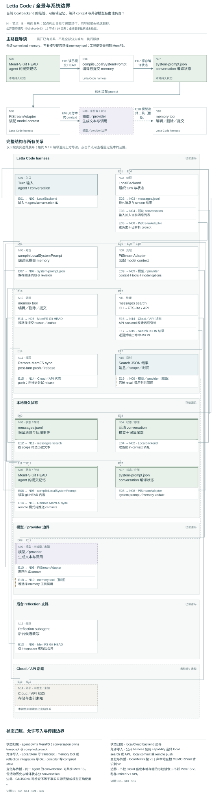

# Letta 当前开源 memory 架构：有界源码研究

**Status:** source-study draft; independent human review pending. These notes are not accepted System Cards or system performance results.

[比较入口](README.md) · [研究问题](../../research/agent-memory-inquiry.md)

## 中文摘要

当前 Letta 的 local backend 将 transcript、Git MemFS 与编译后 context 连接起来；本文区分 local、Cloud 与历史 API 实现。

## English summary

A bounded source study of current Letta local memory: transcripts, Git-backed MemFS and compiled context, with local, Cloud and historical API boundaries kept separate.

研究日：2026-09-22。对象是官方 `letta-ai/letta-code`，固定 commit **`f5c5bbce6e9394b30c626909315c2b3acc665672`**（提交时间 2026-09-22T02:02:42-04:00），`package.json` 标注 **0.32.17**；这是源码快照，不等于已发布 npm 包或线上部署版本。[版本证据][E1]

入口仓库 `letta-ai/letta` 当前 README 将 active source 指向 `letta-code`，把 `archive` 称为 retired V1 API server；入口 main 已解析为 `5bcdd177d70fa2b31a754cfcd801e77b2e1ab16a`。本研究不读取 archive 实现，不把旧 MemGPT 工具、数据库层次或论文实验当成当前机制。[官方入口](https://github.com/letta-ai/letta/blob/5bcdd177d70fa2b31a754cfcd801e77b2e1ab16a/README.md)

## 结论与对象边界

**SOURCE-CLAIMED**：README 把产品描述为通过改写 memory、skills、prompts 和 mods 持续演化的 stateful harness，并宣称身份与经验连续性。这是产品目标及 prompt 的行为要求，不是人格、学习效果或关系连续性的实验证明。[产品说明][E2]

**SOURCE-OBSERVED**：可以从当前源码完整追踪的 local backend，至少具有三种持久对象：conversation 的原始消息记录及压缩事件；Git 管理的可修改 MemFS；供后续调用使用的编译后 system prompt。它实现的是“保留经验＋可编辑的行为上下文＋再发现机制”的组合，不是单一向量记忆库。agent 身份绑定 MemFS，conversation 绑定一段活动上下文；同一个 agent 的新 conversation 可重新使用同一份 memory。

必须区分本地与 Cloud：本地 `localMemfs` 强制识别为 **MemFS v1**，`system/*.md` 是 core memory；非本地且存在根 `MEMORY.md` 才识别为 **v2**，根 Markdown 属 core，子目录需索引才投影。v1/v2 是当前仓库内的 MemFS 格式差异，不是 retired V1 API 的年代划分。[格式分支][E3] README 称 Cloud 为默认选项并保管跨机器状态；客户端只能证明调用与同步意图，不能证明托管数据库、检索索引、删除保证或线上可用性。[产品部署说明][E2]

## 一条写入、保留、使用与修订路径

**SOURCE-OBSERVED**：本地输入转成含 `id/role/timestamp/agent_id/conversation_id` 的消息；持久化路径写 `conversation.json` 与 `messages.jsonl`，追加记录有 `parentId` 和 timestamp。消息不必先被模型选为“值得记忆”才被保留。[消息写入][E4][持久化][E5]

模型要形成长期规则时可调用 `memory`：create、str_replace、insert、delete、rename、update_description。工具要求非空 reason，解析当前 agent 身份和目录，先检查工作区，执行文件变更，再按受影响路径 commit，记录 agent author。local commit 与远程 commit 有分支；远程返回信息明确等待 turn 后同步。[编辑入口][E6] 因而“是否抽取、怎样概括、把偏好提升为规则”主要交给模型，harness 负责路径、格式、提交与编译时序。reflection 也非必然每轮学习：源码按 off、compaction-event、step-count 判断是否启动。[触发条件][E7]

使用路径更精确地说是“已提交修订进入后续 context”。本地编译器用 `git ls-tree HEAD` 与 `git show HEAD:path` 读取 committed Markdown；persona 变成 `<self>`，其余 system 文件正文进入 `<memory>`，external 文件只列目录树，需要后续阅读。[编译输入][E8][投影规则][E9] 每个 turn 对比已编译版本与当前 Git revision；revision 改变时产生新的 memory update。stream adapter 把它作为 system 消息追加到待发送 context，并保留原始 system prompt。[变更检测][E10][实际调用桥接][E11] 这不是编辑磁盘后当前推理立即重写，也不能单凭代码断言模型遵循了新规则。

长 conversation 的 compaction 另走模型摘要路径，活动消息换为 summary 加保留尾部；持久 transcript 追加 compaction 事件，而不是该操作直接删除早期记录。[压缩保留][E12] 跨 session 延续因此同时依赖 agent 的 MemFS 和可搜索历史，不能只检查一个 human/persona 文件。

## 可检查性、来源与控制

**SOURCE-OBSERVED**：Git revision、diff、commit reason、文件正文、conversation/message ID 和时间戳提供较强的操作可检查性。消息角色区分 user、assistant、toolResult，并携带 provider/model 元数据；搜索结果可回到 conversation 和 message。但这些是消息/操作来源，不等于每条抽象记忆的事实来源。MemFS frontmatter 允许的字段主要为 description/read_only/limit 或 name/description，没有强制事实级 source、speaker、valid-time 或支持证据 ID。[消息模型][E13][frontmatter][E14]

**INFERRED**：若模型把“同事喜欢咖啡”概括成“用户喜欢咖啡”，Git 会忠实记录错误概括；除非正文自觉保留引用，结构本身不会纠正归属。agent/conversation 是技术 scope，不天然等于家庭、客户、项目或亲密关系 scope。可用文件结构与提示表达内容边界，但本研究未证明其能确定性阻止跨域泛化。

本地 recall 搜索按 agent/conversation、日期及 hidden 筛选，匹配词与短语后排序；代码明确将 vector/hybrid 也按 **FTS-lite** 处理，尚无本地向量索引。Cloud 搜索则经 API 分支，不能以本地检索实现代替 Cloud 结论。[检索][E15][后端分发][E16] 因此一次查不到可竞争地解释为改写词汇不匹配、错误 scope、模型没搜索或信息原本没写入；不能直接等同于“系统没有记忆”。

## 修改、删除及派生影响

**SOURCE-OBSERVED**：`memory delete` 删除目标文件或目录并提交，rename 移动目标路径；在该工具调用路径中没有同步清除 transcript、既存摘要、其他记忆中的复述或 Git 历史的级联逻辑。[删除分支][E17] 新编译可停止注入已删除文件，但“从活动记忆消失”与“不可再恢复/全系统遗忘”不同。Cloud 同步可出现 dirty、conflict、push_failed；非快进时尝试 rebase 后 push，失败状态会返回。[同步状态][E18]

**INFERRED**：修改正确规则时，旧 summary、未更新的别名文件或再次 recall 到旧消息仍可能竞争；删除要求应区分纠错、撤回可用性和数据清除。这里没有证据证明全系统语义级撤销闭包，也没有证据证明产品做不到；后者需要更广源码和托管端调查。

架构长处是把“记忆内容的演化”变为普通文件与 Git 操作，便于人和 agent 检查、修订、迁移；原始经验与压缩后的工作上下文分离，允许摘要遗漏后再查；core/deferred/skills 分层能控制长期上下文体积。条件性局限是抽象与适用性仍依赖模型判断，检索召回依赖后端，跨机器存在同步时序，Git 可追溯性并不自动赋予事实正确性或遗忘保证。更强的竞争解释是：它是一套可编程 context management，而“学习”可指未来提示改变；这并不贬低工程价值，却不能替代跨时行为改善的证据。

## 两个 synthetic probe（建议，未执行）

1. **归属与时效的双重修订**：成人 A 说“B 喜欢咖啡，我以前喝咖啡，现在不喝”；后续项目聊天只提“给 B 带咖啡”，跨 conversation 询问为 A/B 各准备什么。固定 agent、初始 MemFS、backend、模型和压缩条件，检查原始 role/time、memory diff、编译 context、搜索调用及回答。再明确纠正一次，区分没有保留、错误概括、scope 混淆和读到了却误用。
2. **删除与派生残留**：用纯 synthetic 偏好写 core、external reference 并形成摘要，随后要求撤回该偏好的未来使用；分别比较只删除文件、修订关联文字、显式检索历史三种条件。跨新 conversation 观察旧偏好是否返回，并记录 Git、summary、transcript 哪层仍有它。成功标准先限定“未来不据此行动”，另列完整清除；不要把回答没提及当作删除证明。

## 覆盖与未验证

本次只读 clone、静态追踪约二十个核心文件及相关搜索结果，没有安装依赖、启动服务、接入 provider、读取真实 memory 或做行为实验。上述 SOURCE-OBSERVED 仅指读到实现，不代表运行观察。已覆盖 local MemFS 编译、memory 工具/Git commit、JSONL 保留、compaction 记录、搜索分发和 Cloud push 错误分支；reflection 仅读触发与部分 prompt，不宣称完整 dreaming 生命周期。未完整审阅 channels、多用户授权、shared memory、权限 confinement、Cloud 后端、所有迁移与恢复路径、UI、模型/provider 差异；未研究旧 archive。**UNVERIFIED**：线上性能、召回率、跨进程一致性、长期关系效果、托管清除保证和全局权限安全。源码 checkout 最后 `git status --short` 为空。未运行测试，理由是此次交付为有界 source review，且未建立允许安装依赖的执行环境。

## 固定源码证据索引

所有 E 链接固定到同一实现 commit；行号由本地 `nl -ba` 核对。

[E1]: https://github.com/letta-ai/letta-code/blob/f5c5bbce6e9394b30c626909315c2b3acc665672/package.json#L1-L7
[E2]: https://github.com/letta-ai/letta-code/blob/f5c5bbce6e9394b30c626909315c2b3acc665672/README.md#L5-L57
[E3]: https://github.com/letta-ai/letta-code/blob/f5c5bbce6e9394b30c626909315c2b3acc665672/src/agent/memory-format.ts#L4-L47
[E4]: https://github.com/letta-ai/letta-code/blob/f5c5bbce6e9394b30c626909315c2b3acc665672/src/backend/local/local-store.ts#L1729-L1752
[E5]: https://github.com/letta-ai/letta-code/blob/f5c5bbce6e9394b30c626909315c2b3acc665672/src/backend/local/local-store.ts#L3029-L3074
[E6]: https://github.com/letta-ai/letta-code/blob/f5c5bbce6e9394b30c626909315c2b3acc665672/src/tools/impl/memory.ts#L102-L159
[E7]: https://github.com/letta-ai/letta-code/blob/f5c5bbce6e9394b30c626909315c2b3acc665672/src/cli/helpers/post-turn-reflection.ts#L40-L77
[E8]: https://github.com/letta-ai/letta-code/blob/f5c5bbce6e9394b30c626909315c2b3acc665672/src/backend/local/system-prompt-compilation.ts#L76-L115
[E9]: https://github.com/letta-ai/letta-code/blob/f5c5bbce6e9394b30c626909315c2b3acc665672/src/backend/local/system-prompt-compilation.ts#L223-L264
[E10]: https://github.com/letta-ai/letta-code/blob/f5c5bbce6e9394b30c626909315c2b3acc665672/src/backend/local/local-backend.ts#L924-L1003
[E11]: https://github.com/letta-ai/letta-code/blob/f5c5bbce6e9394b30c626909315c2b3acc665672/src/backend/dev/pi-stream-adapter.ts#L593-L606
[E12]: https://github.com/letta-ai/letta-code/blob/f5c5bbce6e9394b30c626909315c2b3acc665672/src/backend/local/local-store.ts#L1664-L1725
[E13]: https://github.com/letta-ai/letta-code/blob/f5c5bbce6e9394b30c626909315c2b3acc665672/src/backend/local/local-message.ts#L17-L86
[E14]: https://github.com/letta-ai/letta-code/blob/f5c5bbce6e9394b30c626909315c2b3acc665672/src/memory-frontmatter.ts#L63-L110
[E15]: https://github.com/letta-ai/letta-code/blob/f5c5bbce6e9394b30c626909315c2b3acc665672/src/backend/local/transcript-search.ts#L409-L461
[E16]: https://github.com/letta-ai/letta-code/blob/f5c5bbce6e9394b30c626909315c2b3acc665672/src/backend/message-search.ts#L18-L37
[E17]: https://github.com/letta-ai/letta-code/blob/f5c5bbce6e9394b30c626909315c2b3acc665672/src/tools/impl/memory.ts#L289-L350
[E18]: https://github.com/letta-ai/letta-code/blob/f5c5bbce6e9394b30c626909315c2b3acc665672/src/agent/memory-git.ts#L1930-L2058

## 三视图补读：独立反思与消费边界

当前 CLI turn 后的 memory reflection 另读 `transcript.jsonl/state.json`，与 backend 的 `messages.jsonl` 分开。它选未反思范围，在候选 Git worktree 内启动后台子 agent，再由父流程整合；`merged` 与 `no_changes` 都消费该范围，只有 `merged` 要求重新编译 memory，checkpoint 仅在成功时推进。图中 CLI search JSON → 应用 context 的箭头保留为调用方条件，不能从搜索返回值推定模型实际使用。当前本地 FTS-lite 也不能因为通用 recall prompt 提及 hybrid 就提升成另一实现。精确来源、失败/取消与状态归属见[三视图模型](../architecture-atlas/models/letta.json)。本段为补充源码阅读，未执行 CLI、reflection 子 agent 或模型。

## 架构三视图

[打开交互图集](../architecture-atlas/index.html#letta/overview) · [总览 SVG](../architecture-atlas/diagrams/letta/overview.svg) · [写入到使用 SVG](../architecture-atlas/diagrams/letta/flow.svg) · [修订与控制 SVG](../architecture-atlas/diagrams/letta/revision.svg) · [可编辑模型与源码证据](../architecture-atlas/models/letta.json)

图中“已读”表示固定版本的静态源码观察；“推断”和“未知”分别保留条件与未检查边界。三幅图覆盖不同问题，不等于全仓审计。[图例与阅读方法](../architecture-atlas/README.md)。
