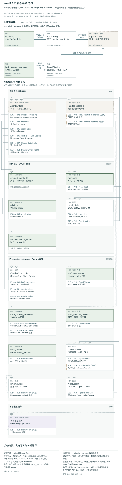

# lmc-5：公开源码架构研究

**Status:** source-study draft; independent human review pending. These notes are not accepted System Cards or system performance results.

[比较入口](README.md) · [研究问题](../../research/agent-memory-inquiry.md)

## 中文摘要

lmc-5 以五轴组织 raw/curated memory、事实变化、关系与维护；本文区分 minimal、production reference、接线责任和已执行离线观察。

## English summary

A bounded source study of the lmc-5 upstream, separating minimal storage, production reference wiring and maintenance responsibilities; includes two isolated offline observations.

研究对象为公开 upstream `wuxuyun0606-collab/lmc-5`，2026-09-22 shallow clone 固定 commit **`fb3e72c9ee7357c8b17311097b0750082a8a1237`**。这里的 production 是仓库命名，其 README 同时标明 **alpha reference**；不是本研究确认的生产运行状态。没有读取真实记忆或个人账号材料。

## 判断与五轴落点

**SOURCE-CLAIMED**：LMC-5 希望通过 raw evidence、事实演化、关系、体验信号和代谢实现可恢复连续性；它将比普通检索更少过时、更可解释等写为可证伪目标，而不是已经完成的公共 benchmark。[项目假说][hypothesis]

**SOURCE-OBSERVED**：XYZEM 不是五种独立存储引擎，而是共享记忆记录、关系表、审计和调度操作的分工：

| 轴 | 真实数据与操作 | 限制 |
|---|---|---|
| X timeline | minimal 的 `thread`、创建/更新时间、chunk/event 顺序；production 的叙事索引、时间字段及按线程 sweep callback | 线程名称由调用方选择；创建时间不等于事件发生时间，叙事也不是完整历史 |
| Y relations | typed edges；安全类型可自动写，contradiction/cause/support 分流 review；召回允许双向两跳 | `add_memory` 本身不连图；边可由显式 add_relation、hippocampus、NightDream、nap 或部署接线写入，召回仍需可检索端点 |
| Z fact evolution | `fact_key`、current/review/superseded、active 标志；production 另有 valid/invalid time、superseded_by 和 audit | 审计与事实应用分离，但 minimal 直接 add 同 key 的 current fact 会自动替代旧值 |
| E experience | 风险/紧迫/回应倾向；valence/arousal/tension、growth、作者和初始优先级 | 是主 agent 的显式书写策略；字段不能证明主体体验或关系真实性 |
| M metabolism | 命中次数、排序、冷热/隔离 gate、重复检测、巡检与维护建议 | 不是统一自动删除器；不同实现的 gate、公式和执行能力不同 |

这些字段与不可变 E 的数据库约束可以直接检查。[minimal 模型][models] [production schema][schema] [nap 建边][nap-relations] 最值得保留的设计是：原始事件与 curated 记录分开、事实状态与历史留存分开、命中包含理由/trace，主动 surface 对 curated 记录的 gate 比显式 recall 更严格。同一输出包中的 raw events/current-state 项另走规则。这些设计适合研究“为什么这个上下文现在有资格进入窗口”，并不限于亲密关系。

## 一条完整生命周期及接线责任

**SOURCE-OBSERVED**：以成年 synthetic 使用者的一条项目交付约定为例：

1. **录入**：minimal `log_event` 保存 role/channel/content/metadata；production SessionEnd 读取 session JSONL 写 raw_events。后者保存 session、role 和 metadata，但 INSERT 没将输入事件时间写进 `created_at`，于是默认是归档时间；原时间可能仅留 metadata。express dream 即使开开关也返回 deployment-specific skipped。[SessionEnd][end]
2. **整理**：minimal 按事件窗口生成确定性摘要、chunk_events 绑定，以及 review observations；hippocampus 当前默认已按单个 event 生成带 speaker 文字与 event/chunk trace 的原子候选，并非只有 chunk 复述。[原子候选][atoms]
3. **晋升**：production NightDream 接 injected proposer，要求类型、非空 evidence、importance/risk/source IDs，通过 gate 后由 writer callback 落库。缺 proposer 的 deterministic fallback 一律 `risk=review`，所以默认 gate 不自动晋升。semantic dedup 也是可选 callback；writer 必须实现持久化及幂等语义。[NightDream 候选与 gate][dreamgate]
4. **关联**：writer 成功返回 ID 后，find_neighbors 扩邻居，第一条 safe hint 决定所有邻居的主边类型，review hints 进入另一个 callback。缺邻居函数直接跳过。自动边统一 0.5；graph adapter 默认一跳 >0.4、二跳 >0.7，因此仅靠默认新边不能获得第二跳。它还按 ID 排序写入两个端点，并非根据事件时间建立方向；“temporal_sequence”类型名不能替代时序验证。[建边][relations] [图检索][graph]
5. **回忆/注入**：production 先 curated vector，低置信再 FTS 与 raw evidence，并合并 literal、graph、emotion、perception、去重、可选 rerank。raw fallback 判断使用 top vector score，不是要求 curated FTS 也没有结果。默认 flat 输出仍带 layer/evidence 标签，layered 输出可选。SessionStart 从 identity/current facts/narrative/open threads 恢复有限启动上下文。[召回流水线][recall]
6. **修订和维护**：minimal 同 `fact_key` current 写入自动 supersede；独立 `run_z_audit(apply=True)`只落 pending，不改事实。production 的审计 schema 与 DreamRunner 的 z_audit callback 不是现成完整判决应用器。E 的作者/初始次序与内容一经写入不可更新，需要 successor record；但 `e_authored_by` 是调用方提供的字符串，不是认证身份。维护需要调度与 review；production patrol 实际有 apply 模式，可注销重复、孤儿及失效 contradiction 边，并非绝对只读。[事实写入][supersede] [E 约束][schema] [patrol][patrol]

**SOURCE-OBSERVED**：README/部分 docstring 说 graph/emotion 默认 None，当前 UserPromptSubmit constructor 却已实际接上两个 adapters，不能把陈旧说明当缺失实现。相反，curated FTS adapter 明确要求 `content_tsv`，schema 主表未提供这一列，部署者仍须补接。[实际 hook][hook] [FTS adapter][fts] DreamRunner 各步默认 None；安装和加 cron 并不自动产生完整写入生命周期。

## 证据、纠正、scope 与连续性边界

**SOURCE-OBSERVED**：minimal raw role 能区分 user/assistant/tool，原子候选用 “user said / assistant replied”保留语用来源；但 curated `source` 主要描述生产路径或 trace，production schema 没有强制 speaker、subject、tenant、访问授权 scope 列。`thread` 是组织标签，`fact_key` 匹配没有 thread 限制。production 检索的 session_id 用于注入历史去重，raw search 仍横跨库内 sessions；它不是查询授权隔离器。

一个更重要的跨层落差是：production vector adapter 直接回传向量 `text_preview`；底层 search 仅按 model/dimension/owner_type 过滤，没有 join curated 当前状态。**INFERRED**：若部署在 supersede/archive 后保留旧 embedding，又没包装额外过滤，旧事实仍可能进入标为 main 的 vector 通道。图/FTS 的 current 过滤不能补救这一入口；这是部署条件下的风险，不是已观察的线上失败。[向量 adapter][fts] [向量 SQL][vectors]

图集补读进一步区分三个 minimal 状态入口：`recall_hits` 不自动合并独立的 `search_vectors`；向量 hydration 不按当前 owner 状态过滤；current-state 项由显式 refresh 创建、默认 TTL 24 小时，并未在 fact supersede 时自动失效。因而“当前事实改了”不保证所有启动/检索材料立即相同。[minimal 向量入口][minimal-vectors] [recall 与 hydration][minimal-recall] [current state][current-state] [surface][surface]

删除应拆开看：仓库主张保留 raw、旧事实、cold archive，存在删除单个向量接口，但本次读取范围未发现覆盖 raw/chunks/curated/relations/向量/缓存/快照的统一遗忘请求。redaction 是输出和远程 embedding 输入的 pattern scrub，不等于原文删除，也不是普遍匿名化。minimal `surface` 默认 redact，`recall` API 默认不 redact。[surface][surface] [recall 默认参数][recall-default] [redaction][redact]

**INFERRED**：可恢复连续性依赖稳定的采集、review、fact_key 命名、维护和窗口注入，而非模型天然拥有连续自我。Forge/Swap 文档主要是部署 reference pattern，不能当已执行恢复；仓库另有具体 refined carryover helper，但它还依赖 Claude transcript/resume 机制。本次未审计该 helper 全算法或实际 resume。远程 embedding/reranker/LLM proposer 是可选接入，SQLite core 可无模型运行；无模型路径可证明工程链路存在，不能代替语义质量验证。

## 小观察、竞争解释与后续 probes

**SOURCE-OBSERVED（离线小观察）**：审读相关模块 imports 与调用路径后，只运行 Python 标准库、内存 SQLite 和注入常量 proposer；无网络、无安装、无 PostgreSQL 服务。结果：不同 thread 的两条 synthetic delivery fact 共用 `delivery_day`，第二条使第一条变为 superseded，audit rows=0；NightDream 在唯一真实 chunk id=1 时接受 source_chunk_ids=[999] 与不在原文中的 evidence，dry-run promoted=1、rejected=0。这确认 gate 检查“有 source/evidence”不等于检查引用存在或蕴含内容。[观察脚本](observations/lmc5-observe.py)与[保存结果](observations/lmc5-observed.json)可按[复现说明](README.md#离线观察复现)核验；它不是完整系统测试。

**INFERRED／竞争解释**：五轴也可理解为成熟数据库生命周期概念的一种产品化组织，而非新的记忆理论；若优于普通 RAG，增益可能来自 current filtering、角色归属、raw fallback、去重及人工维护，未必来自五轴或情感几何。反过来，这不削弱其把维护责任、证据层级和写入权分显式化的价值。E 的优先级和 M 的保护类别可能保住关系重要事件，也可能持续占用窗口；“safe relation”表示自动化风险分级，不表示 same_person/same_event 等语义已经证实。

建议两个 public synthetic probes，均保留 full-history/full-search 对照：

- **作用域与纠正**：两个成年参与者、两个项目同名约定，包含 assistant 猜测、用户明确纠正、历史生效时间与当前值。分别使用相同/带 scope 的 fact_key，检查旧值能否作为历史证据找到、是否被误注入当前事实，以及不同检索层有无差异；接 PostgreSQL 时额外保留旧向量观察状态传播。
- **关系与证据绑定**：构造 A→B→C、相同主题但不同人/事件，插入合法引用、伪 source ID、错引 evidence 和看似相近的修订候选。对比未接夜间作业、默认 0.5 边、经审查的强边，记录两跳可达、错误归属、去重误删新事实、低情绪但关键操作事件是否被挤出。只据可观测路径判结果，不把没有接线说成架构不可能。

对 Relata 的采用建议：把它作为“生命周期责任如何显式化”的 source case；把作用域、证据绑定和跨层状态传播留作压力点。不要将五轴分类导入为 Relata 的统一系统本体，也不要从源码字段反推真实用户关系中的心理状态。

**UNVERIFIED**：未验证私有长期部署、真实 PostgreSQL 集成、模型质量、延迟/成本、任何对外 benchmark 或人格/关系连续性效果。extras README 自认缺真实 PG integration tests 与性能 benchmark；其“私有部署实测”只能保留为来源自述。[alpha 边界][alpha]

## 阅读覆盖

完整或围绕相关函数逐段读：`src/lmc5/{models,store,consolidation,hippocampus,fact_evolution,scoring,redact}.py`；`extras/pgvector_backend/{README.md,schema.sql,night_dream.py,recall_pipeline.py,vector_pgvector.py,dream_runner.py,patrol.py,embedders.py}`；三种 hooks；`docs/{AUTOMATION_BOUNDARIES,M_METABOLISM,FORGE_AND_SWAP,project_hypothesis}.md`。根 README 阅读定位的 model、implementation、automation 段与目录索引，网页也核对项目入口；图集补读了 nap 建边、current-state refresh/surface、minimal vector/hydration、recall 默认参数及输出入口；精确区间见[图模型](../architecture-atlas/models/lmc-5.json)。README 其余长篇、全部测试、其它 docs、nap/perception/narrative 的其余实现及 carryover 全算法未读。一次过宽组合输出被截断，关键 hook/recall/hippocampus 之后用窄范围重读；上述未读部分不作验证依据。

[hypothesis]: https://github.com/wuxuyun0606-collab/lmc-5/blob/fb3e72c9ee7357c8b17311097b0750082a8a1237/docs/project_hypothesis.md#L1-L119
[models]: https://github.com/wuxuyun0606-collab/lmc-5/blob/fb3e72c9ee7357c8b17311097b0750082a8a1237/src/lmc5/models.py#L104-L193
[schema]: https://github.com/wuxuyun0606-collab/lmc-5/blob/fb3e72c9ee7357c8b17311097b0750082a8a1237/extras/pgvector_backend/schema.sql#L9-L123
[end]: https://github.com/wuxuyun0606-collab/lmc-5/blob/fb3e72c9ee7357c8b17311097b0750082a8a1237/extras/pgvector_backend/hooks/session_end.py#L30-L118
[atoms]: https://github.com/wuxuyun0606-collab/lmc-5/blob/fb3e72c9ee7357c8b17311097b0750082a8a1237/src/lmc5/hippocampus.py#L232-L282
[dreamgate]: https://github.com/wuxuyun0606-collab/lmc-5/blob/fb3e72c9ee7357c8b17311097b0750082a8a1237/extras/pgvector_backend/night_dream.py#L197-L265
[relations]: https://github.com/wuxuyun0606-collab/lmc-5/blob/fb3e72c9ee7357c8b17311097b0750082a8a1237/extras/pgvector_backend/night_dream.py#L367-L472
[graph]: https://github.com/wuxuyun0606-collab/lmc-5/blob/fb3e72c9ee7357c8b17311097b0750082a8a1237/extras/pgvector_backend/recall_pipeline.py#L1454-L1563
[recall]: https://github.com/wuxuyun0606-collab/lmc-5/blob/fb3e72c9ee7357c8b17311097b0750082a8a1237/extras/pgvector_backend/recall_pipeline.py#L911-L1189
[supersede]: https://github.com/wuxuyun0606-collab/lmc-5/blob/fb3e72c9ee7357c8b17311097b0750082a8a1237/src/lmc5/store.py#L874-L887
[patrol]: https://github.com/wuxuyun0606-collab/lmc-5/blob/fb3e72c9ee7357c8b17311097b0750082a8a1237/extras/pgvector_backend/patrol.py#L228-L313
[hook]: https://github.com/wuxuyun0606-collab/lmc-5/blob/fb3e72c9ee7357c8b17311097b0750082a8a1237/extras/pgvector_backend/hooks/user_prompt_submit.py#L117-L240
[fts]: https://github.com/wuxuyun0606-collab/lmc-5/blob/fb3e72c9ee7357c8b17311097b0750082a8a1237/extras/pgvector_backend/recall_pipeline.py#L1195-L1292
[vectors]: https://github.com/wuxuyun0606-collab/lmc-5/blob/fb3e72c9ee7357c8b17311097b0750082a8a1237/extras/pgvector_backend/vector_pgvector.py#L195-L245
[surface]: https://github.com/wuxuyun0606-collab/lmc-5/blob/fb3e72c9ee7357c8b17311097b0750082a8a1237/src/lmc5/store.py#L1488-L1508
[redact]: https://github.com/wuxuyun0606-collab/lmc-5/blob/fb3e72c9ee7357c8b17311097b0750082a8a1237/src/lmc5/redact.py#L9-L82
[alpha]: https://github.com/wuxuyun0606-collab/lmc-5/blob/fb3e72c9ee7357c8b17311097b0750082a8a1237/extras/pgvector_backend/README.md#L6-L45

[recall-default]: https://github.com/wuxuyun0606-collab/lmc-5/blob/fb3e72c9ee7357c8b17311097b0750082a8a1237/src/lmc5/store.py#L2170-L2194
[minimal-vectors]: https://github.com/wuxuyun0606-collab/lmc-5/blob/fb3e72c9ee7357c8b17311097b0750082a8a1237/src/lmc5/store.py#L1724-L1768
[minimal-recall]: https://github.com/wuxuyun0606-collab/lmc-5/blob/fb3e72c9ee7357c8b17311097b0750082a8a1237/src/lmc5/store.py#L2045-L2168
[current-state]: https://github.com/wuxuyun0606-collab/lmc-5/blob/fb3e72c9ee7357c8b17311097b0750082a8a1237/src/lmc5/store.py#L1239-L1284
[nap-relations]: https://github.com/wuxuyun0606-collab/lmc-5/blob/fb3e72c9ee7357c8b17311097b0750082a8a1237/extras/pgvector_backend/nap.py#L89-L173

## 架构三视图

[打开交互图集](../architecture-atlas/index.html#lmc-5/overview) · [总览 SVG](../architecture-atlas/diagrams/lmc-5/overview.svg) · [写入到使用 SVG](../architecture-atlas/diagrams/lmc-5/flow.svg) · [修订与控制 SVG](../architecture-atlas/diagrams/lmc-5/revision.svg) · [可编辑模型与源码证据](../architecture-atlas/models/lmc-5.json)

图中“已读”表示固定版本的静态源码观察；“推断”和“未知”分别保留条件与未检查边界。三幅图覆盖不同问题，不等于全仓审计。[图例与阅读方法](../architecture-atlas/README.md)。
