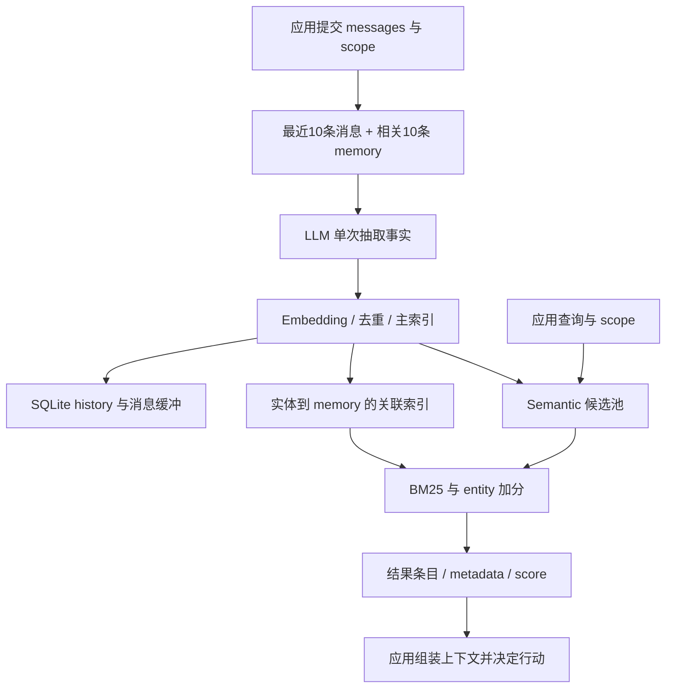

# Mem0 OSS 有界架构研究

**Status:** source-study draft; independent human review pending. These notes are not accepted System Cards or system performance results.

[比较入口](README.md) · [研究问题](../../research/agent-memory-inquiry.md)

## 中文摘要

Mem0 的 Python OSS 将抽取事实、近期消息、实体索引与变更历史组合为应用可调用的 memory 层；本文固定源码并区分托管产品声明。

## English summary

A bounded source study of Mem0 Python OSS as an application-facing memory layer, separating extraction, retrieval, change history and the managed product boundary.

研究日：2026-09-22。对象为官方 `mem0ai/mem0` 公开仓库，固定 commit **`a39a802bbc93e85b820078cd3c4dbaf53af25dbe`**。本文的 SOURCE-CLAIMED 指维护方声明或 prompt 规范；SOURCE-OBSERVED 指静态代码可见机制；INFERRED 指由机制推导的条件性解释；UNVERIFIED 指未运行、未测量的效果。未安装依赖、调用模型/API、访问真实 memory 或启动服务。

核心结论：这个版本的 Mem0 Python OSS 把 memory 实现为**由对话抽取、带 scope 与部分来源标签的可检索事实条目，配合最近消息缓冲、变更历史和实体索引**。它是供应用调用的持久化与检索层；记住什么、何时调用、怎样把结果变成可靠行动，仍由模型、harness、应用和人共同承担。当前主路径是 V3 ADD-only，不能沿用旧版自动 ADD/UPDATE/DELETE 的整体叙述。

## 对象边界与证据口径

**SOURCE-CLAIMED：** README 的 LoCoMo 92.5、LongMemEval 94.4 等 headline 数字属于 managed platform，使用 OSS 没有的 proprietary optimizations；“OSS 应有同方向收益”仍是官方预期，本文没有验证。不能把这些数字标作当前 clone 的 OSS 实测，也不能因 evaluation framework 开源就推定平台优化已开源。[README L45–63](https://github.com/mem0ai/mem0/blob/a39a802bbc93e85b820078cd3c4dbaf53af25dbe/README.md#L45-L63)

**SOURCE-OBSERVED：** `Memory` 本地组织 embedder、vector store、LLM、SQLite history；`MemoryClient` 则默认连接 `api.mem0.ai`，要求 API key。相同项目品牌与近似接口，不等于相同执行对象。本文研究前者；也不把 Python library 的结论扩大到 self-hosted server 的认证、TypeScript 或全部 integrations。[本地构造 L487–511](https://github.com/mem0ai/mem0/blob/a39a802bbc93e85b820078cd3c4dbaf53af25dbe/mem0/memory/main.py#L487-L511)、[托管 client L184–228](https://github.com/mem0ai/mem0/blob/a39a802bbc93e85b820078cd3c4dbaf53af25dbe/mem0/client/main.py#L184-L228)

## 生命周期：材料怎样变成可用 memory

**SOURCE-OBSERVED：写入与保留。** `add` 至少需要一个 `user_id/agent_id/run_id`；scope 身份来自显式参数，metadata 不能覆盖身份。默认 `infer=True` 先取该 scope 的最近10条消息，再以整段新消息 embedding 查相关10条 memory，交给 LLM 单次抽取。随后批量 embedding，按文本 hash 在本批与已检索条目内去重，创建 UUID、文本、时间和可选 `attributed_to`，写主索引、history 与实体索引。不是全库语义去重，也不是自动维持唯一“当前事实”。`infer=False` 可逐条保存非 system 消息及 role/name；procedural 分支则生成文本摘要再入库。[scope L360–404](https://github.com/mem0ai/mem0/blob/a39a802bbc93e85b820078cd3c4dbaf53af25dbe/mem0/memory/main.py#L360-L404)、[主路径 L879–1039](https://github.com/mem0ai/mem0/blob/a39a802bbc93e85b820078cd3c4dbaf53af25dbe/mem0/memory/main.py#L879-L1039)、[持久化 L1045–1206](https://github.com/mem0ai/mem0/blob/a39a802bbc93e85b820078cd3c4dbaf53af25dbe/mem0/memory/main.py#L1045-L1206)、[procedural L1993–2035](https://github.com/mem0ai/mem0/blob/a39a802bbc93e85b820078cd3c4dbaf53af25dbe/mem0/memory/main.py#L1993-L2035)

**SOURCE-OBSERVED：检索与交接。** `search` 要求 scope filters，默认 top_k=20；先取 `max(4×top_k,60)` 个 semantic 候选，再计算 BM25 与 entity boost。最终候选只来自 semantic 结果，且 semantic threshold 先于融合分数生效：keyword/entity 命中不能救回池外条目。可选 reranker 和 `explain` 提供可观察调优空间；返回文本、ID、score、时间及 metadata，不生成最终回答，`chat` 尚未实现。INFERRED：这是一种低耦合检索服务边界，同时把 query 构造、上下文预算、冲突处理和行动判断交回调用者。[检索 L1628–1731](https://github.com/mem0ai/mem0/blob/a39a802bbc93e85b820078cd3c4dbaf53af25dbe/mem0/memory/main.py#L1628-L1731)、[分数 L94–139](https://github.com/mem0ai/mem0/blob/a39a802bbc93e85b820078cd3c4dbaf53af25dbe/mem0/utils/scoring.py#L94-L139)、[chat L2168–2169](https://github.com/mem0ai/mem0/blob/a39a802bbc93e85b820078cd3c4dbaf53af25dbe/mem0/memory/main.py#L2168-L2169)

**SOURCE-OBSERVED：更新与删除。** ADD-only 限制的是自动抽取；显式 `update(id)` 仍替换文本与向量、保留创建时间、写 UPDATE 历史，并尝试重新链接实体。`delete(id)` 删除主向量，写含旧文本的 DELETE history，尝试清理实体关联；清理是 best-effort，当前进程未初始化 entity store 时直接跳过。`delete_all` 遍历 scope 的向量条目，所读路径未清理 SQLite 最近消息。INFERRED：操作可审计性较强，但单条删除不能代表来源消除、完全遗忘或下游撤回；残留缓冲可能继续进入之后的抽取上下文，是否再生具体事实需要 probe 验证。[更新/删除 L2038–2126](https://github.com/mem0ai/mem0/blob/a39a802bbc93e85b820078cd3c4dbaf53af25dbe/mem0/memory/main.py#L2038-L2126)、[实体清理 L652–705](https://github.com/mem0ai/mem0/blob/a39a802bbc93e85b820078cd3c4dbaf53af25dbe/mem0/memory/main.py#L652-L705)、[批量删除 L1918–1944](https://github.com/mem0ai/mem0/blob/a39a802bbc93e85b820078cd3c4dbaf53af25dbe/mem0/memory/main.py#L1918-L1944)、[消息保留 L257–324](https://github.com/mem0ai/mem0/blob/a39a802bbc93e85b820078cd3c4dbaf53af25dbe/mem0/memory/storage.py#L257-L324)

## 来源、角色、时间与派生影响

**SOURCE-CLAIMED：** 活跃抽取 prompt 同时接纳 user 与 assistant 内容，要求区分用户事实和助手建议、避免回声重复，并按命名说话者理解多方材料。这让共同工作、计划和 agent 行动进入 memory，不局限于用户偏好。**SOURCE-OBSERVED：** 默认 `parse_messages` 仅保留 system/user/assistant 的 role+content，忽略结构化 name 和 tool role；`attributed_to` 来自 LLM 输出，不能充当来源认证、原文定位或行动已完成的凭据。INFERRED：harness 必须主动保存来源消息 ID、工具执行结果与说话者身份；人仍须决定何种推断允许成为长期条目。[prompt L472–488](https://github.com/mem0ai/mem0/blob/a39a802bbc93e85b820078cd3c4dbaf53af25dbe/mem0/configs/prompts.py#L472-L488)、[归属字段 L924–956](https://github.com/mem0ai/mem0/blob/a39a802bbc93e85b820078cd3c4dbaf53af25dbe/mem0/configs/prompts.py#L924-L956)、[消息解析 L61–76](https://github.com/mem0ai/mem0/blob/a39a802bbc93e85b820078cd3c4dbaf53af25dbe/mem0/memory/utils.py#L61-L76)

**SOURCE-OBSERVED：** prompt 要求 `linked_memory_ids` 表示新旧事实联系，但默认持久化只采纳 text 与 attributed_to；其 UUID mapping 没有进入该持久化逻辑。实际 entity→memory 关联由独立 NLP 阶段建立，不能据 prompt 宣称已有事实之间的修订谱系或依赖撤回。INFERRED：改掉一个错误，不会由这些已读路径自动改掉据此生成的另一条 memory、计划或应用输出。[prompt L506–516](https://github.com/mem0ai/mem0/blob/a39a802bbc93e85b820078cd3c4dbaf53af25dbe/mem0/configs/prompts.py#L506-L516)、[payload L1013–1039](https://github.com/mem0ai/mem0/blob/a39a802bbc93e85b820078cd3c4dbaf53af25dbe/mem0/memory/main.py#L1013-L1039)

**SOURCE-OBSERVED：** OSS 拒绝 `add(timestamp=...)` 与 `search(reference_date=...)`；默认 prompt builder 把 observation date 设为当天，而 add 调用未传入历史时间。虽然可保存 created_at metadata 与文本日期，也支持 expiration_date，但后者只是默认检索/列表可见性过滤，不能等同 temporal reasoning 或物理清除。INFERRED：历史对话回灌必须显式处理事件时间，不能相信“昨天”会自动锚定真实历史日期。[参数拒绝 L817–829](https://github.com/mem0ai/mem0/blob/a39a802bbc93e85b820078cd3c4dbaf53af25dbe/mem0/memory/main.py#L817-L829)、[检索拒绝 L1432–1433](https://github.com/mem0ai/mem0/blob/a39a802bbc93e85b820078cd3c4dbaf53af25dbe/mem0/memory/main.py#L1432-L1433)、[日期默认 L1007–1042](https://github.com/mem0ai/mem0/blob/a39a802bbc93e85b820078cd3c4dbaf53af25dbe/mem0/configs/prompts.py#L1007-L1042)

scope 是调用约定，不是自动识别研究中的内容域或关系边界。按 ID 的 get/update/delete 也没有在该 library 入口接收调用者身份；应用须实施权限和 scope 映射。默认英语 `en_core_web_sm` 支撑 NLP，未装载时可退化；中文效果不能由英文功能表推出。[NLP loader L21–65](https://github.com/mem0ai/mem0/blob/a39a802bbc93e85b820078cd3c4dbaf53af25dbe/mem0/utils/spacy_models.py#L21-L65)

**SOURCE-OBSERVED：** 批量写入失败时，代码逐条重试；某条仍失败只记录日志，后面的 history、entity linking 和返回列表仍遍历原始 records。因此，返回 ADD 事件不能单独证明每条事实已经可检索，history 也不是跨存储事务提交证明。[批量持久化 L1045–1084](https://github.com/mem0ai/mem0/blob/a39a802bbc93e85b820078cd3c4dbaf53af25dbe/mem0/memory/main.py#L1045-L1084)、[返回结果 L1192–1198](https://github.com/mem0ai/mem0/blob/a39a802bbc93e85b820078cd3c4dbaf53af25dbe/mem0/memory/main.py#L1192-L1198) INFERRED：继续处理可保存一部分有用材料，但应用需要独立的落库核验与失败反馈；这项限制不能从正常成功路径的演示中排除。本文未注入故障，不能声称已复现生产丢写。

Relata 可据此把“记忆”拆成可观察的保留、选择、修订和使用环节，而不要仅以是否存在向量库判定。这里保留的是经模型选择的表述，检索分数表达相关性，归属字段表达模型给出的来源分类；它们都不直接等于事实可信度、用户认可或关系意义。对普通项目协作与长期亲密互动，同样需要检查当事人否认、角色错置和过去状态是否仍可恢复；不同应用的重要性权重可以不同。

## 竞争解释与 public synthetic probes

ADD-only 的长处是保留变化材料、减少自动覆写；代价可能是冲突累积和下游时间裁决。它未必“不会修正”，也可能有意把修正责任放到显式 API 与检索/回答阶段。semantic 候选门槛未必是错误，也可能是精度、成本和接口一致性的取舍；只有控制实验才能判断其召回代价。未保留全部来源不等于产品不能被应用扩展，但扩展必须计入 system boundary，不能把应用补全算作 OSS 原生能力。

1. **归属与修订 probe。** 使用两名虚构成年人的合成跨日对话：用户提出周五交稿，助手仅建议周四；后续用户明确改为周六，并澄清助手先前没有提交。保持 user/agent scope 不变，另设不同项目 scope 对照；询问谁提出、谁批准、当前/过去日期、是否实际提交。分别记录原始抽取、metadata、search 与最终答案，以 full-history/full-search 对照区分抽取丢失、检索遗漏和回答误判。
2. **删除与派生 probe。** 合成“蓝色门牌”为事实 A，后续产生依赖 A 的计划 B。显式改 A，再删 A；观察主索引、history、近期消息与 entity links，并在新实例及原实例分别查询、继续录入无关短句。验证 B 是否被撤回、A 是否仍参与上下文；控制 `infer=False` 与正常抽取，并分别测试 expiration 与 delete。预期只作为待证假设，不把保留审计历史直接判成整体失败。

## 覆盖与限制

读到 Python 同步 `Memory` 的写入、scope、检索、更新、删除、history、procedural 关键路径，活跃 V3 prompt、SQLite schema/消息保留、scoring、消息解析、spaCy loader、配置和 hosted client 边界；检索了 async 对应关联字段，但没有做完整 parity 审计。未完整阅读所有 provider、server/auth、TypeScript、graph 历史路径、测试或 evaluation submodule，未核查 managed 内部实现。某次批量工具输出发生截断，本文实质引用的生命周期与 prompt 段落已分段重新读取。没有运行测试或效果实验；以上 SOURCE-OBSERVED 均为静态观察，性能、中文召回、事实忠实性、长期稳定性与端到端纠错效果均 UNVERIFIED。
