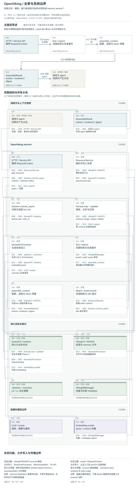

# OpenViking：公开源码架构研究（bounded draft）

**Status:** source-study draft; independent human review pending. No complete-system performance result.

研究日期：2026-09-22。对象：[volcengine/OpenViking](https://github.com/volcengine/OpenViking)，公开 main 的精确 commit `bbf2e37f88b8b15482edb83be41feb3ed510d03a`，commit 时间 `2026-09-22T18:20:02+08:00`。这是静态源码 study，不是 accepted System Card、运行观察、benchmark 复现或正式产品审计。`architecture.json` 中 observed 仅指已检查源码；图模型和渲染输出的关系见[图集说明](../architecture-atlas/README.md)。

## 中文摘要

OpenViking 的区分性机制是可寻址、可编辑的 context filesystem：资源、记忆、技能在 `viking://` 目录中组织，account/user/peer scope 参与读写与召回。普通资源先解析成可持久化内容树；session commit 则先保存原始消息 archive 和 live tail，再由持久队列提取可更新的 memory 文件。L0/L1 摘要和向量索引是与内容文件分离的派生状态。检索并不总是“逐目录下钻”：`find` 固定 QUICK，`search` 可进行 session-aware intent planning，且只有适当配置下才走带 rerank 的 THINKING 目录展开。统一 assembler 将候选变成有预算的上下文，而最终 agent 使用和回复仍属于调用方。[S4](https://github.com/volcengine/OpenViking/blob/bbf2e37f88b8b15482edb83be41feb3ed510d03a/openviking/storage/viking_fs/_access.py#L659-L675) [S6](https://github.com/volcengine/OpenViking/blob/bbf2e37f88b8b15482edb83be41feb3ed510d03a/openviking/core/retrieval_targets.py#L49-L171) [S17](https://github.com/volcengine/OpenViking/blob/bbf2e37f88b8b15482edb83be41feb3ed510d03a/openviking/session/session.py#L1989-L2140) [S19](https://github.com/volcengine/OpenViking/blob/bbf2e37f88b8b15482edb83be41feb3ed510d03a/openviking/session/compressor_v3.py#L651-L793) [S25](https://github.com/volcengine/OpenViking/blob/bbf2e37f88b8b15482edb83be41feb3ed510d03a/openviking/storage/viking_fs/_semantic.py#L246-L299) [S26](https://github.com/volcengine/OpenViking/blob/bbf2e37f88b8b15482edb83be41feb3ed510d03a/openviking/storage/viking_fs/_semantic.py#L431-L499) [S27](https://github.com/volcengine/OpenViking/blob/bbf2e37f88b8b15482edb83be41feb3ed510d03a/openviking/retrieve/hierarchical_retriever.py#L120-L218) [S29](https://github.com/volcengine/OpenViking/blob/bbf2e37f88b8b15482edb83be41feb3ed510d03a/openviking/retrieve/context_assembler/pipeline.py#L53-L170)

## English summary

At the pinned commit, OpenViking is a filesystem-oriented context service with separate resource-ingestion and session-memory paths. Session commits first persist recoverable archive state and retained live messages, then queue extraction. Current content files, generated directory summaries, and vector records have different authority and update timing. `find` uses QUICK retrieval; `search` can plan from session context and conditionally expand directory candidates with reranking. A context assembler controls quotas, body reads, token budgets, optional rewriting, and cross-turn deduplication. These mechanisms offer inspectable scope and revision paths, but this study establishes neither deployed behavior nor improved memory quality. Source-level deletion, restoration, and completion receipts require careful interpretation.

## 边界与模型

图分为 `overview`、`flow`、`revision` 三视图，分别有 16/24、14/21、15/23 个 node/edge。它们保留 API、原生 service、持久存储/队列、配置模型和调用方边界。主图将 service classes 折叠为可读模块，不把每个 helper 当作独立组件。架构文件有 47 条固定 commit 的源码证据。

本次代表 Python `OpenVikingService`、VikingFS façade、资源/会话/记忆、QueueFS 消费者、retrieval/context assembly 和高层修改路径。RAGFS binding、VikingDBManager 的配置连接已读；Rust 文件系统、底层 vector engine/TrieHI 的内部算法和部署拓扑未审计。模型可能是本地或远端，取决于配置，本研究未作出统一网络/隐私保证。具体 harness 注入与最终回答标为 unknown。[S1](https://github.com/volcengine/OpenViking/blob/bbf2e37f88b8b15482edb83be41feb3ed510d03a/openviking/service/core.py#L160-L213) [S2](https://github.com/volcengine/OpenViking/blob/bbf2e37f88b8b15482edb83be41feb3ed510d03a/openviking/service/core.py#L510-L585) [S3](https://github.com/volcengine/OpenViking/blob/bbf2e37f88b8b15482edb83be41feb3ed510d03a/openviking/server/app.py#L594-L620) [S14](https://github.com/volcengine/OpenViking/blob/bbf2e37f88b8b15482edb83be41feb3ed510d03a/openviking/storage/collection_schemas.py#L768-L786) [S27](https://github.com/volcengine/OpenViking/blob/bbf2e37f88b8b15482edb83be41feb3ed510d03a/openviking/retrieve/hierarchical_retriever.py#L120-L218)

## 状态与全生命周期

**写入资源。** `ResourceService.add_resource` 与 scheduled `refresh_resource` 进入资源处理。解析器产出临时 artifact，TreeBuilder 解析目标与内容树，随后存在异步 post-process job。L2 的准确说法是保留的资源内容或解析后内容，不能一律叫上传文件的原始字节。SemanticProcessor 从文件摘要和子目录 abstracts 生成目录 overview；大目录可能采用采样或分批。摘要写入携带 `generated_by` 与 freshness metadata，然后派发 embedding 工作，写入向量与 metadata。[S7](https://github.com/volcengine/OpenViking/blob/bbf2e37f88b8b15482edb83be41feb3ed510d03a/openviking/service/resource_service.py#L1496-L1600) [S8](https://github.com/volcengine/OpenViking/blob/bbf2e37f88b8b15482edb83be41feb3ed510d03a/openviking/utils/resource_processor.py#L694-L840) [S9](https://github.com/volcengine/OpenViking/blob/bbf2e37f88b8b15482edb83be41feb3ed510d03a/openviking/service/resource_service.py#L2080-L2170) [S10](https://github.com/volcengine/OpenViking/blob/bbf2e37f88b8b15482edb83be41feb3ed510d03a/openviking/storage/queuefs/semantic_processor.py#L405-L465) [S11](https://github.com/volcengine/OpenViking/blob/bbf2e37f88b8b15482edb83be41feb3ed510d03a/openviking/storage/queuefs/semantic_processor.py#L1035-L1066) [S12](https://github.com/volcengine/OpenViking/blob/bbf2e37f88b8b15482edb83be41feb3ed510d03a/openviking/storage/queuefs/semantic_processor.py#L1495-L1545) [S13](https://github.com/volcengine/OpenViking/blob/bbf2e37f88b8b15482edb83be41feb3ed510d03a/openviking/storage/queuefs/semantic_processor.py#L1847-L1894) [S14](https://github.com/volcengine/OpenViking/blob/bbf2e37f88b8b15482edb83be41feb3ed510d03a/openviking/storage/collection_schemas.py#L768-L786) [S15](https://github.com/volcengine/OpenViking/blob/bbf2e37f88b8b15482edb83be41feb3ed510d03a/openviking/storage/collection_schemas.py#L965-L980)

**写入会话记忆。** `commit_async` Phase 1 在 filesystem path lock 下分割 archive/live 内容，写 recoverable intent 和 `messages.jsonl`，入队 `SessionCommitMsg`，再发布 retained root。Phase 2 消费者读取 session 并恢复 queued commit；未就绪会重入队。`SessionCompressorV3` 的普通记忆路线准备 context/schema，运行可用工具的 ExtractLoop，经 MemoryIsolationHandler 解析允许的 self/peer/type，然后提交 streaming updater。其 count/time buffer 为 process-local，按 account/user 及 peer/type 分组；它不应与持久 QueueFS 混为一谈。最终 MemoryUpdater 合并字段、更新 version/来源、写入文件并维护摘要、向量和 links。源码也有条件 agent-evolution training / session-skill 分支，本次仅检查分支入口。[S16](https://github.com/volcengine/OpenViking/blob/bbf2e37f88b8b15482edb83be41feb3ed510d03a/openviking/session/session.py#L1786-L1830) [S17](https://github.com/volcengine/OpenViking/blob/bbf2e37f88b8b15482edb83be41feb3ed510d03a/openviking/session/session.py#L1989-L2140) [S18](https://github.com/volcengine/OpenViking/blob/bbf2e37f88b8b15482edb83be41feb3ed510d03a/openviking/storage/queuefs/session_commit_processor.py#L43-L93) [S19](https://github.com/volcengine/OpenViking/blob/bbf2e37f88b8b15482edb83be41feb3ed510d03a/openviking/session/compressor_v3.py#L651-L793) [S20](https://github.com/volcengine/OpenViking/blob/bbf2e37f88b8b15482edb83be41feb3ed510d03a/openviking/session/memory/extract_loop.py#L111-L145) [S21](https://github.com/volcengine/OpenViking/blob/bbf2e37f88b8b15482edb83be41feb3ed510d03a/openviking/session/memory/streaming_memory_updater.py#L1-L110) [S22](https://github.com/volcengine/OpenViking/blob/bbf2e37f88b8b15482edb83be41feb3ed510d03a/openviking/session/memory/memory_updater.py#L928-L1045) [S23](https://github.com/volcengine/OpenViking/blob/bbf2e37f88b8b15482edb83be41feb3ed510d03a/openviking/session/memory/memory_updater.py#L1100-L1212) [S24](https://github.com/volcengine/OpenViking/blob/bbf2e37f88b8b15482edb83be41feb3ed510d03a/openviking/session/memory/memory_isolation_handler.py#L62-L167) [S46](https://github.com/volcengine/OpenViking/blob/bbf2e37f88b8b15482edb83be41feb3ed510d03a/openviking/session/compressor_v3.py#L434-L516)

**权威分层。** archive `messages.jsonl` 是导入会话消息的历史记录；live root 是当前活跃片段；working-memory overview 是模型生成的压缩；长期 memory Markdown 是 schema 与提取决策的结果；`.abstract.md`/`.overview.md` 是内容树的摘要；vector record 是召回状态。文件可读意味着可检查，不意味着摘要、提取或模型回答正确。schema 可以通过 templates/config/account 路径变化，不能把某一版本的默认类别当作普适 memory ontology。[S17](https://github.com/volcengine/OpenViking/blob/bbf2e37f88b8b15482edb83be41feb3ed510d03a/openviking/session/session.py#L1989-L2140) [S19](https://github.com/volcengine/OpenViking/blob/bbf2e37f88b8b15482edb83be41feb3ed510d03a/openviking/session/compressor_v3.py#L651-L793) [S22](https://github.com/volcengine/OpenViking/blob/bbf2e37f88b8b15482edb83be41feb3ed510d03a/openviking/session/memory/memory_updater.py#L928-L1045) [S23](https://github.com/volcengine/OpenViking/blob/bbf2e37f88b8b15482edb83be41feb3ed510d03a/openviking/session/memory/memory_updater.py#L1100-L1212) [S47](https://github.com/volcengine/OpenViking/blob/bbf2e37f88b8b15482edb83be41feb3ed510d03a/openviking/session/memory/memory_type_registry.py#L43-L86)

**保留与异步。** turn-aware retention 按用户 turn、assistant step 和 token budget 决定 live tail 与 archive 边界，保留 user anchor 和原子 tool/assistant 关联；这不是过期数据销毁。WatchScheduler 在启用时按周期重新导入资源；SessionAutoCommitScheduler 在 idle 配置启用时扫描并提交 session；它们不是自动“忘记”旧记忆的同一个 daemon。`hotness_score` 在适用的检索路径里混合访问/更新时间分数，本研究没有据此认定任何自动删除机制。[S2](https://github.com/volcengine/OpenViking/blob/bbf2e37f88b8b15482edb83be41feb3ed510d03a/openviking/service/core.py#L510-L585) [S31](https://github.com/volcengine/OpenViking/blob/bbf2e37f88b8b15482edb83be41feb3ed510d03a/openviking/resource/watch_scheduler.py#L310-L424) [S32](https://github.com/volcengine/OpenViking/blob/bbf2e37f88b8b15482edb83be41feb3ed510d03a/openviking/service/session_auto_commit.py#L28-L145) [S40](https://github.com/volcengine/OpenViking/blob/bbf2e37f88b8b15482edb83be41feb3ed510d03a/openviking/session/retention.py#L406-L494) [S41](https://github.com/volcengine/OpenViking/blob/bbf2e37f88b8b15482edb83be41feb3ed510d03a/openviking/retrieve/hierarchical_retriever.py#L590-L664)

**选择、读取与使用。** URI scope 映射到 account 路径，检索还限制 user、actor peer、context type 与显式 target directories。`find` 固定 QUICK 的范围向量查询；`search` 在 session 信息存在且 intent 开启时可拆成 typed queries，但无 reranker 时 retriever 默认 QUICK。THINKING 路径用目录优先队列查询 children，结合 child 与 parent scores，按 convergence 条件停止。返回可含 L0/L1/L2。assembler 另有 query expansion、类别配额、scope、排除 URI、跨 turn 冷却、按 tier 按需读取、预算降级、render 和可选 rewrite。这里“abstract tier”可直接用 vector payload，不总会读取当前 sidecar 文件。返回 `AssembleResult` 不证明调用方真的注入了这些内容。[S4](https://github.com/volcengine/OpenViking/blob/bbf2e37f88b8b15482edb83be41feb3ed510d03a/openviking/storage/viking_fs/_access.py#L659-L675) [S5](https://github.com/volcengine/OpenViking/blob/bbf2e37f88b8b15482edb83be41feb3ed510d03a/openviking/storage/viking_fs/_access.py#L205-L265) [S6](https://github.com/volcengine/OpenViking/blob/bbf2e37f88b8b15482edb83be41feb3ed510d03a/openviking/core/retrieval_targets.py#L49-L171) [S25](https://github.com/volcengine/OpenViking/blob/bbf2e37f88b8b15482edb83be41feb3ed510d03a/openviking/storage/viking_fs/_semantic.py#L246-L299) [S26](https://github.com/volcengine/OpenViking/blob/bbf2e37f88b8b15482edb83be41feb3ed510d03a/openviking/storage/viking_fs/_semantic.py#L431-L499) [S27](https://github.com/volcengine/OpenViking/blob/bbf2e37f88b8b15482edb83be41feb3ed510d03a/openviking/retrieve/hierarchical_retriever.py#L120-L218) [S28](https://github.com/volcengine/OpenViking/blob/bbf2e37f88b8b15482edb83be41feb3ed510d03a/openviking/retrieve/hierarchical_retriever.py#L421-L588) [S29](https://github.com/volcengine/OpenViking/blob/bbf2e37f88b8b15482edb83be41feb3ed510d03a/openviking/retrieve/context_assembler/pipeline.py#L53-L170) [S30](https://github.com/volcengine/OpenViking/blob/bbf2e37f88b8b15482edb83be41feb3ed510d03a/openviking/retrieve/context_assembler/tiers.py#L1-L8)

**修订与 consolidation。** 普通内容通过 ContentWriteCoordinator 进入写入与派生刷新。memory 更新先读当前文件，再按 schema `merge_op` 合并，保存 version 和 extraction/trace metadata；同批 upsert/delete 冲突有专门策略。并发提取可以由 streaming updater 合并 patches。上述机制支持修订，不保证新旧主张冲突、人物归属或语义重要性被正确判断。原始会话 archive 不会因为 memory 文件被编辑而自动变成经过纠正的新原始证据。[S21](https://github.com/volcengine/OpenViking/blob/bbf2e37f88b8b15482edb83be41feb3ed510d03a/openviking/session/memory/streaming_memory_updater.py#L1-L110) [S22](https://github.com/volcengine/OpenViking/blob/bbf2e37f88b8b15482edb83be41feb3ed510d03a/openviking/session/memory/memory_updater.py#L928-L1045) [S23](https://github.com/volcengine/OpenViking/blob/bbf2e37f88b8b15482edb83be41feb3ed510d03a/openviking/session/memory/memory_updater.py#L1100-L1212) [S35](https://github.com/volcengine/OpenViking/blob/bbf2e37f88b8b15482edb83be41feb3ed510d03a/openviking/storage/content_write.py#L123-L205)

**删除。** 低层 VikingFS.rm 在锁内先清索引，再删文件，并可清理孤儿索引。高层 FSService.rm 随后同步 watch、刷新仍存在的父目录并调用 ResourceMemoryLinkService：先触发关联记忆更新，再扫描和移除残余 literal refs。尽管 helper 名为 `before_resource_delete`，此调用点在底层 `rm` 之后，图按实际控制流绘制。父摘要可能通过 FreshnessAction 累积 pending 到阈值后再刷新；因此不能声称所有摘要、引用、索引在同一原子删除中消失。底层 snapshots、备份、日志、provider 记录是否擦除不在本研究已检查范围。[S33](https://github.com/volcengine/OpenViking/blob/bbf2e37f88b8b15482edb83be41feb3ed510d03a/openviking/service/fs_service.py#L401-L474) [S34](https://github.com/volcengine/OpenViking/blob/bbf2e37f88b8b15482edb83be41feb3ed510d03a/openviking/storage/viking_fs/_ops.py#L215-L349) [S36](https://github.com/volcengine/OpenViking/blob/bbf2e37f88b8b15482edb83be41feb3ed510d03a/openviking/storage/queuefs/semantic_ops/freshness_policy.py#L12-L61) [S37](https://github.com/volcengine/OpenViking/blob/bbf2e37f88b8b15482edb83be41feb3ed510d03a/openviking/service/resource_memory_link_service.py#L355-L462)

**恢复与回执的具体落差。** snapshot restore 文档注释称后台任务 completed 可以保证检索看到已恢复状态；但当前 `_run_vector_rebuild` 捕获子路径异常并只记录日志，外层 gather 之后仍可 `tracker.complete`。由此静态可确认的是“有按 URI/level 的后台 reindex 路径”，不是“completed 必然证明每项索引已更新”。这是源码与自身注释的真实差异，未运行故障注入，因此不扩张为线上故障率结论。[S38](https://github.com/volcengine/OpenViking/blob/bbf2e37f88b8b15482edb83be41feb3ed510d03a/openviking/storage/viking_fs/_snapshot.py#L336-L383) [S39](https://github.com/volcengine/OpenViking/blob/bbf2e37f88b8b15482edb83be41feb3ed510d03a/openviking/storage/viking_fs/_snapshot.py#L855-L929)

## README、论文与 hosted 主张如何使用

README 介绍 L0/L1/L2、memory extraction 和 benchmark 数字；这些作为作者主张记录，不转写为本研究验证结果。其性能段落明确指向 0.3.22 与特定模型/集成，本研究对象是另一 exact commit，不能横向搬用数值。README 也明确 OpenViking 开源 VikingMem 的部分能力。[S43](https://github.com/volcengine/OpenViking/blob/bbf2e37f88b8b15482edb83be41feb3ed510d03a/README.md#L49-L120) [S44](https://github.com/volcengine/OpenViking/blob/bbf2e37f88b8b15482edb83be41feb3ed510d03a/README.md#L282-L302)

本次仅读三篇 arXiv 的 abstract/metadata，未读全文或重现实验：[VikingMem v3](https://arxiv.org/abs/2605.29640v3) 描述 event/entity 和时间压缩；[Directory-Aware Query and Maintenance v1](https://arxiv.org/abs/2606.16903v1) 描述 DSQ/DSM 和 TrieHI；[VikingRAG v1](https://arxiv.org/abs/2609.11390v1) 包含 retrieval-trace reuse 与 adaptive escalation。Python 中可见 scope 和层级检索，不足以验证 TrieHI 引擎内部或把论文的所有策略视为此 commit 的默认路径。商业 hosted 服务、Studio demo、收费部署的能力与保障均未检查。

## 有条件优势与限制

- 对一般 agent memory：若目录/peer 归属可靠、内容可被解析且模型适合任务，统一 URI、显式 scope、可编辑 Markdown、raw archive 和阶段状态为项目材料、个人偏好、经验与技能提供可检查的组织方式。代价是多个派生状态、配置模式和异步阶段；调用方需要区分内容存在、摘要新鲜、索引完成与实际 context use。
- 对长期关系/亲密场景：若归属与授权由上层正确提供，self/peer 分离和 archive 回看能支持人物边界及修订；但 peer ownership 技术规则不等于共同同意、关系连续性或完整关系真相。默认 event schema 偏好原子、第三人称、日期化的现实事件，可能善于保留承诺/安排，也可能改变“这段共同对话本身”的意义；这是根据模板的待验证研究问题，不是已观察到的损害。[S24](https://github.com/volcengine/OpenViking/blob/bbf2e37f88b8b15482edb83be41feb3ed510d03a/openviking/session/memory/memory_isolation_handler.py#L62-L167) [S42](https://github.com/volcengine/OpenViking/blob/bbf2e37f88b8b15482edb83be41feb3ed510d03a/openviking/prompts/templates/memory/events.yaml#L1-L98)
- 混合场景无需浪漫标签：项目资料、日常事件与用户偏好可以通过同一目录/API 组织。但 extraction schema、查询配额、摘要采样与模型会共同影响可召回内容，不能从 unified filesystem 推论所有内容域公平覆盖。[S6](https://github.com/volcengine/OpenViking/blob/bbf2e37f88b8b15482edb83be41feb3ed510d03a/openviking/core/retrieval_targets.py#L49-L171) [S12](https://github.com/volcengine/OpenViking/blob/bbf2e37f88b8b15482edb83be41feb3ed510d03a/openviking/storage/queuefs/semantic_processor.py#L1495-L1545) [S29](https://github.com/volcengine/OpenViking/blob/bbf2e37f88b8b15482edb83be41feb3ed510d03a/openviking/retrieve/context_assembler/pipeline.py#L53-L170) [S47](https://github.com/volcengine/OpenViking/blob/bbf2e37f88b8b15482edb83be41feb3ed510d03a/openviking/session/memory/memory_type_registry.py#L43-L86)

## 两个提议但未运行的 synthetic probes

**OV-P1：同一修改的跨层可见性与恢复失败。** 用纯合成 project resource 写入旧日期，等待正常后处理；经公开内容 API 改为新日期，分别记录即时 read、L0/L1、find QUICK、search THINKING（可用时）、context assembler 和 task 状态。随后删除资源，检查父摘要与关联 memory refs；最后在可控测试后端对一个 restore reindex 子任务注入失败。比较 `completed`、日志及实际检索命中。probe evidence contract：只报告各阶段旧值/新值、URI、任务状态与错误，避免把“未召回”直接归因于内容不存在。此 probe 的 model calls / execution 需要独立授权与明确配置。

**OV-P2：成人混合域 continuity 与归属修订。** 合成两个成年参与者 A/B，交错普通共同活动、项目 deadline、A 的个人偏好、仅属于 B 的信息，以及后来对共同安排的更正；含一句“这次谈话本身是重要约定”。用同一段 messages 分别提交正确/不明确 peer metadata，保留 raw archive 和 MemoryIsolation skip receipts。比较 full-history control、显式 scope 的 find/search 与 assembler，记录承诺、修订、对话意义和第三方细节在何处保留/被改写/被拒绝。不能将 peer 未归属导致的跳过直接称作 memory failure；需将输入合同、提取判断、存储、召回与最终回答分开。未运行，未指定预期获胜架构。

## 覆盖与检查

已读的主路径和精确行区间列于 `architecture.json.sources`，包括 resource processing、session phase1/phase2、普通 memory extraction/merge、namespace/peer、retrieval、context assembly、watch/idle scheduler、write/delete/freshness、snapshot restore。另阅读 context assembler 一项预算测试 body，搜索相关 retention/commit/restore/isolation 测试名称；没有运行任何 upstream 测试。[S45](https://github.com/volcengine/OpenViking/blob/bbf2e37f88b8b15482edb83be41feb3ed510d03a/tests/retrieve/test_context_assembler_pipeline.py#L123-L149)

未覆盖：全体 parser、完整 AGFS/RAGFS Rust 代码、vector backends/TrieHI、认证插件完整威胁模型、账号删除/data-cleanup 全路径、模型 provider 数据策略、agent-evolution training pipeline、技能演化内部、VikingBot compile、MCP/harness 注入、benchmark reproduction、hosted 产品。部分早期目录/函数检索输出被工具截断；报告中的实际证据均转为明确文件区间检查，不声称全仓覆盖。

实际检查：公开 clone 成功；HEAD 和 commit 时间已读；工作树 `git status --short` 为空；本地脚本验证 architecture.json 的三个 view、node 唯一性、region/edge 引用、evidence ID 与每个 pinned source 的实际文件行界。未 import/执行 upstream，未安装依赖，未调用模型/provider。

## 架构三视图

[打开交互图集](../architecture-atlas/index.html#openviking/overview) · [总览 SVG](../architecture-atlas/diagrams/openviking/overview.svg) · [写入到使用 SVG](../architecture-atlas/diagrams/openviking/flow.svg) · [修订与控制 SVG](../architecture-atlas/diagrams/openviking/revision.svg) · [可编辑模型与源码证据](../architecture-atlas/models/openviking.json)

图中“已读”表示固定版本的静态源码观察；“推断”和“未知”分别保留条件与未检查边界。三幅图覆盖不同问题，不等于全仓审计。[图例与阅读方法](../architecture-atlas/README.md)。
