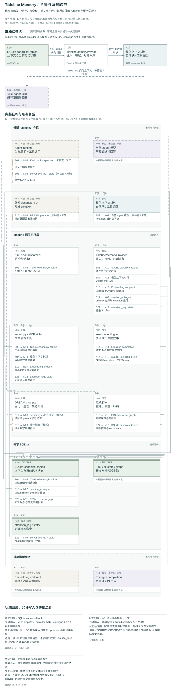

# Tideline Memory：公开源码研究

**Status:** source-study draft; independent human review pending. These notes are not accepted System Cards or system performance results.

[比较入口](README.md) · [研究问题](../../research/agent-memory-inquiry.md)

## 中文摘要

Tideline Memory 连接身份注入、narrative、修订轨迹与维护；本文追查主动检索与自动唤起是否消费相同更新状态。

## English summary

A bounded source study of Tideline Memory identity injection, narratives, amendments and maintenance, with particular attention to differences between active search and automatic recall.

研究日：2026-09-22。对象仅为 [ennisaaaaaaaa-stack/tideline-memory](https://github.com/ennisaaaaaaaa-stack/tideline-memory)，固定 commit **76490fe2c422f1213e735e63c289fef5ae8044f6**，提交时间 2026-09-10T01:54:57+08:00。不涉及真实 memory、账户或维护者运行环境。

标记规则：**SOURCE-CLAIMED** 是 README、注释或 prompt 的主张；**SOURCE-OBSERVED** 是此次实际读到的实现与接线；**INFERRED** 是由实现推导的条件性后果；**UNVERIFIED** 是未运行或公开证据不足。源码存在不等于已经安装、触发，更不等于长期效果得到验证。

## 判断与原生生命周期

**INFERRED**：它适合研究“过去如何变成当前 agent 状态”，比单一向量库多出了身份、人物画像、开放线索和理解演进。但该 commit 的主动搜索、自动注入、维护扫描并未消费完全相同的记忆状态；“存过”与“下次会用到”仍有明显距离。README 的“任意规模准确检索、无压缩、不遗忘”仅是 **SOURCE-CLAIMED**，不能当成结果。[E1]

**写入与保留 — SOURCE-OBSERVED。** `memory_write` 接收 gesture、背景、moment、cognition_direction、tags、entities_role 和 source_links；模型或调用者选择内容与 importance/emotional/unresolved，代码按 tag 频次算 recurrence，生成向量并写 SQLite。source_links 是可选 JSON ID 数组，未核验指向的证据是否支持叙述。一般写入按四维加权，并传播旧条目的 recurrence；这是频次机制，不是事实确认。[E2]

provider 的 `sync_turn` 保存 USER/ASSISTANT 前缀与 session metadata，但每条正文截至 2000 字符、向量只取前 500；压缩前及会话结束补录也截断。`_extract_conversation` 按正文前 200 字去重、丢弃少于 10 字的消息；虽然注释说过滤 tool，实际只明确排除 system。因此短促纠正、长消息尾部、相同开头的不同发言都可能损失，工具文本也可能进入补录。[E3] 批量导入另走按周挑选片段的 summary 路径，并非无损日志导入。[E4]

会话结束可启动后台 epilogue：以部分 chunks 与近时手写 narrative 为材料，调用可配置 LLM 写 1–2 条第一人称记忆；有薄窗口与日上限，失败可写 seal。它直接写 narratives，采用模型给出的 recurrence，并不经过 `memory_write` 的频次传播/归一化路径。**INFERRED**：不同入口产生的同名权重不一定同义。[E5]

**唤起与使用 — SOURCE-OBSERVED。** T0 直接注入 self_concept、最新 snapshot、开放 threads；T2 选七天内高权重条目并按 tag 去重；T3 注入主题图谱与人物画像，self/指定人物全文，其余截取短摘要。身份因而先于当前 query 出现，而非依赖“你是谁”的检索。该机制是上下文供给，不证明模型具有持续主观身份或会遵循它。[E6]

逐轮 T1 取 query 前 500 字，对最近最多 2000 条原 narrative 向量做 cosine，阈值 0.25，按会话去重后取 3 条。若 embedding 失败或无可扫描 narrative，直接返回，未进入 T4；只有 top 少于 2 时才做原 narrative FTS fallback。README 所说 T1 最近 100 条、无 embedding 时退化搜索，需要区分 MCP 与 provider。[E7] MCP `memory_search` 确实合并 context、narrative、amendment 的关键词与向量命中，按 narrative ID 收敛；返回材料后是否核查来源、适用范围与矛盾，由当前模型决定。[E8]

图集补读还定位一个限定条件的静态缺口：provider 模块定义 `_EMBED_KEY/_EMBED_MODEL`，远程 embedding 请求却引用 `_EMB_KEY/_EMB_MODEL`。在非本地 endpoint、模块未修改且没有外部注入这些 globals 的条件下，该路径会触发被捕获的 NameError，返回空向量，再使 T1 提前退出。MCP server 自己定义了正确的 `_EMB_*`，不能把这项判断扩大到 MCP 或所有部署；本研究没有运行复现。[provider 配置](https://github.com/ennisaaaaaaaa-stack/tideline-memory/blob/76490fe2c422f1213e735e63c289fef5ae8044f6/plugins/tideline_provider.py#L58-L64)；[远程调用与异常](https://github.com/ennisaaaaaaaa-stack/tideline-memory/blob/76490fe2c422f1213e735e63c289fef5ae8044f6/plugins/tideline_provider.py#L166-L202)；[T1 退出](https://github.com/ennisaaaaaaaa-stack/tideline-memory/blob/76490fe2c422f1213e735e63c289fef5ae8044f6/plugins/tideline_provider.py#L434-L442)；[MCP 独立配置](https://github.com/ennisaaaaaaaa-stack/tideline-memory/blob/76490fe2c422f1213e735e63c289fef5ae8044f6/server.py#L776-L782)。

**修订与维护 — SOURCE-OBSERVED。** narrative 语义本体不改；`memory_amend` 先 INSERT 并 commit 修订，再 best-effort 写修订向量、重建机械轨迹，相关异常会被捕获。这不是跨派生状态的原子提交；仅在轨迹重建成功时，新修订才使已升格轨迹回到 mech。返回的修订行数不能证明向量与轨迹都已更新。MCP 回显按时序展示全部修订；所谓 effective text 是原文加修订串接，不是确定性裁决后的唯一事实。轨迹存最近 12 段、自动注入最多 6 段；DREAM 被提示保留原事件时间，但写入校验只要求非空 ts/text，不能保证模型没改时间或含义。[E9]

维护由独立脚本和 LLM prompt 配合：重建主题/软聚类、刷新权重、查冲突候选、改画像、写线索和梦。prompt 要求画像“更新不叠加”，代码通过覆盖保存最新版，旧版最多留 30 份。**SOURCE-OBSERVED** 的 anti-inflation 是最近 20 条平均权重超 0.7 后同比缩放至约 0.6；它控制排名幅度，不控制总存储量或叙事偏差。梦的 importance=1 也没有形成检索隔离区。[E10]

## 机制长处、条件性局限与竞争解释

1. **理解演进可查，但各入口不同步。** 修订独立存储且可主动检索，是可贵的历史可追溯设计；provider T1 却仍按原向量命中后才展示轨迹，T2、T4 与压缩提醒只输出原 gesture/cognition。**INFERRED**：新的否定词只能命中 amendment 时，自动唤起可能遗漏它；旧叙述则仍易浮现。竞争解释是当前对话已有纠正或 agent 会主动 MCP 查证，因而最终回答仍可正确。不能凭接线缺口断言用户必然体验失忆。[E7] [E8] [E9]

2. **积累控制是多种局部预算，而非统一遗忘。** tag 去重、top-k、轨迹截断、画像覆盖减轻上下文负担；频繁 tag 又提高 recurrence，长期重要但低频的普通事件可能进入不足。T0 self-concept、snapshot 与开放线索也没有统一 token 总预算。竞争解释是操作者限制画像规模、合理维护 tag 并用主动检索补足；不能把高情绪或多关系叙述默认评为更好记忆。[E2] [E6] [E10]

3. **来源与说话者有线索，但不具备完整归属约束。** USER/ASSISTANT 是文本标记，entities_role 是半结构化文本，profiles 键只有 entity/type。自动 epilogue 把多段上下文重写为“我”，未构建逐命题 speaker、置信度或授权字段。**INFERRED**：转述、共同决定与自我观察需模型主动辨别；source_links 只能帮助回查，不能替代这种判断。成人长期关系可研究称呼与边界的变化，一般 agent 可研究项目归属与事实改正，不应把某种亲密语气当通用评分。[E2] [E3] [E5]

4. **时间和 scope 依赖部署纪律。** narrative 的 `moment` 与写入 `created_at` 分开，但检索过滤和轨迹多用写入/修订时间；context 存两种时间格式，solidification 用最新 narrative 时间作全库 watermark，而非逐 context 的覆盖账。**INFERRED**：晚写一条 narrative 可使更早尚未固化的对话不再被默认扫描；不等于原 context 已删除。单 DB 的 narrative/画像无 tenant/project/scope 键，session 参数主要用于记录和 dedup，检索及身份注入不按它隔离。单一 agent 记忆库可以是合理边界，多人/多项目权限需 harness 与独立 DB 承担。[E2] [E6] [E11]

5. **删除不等于遗忘传播。** 已列出的 MCP tools 没有删除/forget 操作；源码有 FTS 删除触发器，但未见覆盖 source_links、修订、轨迹、画像、图谱、cache 的语义删除流程。尤其内置 memory 的 remove 被 mirror 成新的 context 文本。**INFERRED**：删除用户界面上的 memory 不能据此声称所有派生记忆消失；这也是审计保留与撤回要求的真实张力。[E12]

6. **维护制度尚有版本错位。** solidify prompt 仍要求过期事实“旧条改写（memory_write 更新）”，但该工具实际 INSERT，当前修订机制是 `memory_amend`。scanner 只输出每条前 300 字，且默认忽略不足三条的 chunk。这些具体路径比“DREAM 能自动维护”更能界定完成条件。软聚类/邻接表存在，但所读 provider 未使用其进行向量路由；attention log 是检索命中记录，不是模型实际采用或人重视程度的测量。[E2] [E7] [E11] [E13]

## 两项原创 public synthetic probes（建议，未运行）

**A：纠正经过了哪条入口？** 成人用户“林”与 agent 在虚构项目中先记“周二公开展示青瓷方案”，再明确纠正“延期到周五，且改为仅组内预览”，将纠正只写 amendment。用原事件词、新词“仅组内”与同义改写分别询问下一步。对比 MCP 搜索、首次 T0/T2、T1/T4、同 session 去重后再次提问及轨迹升格前后。观察命中 ID、实际注入文本、日期与公开范围的最终表达；保留完整历史对照。区分检索没找到修订、找到但压缩遗漏、模型忽略已给证据三种机制，不把它们统称遗忘。

**B：普通事件、归属与撤回的累积压力。** 两名合成成年人分别在独立项目和日常共同活动中谈同名“白鹭”；低情绪消息尾部写“该提议出自乔，我只是转述”，另一条短回复撤回原称呼，后续加入多条高频但无关共同 tag 的技术记忆。观察写入截断、固化扫描、画像更新及跨 session 唤起；再对内置 memory 执行合成 remove，检查 mirror、narrative、画像和搜索是否仍回显。保持同 DB 与分 DB 两种部署条件，并标明哪些是原生支持、哪些必须外部操作。目标是检测归属、范围和撤回传播，不奖励浪漫表达或一律少记。

## 阅读与验证边界

实际完成：只 clone 公开上游、用 git 记录 HEAD/时间、用 rg/sed/nl 阅读和交叉追踪。**未执行任何仓库脚本、fixtures、provider 或服务，未安装依赖、未访问真实 DB、未调用模型/embedding。** 因而以上 SOURCE-OBSERVED 均为静态源码观察；性能、安装可用性、harness 实际触发、长期回答质量均 **UNVERIFIED**。

主要阅读路径：README → server schema/tool dispatch/search/amend/trajectory → provider 的 identity/prefetch/bridge/sync/end → epilogue → DREAM 三份 prompts → scan_unindexed/scan_conflicts → import_sessions、memory_mirror、Kimi hook。图集补读 provider embedding 配置/调用和 amendment commit/异常路径，另核对 backfill 的入口跳过条件；完整引用见[图模型](../architecture-atlas/models/tideline-memory.json)。server 向量重试/cache 内部、soft_clusters 数学实现、实体图所有解析分支、backfill 及 fixture 全文未完整精读；仅搜索 fixture 的相关入口，未将其当成通过的测试。Dockerfile、LICENSE、外部 Hermes/Kimi runtime、历史 commit、私有 persona、生产记录均未研究。早期一次大块命令输出有截断，核心 lifecycle 区域随后按较小段重读；未读部分不支持运行结论。

## Pinned evidence

以下全部固定到同一 commit，行号指向本次读到的源文件。

- [E1 README 声明与架构](https://github.com/ennisaaaaaaaa-stack/tideline-memory/blob/76490fe2c422f1213e735e63c289fef5ae8044f6/README.md#L3-L89)
- [E2 写入、来源、频次传播](https://github.com/ennisaaaaaaaa-stack/tideline-memory/blob/76490fe2c422f1213e735e63c289fef5ae8044f6/server.py#L1479-L1607)
- [E3 对话抽取](https://github.com/ennisaaaaaaaa-stack/tideline-memory/blob/76490fe2c422f1213e735e63c289fef5ae8044f6/plugins/tideline_provider.py#L206-L247)；[截断保存与会话尾部](https://github.com/ennisaaaaaaaa-stack/tideline-memory/blob/76490fe2c422f1213e735e63c289fef5ae8044f6/plugins/tideline_provider.py#L759-L911)
- [E4 批量导入 summary](https://github.com/ennisaaaaaaaa-stack/tideline-memory/blob/76490fe2c422f1213e735e63c289fef5ae8044f6/import_sessions.py#L145-L186)
- [E5 epilogue 的模型输入、写入和窗口选择](https://github.com/ennisaaaaaaaa-stack/tideline-memory/blob/76490fe2c422f1213e735e63c289fef5ae8044f6/plugins/session_epilogue.py#L131-L410)
- [E6 identity 与画像注入](https://github.com/ennisaaaaaaaa-stack/tideline-memory/blob/76490fe2c422f1213e735e63c289fef5ae8044f6/plugins/tideline_provider.py#L281-L426)
- [E7 T1 控制流](https://github.com/ennisaaaaaaaa-stack/tideline-memory/blob/76490fe2c422f1213e735e63c289fef5ae8044f6/plugins/tideline_provider.py#L434-L542)；[T4 的原文路径](https://github.com/ennisaaaaaaaa-stack/tideline-memory/blob/76490fe2c422f1213e735e63c289fef5ae8044f6/plugins/tideline_provider.py#L624-L670)
- [E8 MCP 的修订检索](https://github.com/ennisaaaaaaaa-stack/tideline-memory/blob/76490fe2c422f1213e735e63c289fef5ae8044f6/server.py#L2051-L2220)
- [E9 修订与升格 dispatch](https://github.com/ennisaaaaaaaa-stack/tideline-memory/blob/76490fe2c422f1213e735e63c289fef5ae8044f6/server.py#L1609-L1684)；[轨迹保存校验](https://github.com/ennisaaaaaaaa-stack/tideline-memory/blob/76490fe2c422f1213e735e63c289fef5ae8044f6/server.py#L404-L485)；[effective text](https://github.com/ennisaaaaaaaa-stack/tideline-memory/blob/76490fe2c422f1213e735e63c289fef5ae8044f6/server.py#L938-L981)
- [E10 权重归一化](https://github.com/ennisaaaaaaaa-stack/tideline-memory/blob/76490fe2c422f1213e735e63c289fef5ae8044f6/server.py#L748-L772)；[画像历史上限](https://github.com/ennisaaaaaaaa-stack/tideline-memory/blob/76490fe2c422f1213e735e63c289fef5ae8044f6/server.py#L133-L180)；[DREAM 梦境规则](https://github.com/ennisaaaaaaaa-stack/tideline-memory/blob/76490fe2c422f1213e735e63c289fef5ae8044f6/prompts/dream_sleep.md#L15-L27)
- [E11 scanner watermark、分组、输出](https://github.com/ennisaaaaaaaa-stack/tideline-memory/blob/76490fe2c422f1213e735e63c289fef5ae8044f6/scripts/scan_unindexed.py#L39-L137)
- [E12 MCP tool 清单](https://github.com/ennisaaaaaaaa-stack/tideline-memory/blob/76490fe2c422f1213e735e63c289fef5ae8044f6/server.py#L1078-L1466)；[remove 镜像](https://github.com/ennisaaaaaaaa-stack/tideline-memory/blob/76490fe2c422f1213e735e63c289fef5ae8044f6/plugins/memory_mirror.py#L75-L125)；[索引删除触发器](https://github.com/ennisaaaaaaaa-stack/tideline-memory/blob/76490fe2c422f1213e735e63c289fef5ae8044f6/server.py#L317-L374)
- [E13 solidify 的旧修改指令与外部调度命令](https://github.com/ennisaaaaaaaa-stack/tideline-memory/blob/76490fe2c422f1213e735e63c289fef5ae8044f6/prompts/dream_solidify.md#L74-L141)；[Kimi hook 实际派发](https://github.com/ennisaaaaaaaa-stack/tideline-memory/blob/76490fe2c422f1213e735e63c289fef5ae8044f6/kimi-code/hooks/tideline_hook.py#L121-L178)

[E1]: https://github.com/ennisaaaaaaaa-stack/tideline-memory/blob/76490fe2c422f1213e735e63c289fef5ae8044f6/README.md#L3-L89
[E2]: https://github.com/ennisaaaaaaaa-stack/tideline-memory/blob/76490fe2c422f1213e735e63c289fef5ae8044f6/server.py#L1479-L1607
[E3]: https://github.com/ennisaaaaaaaa-stack/tideline-memory/blob/76490fe2c422f1213e735e63c289fef5ae8044f6/plugins/tideline_provider.py#L206-L247
[E4]: https://github.com/ennisaaaaaaaa-stack/tideline-memory/blob/76490fe2c422f1213e735e63c289fef5ae8044f6/import_sessions.py#L145-L186
[E5]: https://github.com/ennisaaaaaaaa-stack/tideline-memory/blob/76490fe2c422f1213e735e63c289fef5ae8044f6/plugins/session_epilogue.py#L131-L410
[E6]: https://github.com/ennisaaaaaaaa-stack/tideline-memory/blob/76490fe2c422f1213e735e63c289fef5ae8044f6/plugins/tideline_provider.py#L281-L426
[E7]: https://github.com/ennisaaaaaaaa-stack/tideline-memory/blob/76490fe2c422f1213e735e63c289fef5ae8044f6/plugins/tideline_provider.py#L434-L542
[E8]: https://github.com/ennisaaaaaaaa-stack/tideline-memory/blob/76490fe2c422f1213e735e63c289fef5ae8044f6/server.py#L2051-L2220
[E9]: https://github.com/ennisaaaaaaaa-stack/tideline-memory/blob/76490fe2c422f1213e735e63c289fef5ae8044f6/server.py#L1609-L1684
[E10]: https://github.com/ennisaaaaaaaa-stack/tideline-memory/blob/76490fe2c422f1213e735e63c289fef5ae8044f6/server.py#L748-L772
[E11]: https://github.com/ennisaaaaaaaa-stack/tideline-memory/blob/76490fe2c422f1213e735e63c289fef5ae8044f6/scripts/scan_unindexed.py#L39-L137
[E12]: https://github.com/ennisaaaaaaaa-stack/tideline-memory/blob/76490fe2c422f1213e735e63c289fef5ae8044f6/server.py#L1078-L1466
[E13]: https://github.com/ennisaaaaaaaa-stack/tideline-memory/blob/76490fe2c422f1213e735e63c289fef5ae8044f6/prompts/dream_solidify.md#L74-L141

## 架构三视图

[打开交互图集](../architecture-atlas/index.html#tideline-memory/overview) · [总览 SVG](../architecture-atlas/diagrams/tideline-memory/overview.svg) · [写入到使用 SVG](../architecture-atlas/diagrams/tideline-memory/flow.svg) · [修订与控制 SVG](../architecture-atlas/diagrams/tideline-memory/revision.svg) · [可编辑模型与源码证据](../architecture-atlas/models/tideline-memory.json)

图中“已读”表示固定版本的静态源码观察；“推断”和“未知”分别保留条件与未检查边界。三幅图覆盖不同问题，不等于全仓审计。[图例与阅读方法](../architecture-atlas/README.md)。
